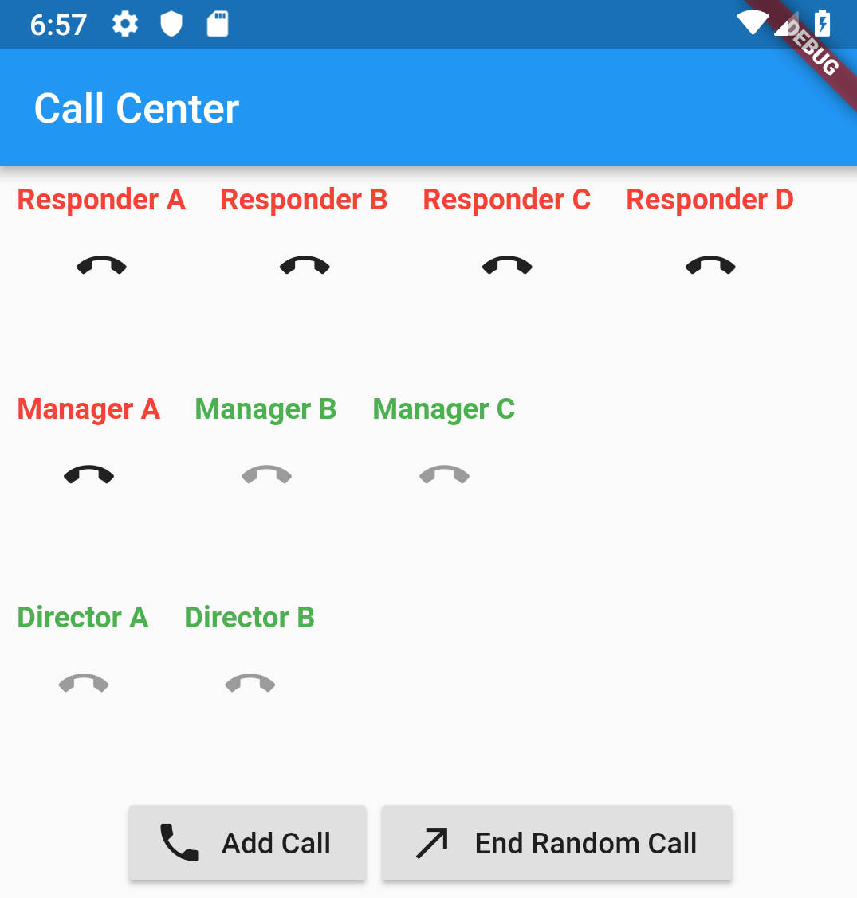
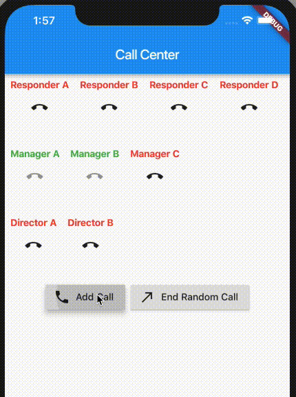

I absolutely love this book:  [Cracking Coding Interview](https://www.amazon.com/Cracking-Coding-Interview-Programming-Questions/dp/098478280X) by **Gayle Laakmann McDowell.**

I decided to dive deeper into Dart. It was interesting for me to reimplement some of the tasks in the book but this time in Flutter+Dart.

We will solve following question (quote from the book):

_Imagine you have a call center with three levels of employees: respondent, manager, and director. An incoming telephone call must be first allocated to a respondent who is free. If the respondent can’t handle the call, he or she must escalate the call to a manager. If the manager is not free or not able to handle it, then the call should be escalated to a director. Design the classes and data structures for this problem. Implement a method dispatchCall() which assigns a call to the first available employee._







Github with working app: [https://github.com/gladimdim/flutter_callcenter](https://github.com/gladimdim/flutter_callcenter)

# Solution

We can break the solution into smaller parts. One part is responsible for ‘backend’ tasks like handling calls, dispatching them to the correct responders. The other is a UI part. It will reuse methods to display current status of CallCenter on a mobile device.

The backend solution can be broken into more atomic parts: CallCenter is a main entry point for UI. CallCenter needs to know how to work with Responders. Responders must know how to work with incoming Calls.

One of the solutions is to break CallCenter into following classes

## CallCenter implementation

*   Responder Class
*   Call Class
*   CallCenter Class

# CallCenter Implementation

## Call Class

According to the description we have to implement CallCenter class with the dispatchCall method. An input for this method will be an instance of another class `Call`.

```
class Call {
   String msg;
   Call({this.msg});
}
```

It accepts string with a question which responder must answer. Let us also add API to end the call. It would be nice to notify possible listeners that the call has ended. For this we will add such methods: `addEndCallback` and `endCall`:

```
class Call {
  String msg;
  List<Function> endCallCallbacks = [];

  Call(this.msg);

  addEndCallback(Function callback) {
    endCallCallbacks.add(callback);
  }

  endCall() {
    endCallCallbacks.forEach((f) => f());
  }
}
```

`addEndCallback` pushes new callback functions to the internal list. Once the `endCall` is called, we call each registered callback. In this way all parties which wanted to be notified about end of the call will have a chance to react.

## Responder Class

Now we need to implement a Responder class. According to the task there are three possible responder types:


```
**enum** ResponderType { Manager, Director, Worker }
```


Responder class has such methods:

*   `respondToCall(Call)` accepts the incoming call.
*   `isBusy` returns true if Responder is already answering a call.
*   `endCurrentCall()` ends current call. After this method is called Responder is available again.
*   If responder is busy and we try to assign another call to it, then it will throw exception:


```
**class** ResponderBusyException **implements** Exception {
  String msg;

  ResponderBusyException(**this**.msg);
}
```


Full listing for Responder Class:


Notice line #21 we save current call to temporary variable, then nullify pointer `call` and only then call `endCall` method. This is done to avoid issues when callback handlers called inside `endCall` method try to read status of our Responder. They will see that Responder is still busy! (call is not null).

## CallCenter Class

The main class should hold a list of all responders: workers, managers and directors:


```
List<Responder> workers = [];
List<Responder> managers = [];
List<Responder> directors = [];
```


For convenience we will provide auxiliary list of lists:


```
List<List<Responder>> allProcessors = [];
```


`allProcessors[0]` will point to workers, `allProcessors[1]` to managers and `allProcessors[2]` to directors. This additional list will help us to iterate over all available responders.

Now let us implement a constructor. It will generate list of workers, managers and directors and assign them into appropriate lists:

```

CallCenter() {
    workers.addAll([
      Responder(type: ResponderType.Worker, name: "Responder A"),
      Responder(type: ResponderType.Worker, name: "Responder B"),
      Responder(type: ResponderType.Worker, name: "Responder C"),
      Responder(type: ResponderType.Worker, name: "Responder D"),
    ]);

    managers.addAll([
      Responder(type: ResponderType.Manager, name: "Manager A"),
      Responder(type: ResponderType.Manager, name: "Manager B"),
      Responder(type: ResponderType.Manager, name: "Manager C"),
    ]);

    directors.addAll([
      Responder(type: ResponderType.Director, name: "Director A"),
      Responder(type: ResponderType.Director, name: "Director B"),
    ]);

    allProcessors.add(workers);
    allProcessors.add(managers);
    allProcessors.add(directors);
 }
```

## Add Queue of Incoming Calls

If all responders are busy then we have to add incoming Call to the queue. For this we use `List<Call>` data structure:


```
**class** CallCenter {
  List<Responder> workers = [];
  List<Responder> managers = [];
  List<Responder> directors = [];
  List<List<Responder>> allProcessors = [];
  **List<Call> queueCalls = [];**
```


## Implement dispatchCall

According to the task, the Call must be first processed by Worker. If all of them are busy we redirect it to Manager and only then to Director. If all of them are busy we add incoming call to the Queue.

```

dispatchCall(Call call) {
    Responder processor;
    for (var i = 0; i < allProcessors.length; i++) {
      try {
        processor = allProcessors[i].firstWhere((Responder p) => !p.isBusy());
      } catch (e) {
        print('Switching to next level');
        continue;
      }
      if (processor != null) {
        break;
      }
    }
    // if all processors are busy we add call to queue
    if (processor == null) {
      queueCalls.add(call);
    } else {
      processor.respondToCall(call);
      // we add a callback listener to now when the call is ended to
      // check the queue and do other stuff in CallCenter
      call.addEndCallback(callEnded);
    }
  }
```

`callEnded` handler will check if queue has incoming calls and dispatch them:

```
callEnded() {
    if (queueCalls.length > 0) {
      dispatchCall(queueCalls[0]);
      queueCalls.removeAt(0);
    }
  }
```

## Backend Summary

We implemented the main task: `CallCenter` can accept incoming calls and dispatch them to Workers. If they are busy then it redirects to Managers and then to Directors. We can use `Call.endCall` to end call it our `CallCenter` listener can catch this event and process it in `callEnded` method. If all responders are busy we add `Call` to Queue. `callEnded` handles case when some responder is freed and it can immediately respond to the enqueued call.

We will improve our API to satisfy UI needs in next paragraphs.

# Flutter UI Part

Our UI must know as little as possible about CallCenter implementation. It will be used to render list of responders and queue. User can also end specific call.


<noscript></noscript>

All Responders are available!

## Widget Structure

There is huge amount of high quality articles on how to build UI in Flutter, so I will just outline the basic structure of our UI.

Main application is a Column. Column’s children are: List of Rows of responders (workers, managers, directors), and a row of buttons. Then goes the Queue.

Responders section is a ListView (with a horizontal scroll when there are a lot of responders):

```
 Widget _buildResponderRow(List<Responder> group) {
    return Container(
      height: 100.0,
      child: ListView.builder(
        itemCount: group.length,
        scrollDirection: Axis.horizontal,
        itemBuilder: (context, index) {
          return _buildResponderView(group[index]);
        },
      ),
    );
  }
```

Row of Responders is a Column with Responder Name and button to end call:

```
Widget _buildResponderView(Responder responder) {
      return Padding(
        padding: const EdgeInsets.all(8.0),
        child: Column(
          mainAxisAlignment: MainAxisAlignment.start,
            children: [
          Text(
            responder.name,
            style: TextStyle(
              color: responder.isBusy() ? Colors.red : Colors.green,
              fontWeight: FontWeight.bold
            ),
          ),
          IconButton(
            icon: Icon(Icons.call_end),
            onPressed: responder.isBusy() ? responder.endCurrentCall : null,
          )
        ]),
      );
    }
```

Row of buttons:

```
Widget _buildButton() {
    return Row(
      mainAxisAlignment: MainAxisAlignment.center,
      children: <Widget>[
        Padding(
          padding: const EdgeInsets.only(right: 8.0),
          child: RaisedButton.icon(
            icon: Icon(Icons.call),
            onPressed: addCall,
            label: Text("Add Call"),
          ),
        ),
        RaisedButton.icon(
          icon: Icon(Icons.call_made),
          onPressed: endCall,
          label: Text("End Random Call"),
        )
      ],
    );
  }
```

```
 Widget _buildQueueView(List<Call> queueCalls) {
    return Column(
//        mainAxisAlignment: MainAxisAlignment.center,
        children: queueCalls.map((call) => Text(call.msg)).toList());
  }
```

# Linking UI to CallCenter backend

So we outlined the UI structure. But how can we get list of responders and how can we rebuild our UI when their statuses change? We could listen in our UI to `Calls` via `endCallCallback`, but that would break our abstraction. UI has to know as little as possible about CallCenter internals.

[StreamBuilder](https://docs.flutter.io/flutter/widgets/StreamBuilder-class.html) comes to the rescue!

We can implement stream of change events in `CallCenter` and our UI can listen to them. We then just rebuild our UI with latest data. With this approach we do not care WHAT actually changed. We care only about the fact that SOMETHING changed and we must rebuild the UI.

We enhance our `CallCenter` implementation with three additional stream: Responder Stream, Queue Stream and merged Responder+Queue stream.


```
StreamController<List<List<Responder>>> _responderStream = StreamController();
StreamController<List<Call>> _queue = StreamController();
Stream changes;
// in constructor:
changes = StreamGroup._merge_([_responderStream.stream, _queue.stream]);
```


`Stream changes` is used by our UI to get notified that something changed and Flutter must rebuild the UI.

Our main `build` method now looks like this:

```
 Widget build(BuildContext context) {
    return Scaffold(
      appBar: AppBar(
        title: Text('Call Center'),
      ),
      body: StreamBuilder(
          stream: callCenter.changes,
          builder: (context, snapshot) {
            return Column(
              children: _buildBody() +
                  [_buildButton()] +
                  [_buildQueueView(callCenter.queueCalls)],
            );
          }),
      bottomNavigationBar: BottomAppBar(
        child: Container(
          height: 50.0,
        ),
      ),
    );
  }
```

Body will be rebuilt each time some value is put into `callCenter.changes` stream. As we saved a pointer to `callCenter` we do not actually care on the `snapshot.data` variable, but we could reuse it.

Now let us implement backend part of our streams.

In `dispatchCall` method we push new values to our streams:


```
**if** (processor == **null**) {
  queueCalls.add(call);
 **_queue.sink.add(queueCalls);**
} **else** {
  processor.respondToCall(call);
  call.addEndCallback(callEnded);
 ** _responderStream.sink.add(allProcessors);**
}
```


`callEnded` method:


```
callEnded() {
  _responderStream.sink.add(allProcessors);
  **if** (queueCalls.length > 0) {
    dispatchCall(queueCalls[0]);
    queueCalls.removeAt(0); **_queue.sink.add(queueCalls);**
  }
}
```


Now each time a new `Call` is put in queue or is answered by some `Responder` our StreamBuilder will rebuild our UI!

# Summary

We implemented `CallCenter` design by using Dart Classes. There are a lot of different variations of solutions for this task. This is just one of them. At first we created ‘algorithmic’ part. Then we created UI. To connect our UI to the backend we used `StreamBuilder` to get notifications when something has changed in `CallCenter`. You can see that our UI relies only on several API calls: `isBusy`, `allProcessers`, `endCall`. The less our UI knows about internal parts of `CallCenter` the better. We can change implementation of `CallCenter` methods without touching the UI at all.

Full project is available at [https://github.com/gladimdim/flutter_callcenter](https://github.com/gladimdim/flutter_callcenter)