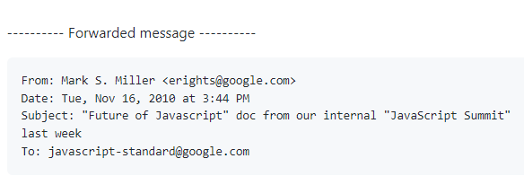
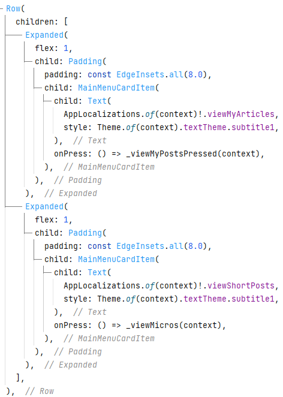
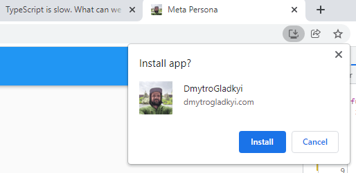

So, 12 years have passed after the infamous ["Dash Memo" leak was published.](https://gist.github.com/paulmillr/1208618)



For those who doesn't know: V8 team did a side gig and created a new language with its own VM as they were exhausted maintaining all the JS shortcomings. So as a side project someone forked V8 and created what is now known as Dart . At those times it was called Dash. Some more effort was put into this and they managed to make a BETTER language for the Web.

As Google controls the Chrome development it was obvious they have power to do a tectonic shift: add another default language for the web and in a long time remove all that JS legacy. Or leave it as is.

But, someone at the team saw the email and leaked it to the public.


**The first passage stated:**

```
Executive Summary

Javascript has fundamental flaws that cannot be fixed merely by evolving the language.
We'll adopt a two-pronged strategy for the future of Javascript.
```

**And their proposal:**

```
Dash (high risk/high reward):
Develop a new language (called Dash) that aims to maintain the dynamic nature of Javascript but have a better performance profile
and be amenable to tooling for large projects. Push for Dash to become an open standard and be adopted by other browsers.
Developers using Dash tooling will be able to use a cross-compiler to target Javascript for browsers that do not support Dash natively.
```

**Did they want to harm web developers? *No*. Did they want to make web development better? *Yes!***

They actually wanted to add optional types, make language tooling friendly, and more performant...all of this was later promised by TypeScript. [That everyone wants to improve](https://dev.to/alekseiberezkin/typescript-is-slow-what-can-we-do-about-it-30hm) because the compilation time is slow. When we added TS to our project in 2016 the compilation time jumped from 40 seconds to...8 minutes. No shit. 4 years have passed I still see articles on how someone rewrote TS Compiler in Rust or Go and got 4000x improvement compilation time. Remember that TypeScript Compiler just converts one text into the other...


## What Dash wanted to give us

```
Dash is designed with three perspectives in mind:

Performance -- Dash is designed with performance characteristics in mind,
so that it is possible to create VMs that do not have the performance problems that all EcmaScript VMs must have.

Developer Usability -- Dash is designed to keep the dynamic, easy-to-get-started, no-compile nature of Javascript
that has made the web platform the clear winner for hobbyist developers.

Ability to be Tooled -- Dash is designed to be more easily tooled (e.g. with optional types) for large-scale projects
that require code-comprehension features such as refactoring and finding callsites.
Dash, however, does not require tooling to be effective--small-scale developers may still be satisfied with a text editor.
```

Remember it was 2012, [Microsoft just issued TypeScript 0.8](https://devblogs.microsoft.com/typescript/announcing-typescript-1-0/#:~:text=When%20we%20introduced%20Typescript%20to,regularly%20interacting%20and%20sharing%20ideas.) which was not needed by anyone in the web at that time. React was not a thing.

But the web community started a hysteria saying that Google wanted to 'lock' them into some Google owned language. Read this absurd again.  So they did not want to get a default new better language and instead welcomed TypeScript that is 100% controlled by Microsoft that was known for making very bad things to devs with their dominance of IE and Windows. Then they welcomed React that is 100% controlled by Facebook. They are all vendor lock technologies. They are done in public but that does not mean you have any control of them. Even W3C is a useless org without Google and Apple. Yet nobody cries over HTML being vendor locked...

## What would happen instead?

Let's imagine they added Dash/Dart to the Chrome in 2015. Dart compiles to JS without any issues. So the backward compatibility would be saved even if Apple rejected to add DartVM to Safari. Firefox was not a thing anymore so we don't care about Mozilla at all. You could serve two bundles *(LIKE ACTUALLY LOTS OF WEB APPS DO TODAY)* : one bundle for DartVM. The other for JS VM for Safari.

## Missed Benefits

### Live Reload

[Live reload](https://docs.flutter.dev/development/tools/hot-reload). Don't compare to web hot reload. In Flutter you can save the file and see updated app without refresh or state change. We still don't have it in current web dev.

### [UI toolkit](https://flutter.dev/ecosystem)

Finally normal UI toolkit made on tech made for...UI! Not for text documents targeting to some basement in Zurich in 1988...

### Same language for logic and UI

The same language for logic and for the UI markup. No more: Learn JS, Learn HTML, Learn CSS. **Just: learn Dart**. Don't switch between completely different mind stacks. Flutter Widget code is 100% Dart code.



### [Multiplatform](https://flutter.dev/multi-platform)

Absolutely the same project now runs on : Web, macOS, Windows, Linux, iOS, Android. No more Electrons, DENOs, Ionics, god knows what else.

### [Native Flutter in Web](https://flutter.dev/multi-platform/web)

Yes, we would get a 'free' Flutter UI toolkit just out of the box, for free! I am more than sure the next step for Google would be to replace the HTML/CSS garbage (they still have like 15 CSS technologies to center things) with Skia + Flutter. With natural integration into DartVM. [No more huge 5Mb bundles](https://stackoverflow.com/questions/41365453/bundle-js-too-big-in-webpack-project) to load the bundle and fonts...the platform provides it for you.

### Real apps, not document markup hacks



With all of the above we would finally get a normally functioning apps that can be downloaded via the browser. No more strange text input, scrolling, CSS issues between browsers...Just a regular desktop/mobile app as we all used to them, just running under the web address. [With 60 FPS!](https://docs.flutter.dev/perf/rendering/ui-performance)


# But

The history went as it went. We can't change it.

Dart survived, found a new free land called Flutter and blossoms from year to year.