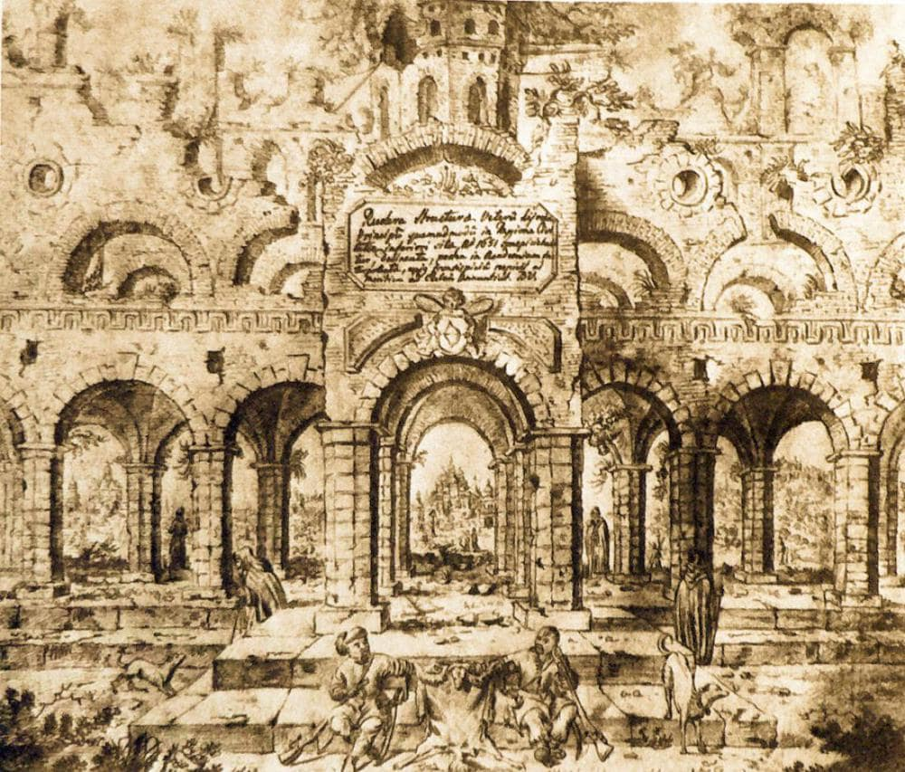
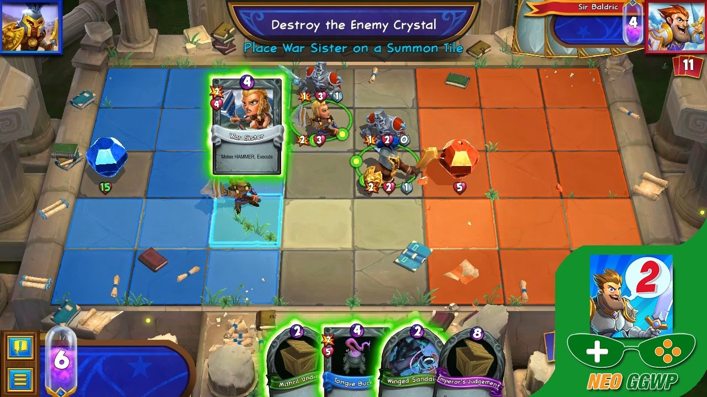
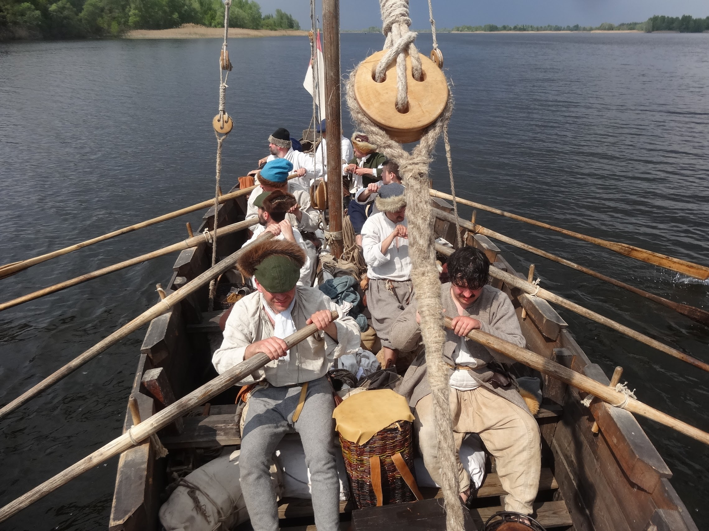
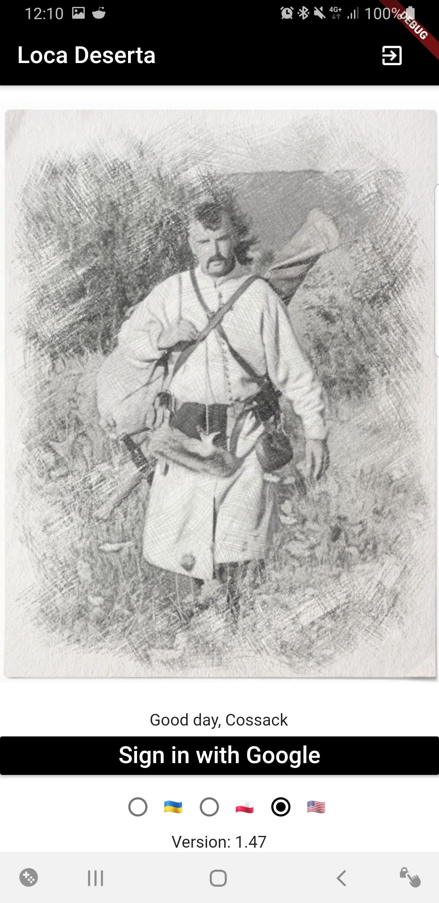
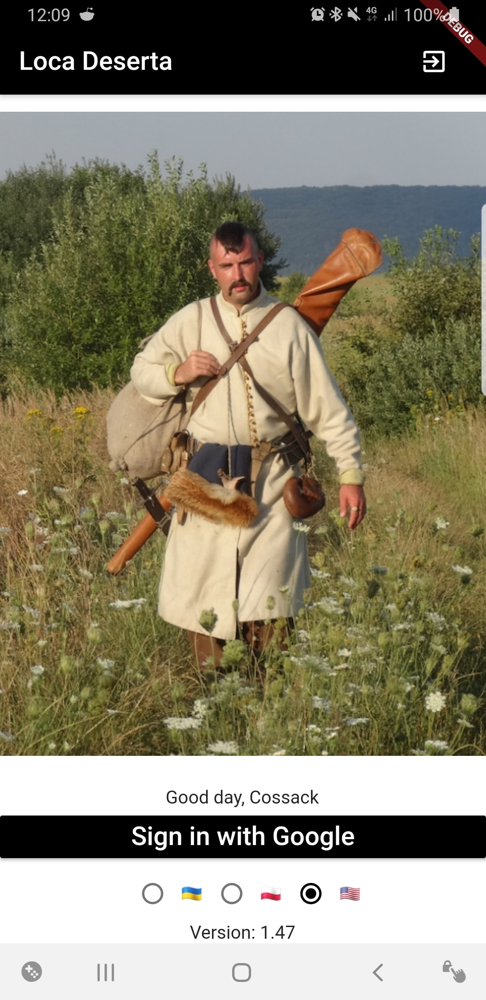

The story started 7 years ago.

*(sketch created by Abraham van Westerveld in 1649. He traveled with Lithuania ruler and pictured life of Ukrainian Cossack warriors).*

I like to play tactical turn-based games on smartphones. I especially liked  [Hero Academy](https://www.metacritic.com/game/ios/hero-academy):

I was a member of living history club  [Ukrainian XVII Century Reenactment](http://www.17c.org.ua/) and decided to create a similar game but in the scope of the Ukrainian war for independence in the middle of XVII century. It started as the multiplayer iOS app written in Objective-C. As a backend, I decided to use Clojure and MongoDB.

*Our club in action*

Weeks passed, I progressed and could play 1vs1 via my multiplayer backend server. But it lacked a lot of features and implementing them would take a lot of time. The progress stalled. But then boom! WWDC 201* happened and Apple released the Game Center support for the multiplayer games! One of the features of the new iOS release was support for turn-based apps. Apple gave developers great SDK and backend. It fit my requirements. I had not to worry about writing Clojure and maintaining Mongo.

So I quickly rewrote my logic to use the iOS Game Center SDK.* [Also at the same time I discovered Redux 😝I had a state object which was given to a pure function which updated the screen. Each user action called a handler, which modified the state which was then given to the pure function, which ...you know Redux, right 😎?]*

But let's return to my game. I implemented 50% of desired functionality. I could start the game, send turns, update turns in the background, etc. The only thing missing was Graphics. I tried to create 2D characters on my own. But...I am not a 2D artist. **And I stopped.** I invested fewer and fewer hours per week into my game and eventually lost any interest in it.

3 years have passed. We were returning from another living history action and I told my club-mates about that game. They were very interested in it and asked why I did not finish it. **And at that moment it clicked in my head: 3 years!** I could take any 2D online course, learn how to create graphics and continue on my game on my own. I could even graduate from another university. Or I could pay 2D artists to create it for me. There were so many options.

**After several months the idea** of resurrecting my game was still in my head. At the same time, I had a talk with my classmate. He had very interesting nightmares and decided to write them down.** He sent me a copy and I was surprised. His story felt like the first part of **  [The Dark Tower: The Gunslinger](https://www.goodreads.com/book/show/43615.The_Gunslinger). *(He promised to publish it soon in English and Ukrainian)*. I asked him if he was interested in writing some stories but in the context of life in Ukraine in the XVII century.

## Resurrection
This moment is the beginning of [Loca Deserta](https://locadeserta.com/). It is an interactive fiction game/book. You read the story, make decisions and the story continues in different ways. *You can even die in game*. The story starts in the year 1620, just after the Rzech Pospolita army was defeated by the Osman Empire in [Battle of Cecora](https://en.wikipedia.org/wiki/Battle_of_Cecora_(1620)). The main hero escaped the tartar prison and tries to get back home to Ukraine.

The story is accompanied by real photos of our reenactment actions. Each image in the game is tappable and 'sketch' filter is applied to images:

Landing View:

### What tech we use

#### Interactive Fiction Engine
As an interactive fiction engine, we ended up on [Inkle Studios](https://www.inklestudios.com/ink/web-tutorial/). It is ported to Objective-C, Java, JavaScript. The engine has a web editor, desktop client. It can be exported to JSON format.

#### Only Native
I am more than happy I used  [**Flutter**](https://flutter.dev/). The game works on Android and iOS from an identical code base. I also have plans in porting to the Flutter Web (UI works without any changes, but I need to make a bridge for Inkle engine, which is pretty easy to do. Also I wait on a Flutter Web Firebase plugin support).
The UI is minimalistic, as this is a book, not an action game.

#### Backend
This time I did not want to repeat mistakes of the past and decided to use Firebase as a database and authentication backends. 0 maintenance efforts, 0 downtimes. Fits well into our requirements. It has great support from the Flutter Team.

#### State Management
You could notice there are a lot of articles about state management in recent times. BLOCs, Redux, Actors, Streams... I have a mix of Streams and callback style Widgets. Is this bad or good? There is no correct answer. Main events in the game are processed by Streams. "Local" events are processed by usual callbacks. It works well for me and I do not want to over-engineer.

# What's next
The plan is to release alpha version on June 1st, 2019 :-) Game will be translated to English, Ukrainian and Polish languages.
We plan to expand the story each week/month with new branches, endings, and details. Sometimes I read the story with my kids and they do the decisions in the book. It seems engaging for them, so maybe we will adjust the game for the younger.

You can follow our Instagram:  [https://www.instagram.com/locadeserta.if/?utm_source=ig_embed](https://www.instagram.com/locadeserta.if/?utm_source=ig_embed)

Try the [alpha version for Android](https://play.google.com/apps/testing/gladimdim.locadeserta). (Story is available only in Ukrainian but will be translated to English and Polish).

**The story started 7 years ago, had ups and downs but this time we plan to run it till the end.**
