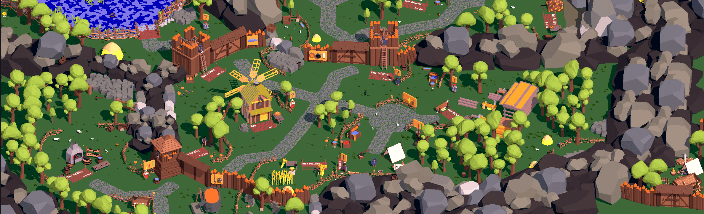
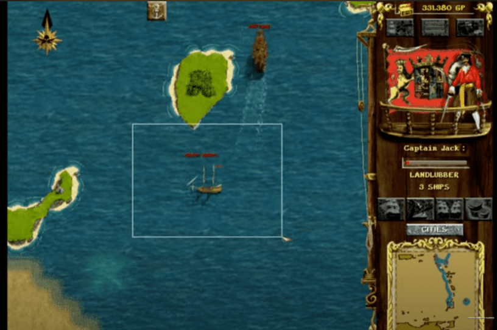

Завершення справи та наступні плани

Ось уже понад рік, як я працюю над своєю грою Дике Поле: Слобода 2.

Почав її, бо більше не можна так жити, кругом якась...Мобільних ігор з дійсно цікавим гейм-плеєм і не туалетним терміном гри (приблизно 2 хвилини) дуже мало. Крім Kingdom of Two Crowns і згадати важко, в яку гру можна пограти, щоб мала під собою якусь канву, розвиток сюжету, зміну ігроладу під час проходження і головне: хотілося без перерви грати 30-40 хв. Всі ж мобільні ігри - це сесійна гра на 2 хвилин, поки сидиш в туалеті. І щоб кожна сесія гри це не заробляння монеток чи діамантів для купівлі наступного айтема.

А ще ігор про Україну немає. Є Острів. Стоїть один в полі. Уже років 8. Я одразу ж його придбав, коли він на стім забетився. І все. Повна пустка. На 50 мільйон людей немає нікого, хто б вніс щось корисне в цей відділ нашої культури. А це надвзичайно важливий і впливовий відділ. Подивіться на русню: у них всі ігрові гіганти мають бюджетування або з держави, або з газпрому чи інших нафтових доїлок. Бо через гру ти несеш свою ідею, збагачуєш свій власний культурний шар. Всі діти грають в мобільні чи стільникові ігри. Ось заходить маленький українець в стім вибрати гру. Він в щось зможе пограти про свою власну країну? Чи про її історію? У русні є танки, якась РПГ про слов'ян і махачі з німотою (як раз їх фішка, все життя штурмувати рейхстаг), є вар сандер...Встановить Острів, але гра дуже специфічна, не всі потягнуть. Візьме дитина мобілку, а там...ГК і айдл ферма. І все, росте дитина відірвана від культурного шару. Батьки можуть бути 100 разів патріотами, волонтерами та воїнами, але ось такого практичного впливу мало. Та його не існує просто. Буде роблокс і три кульки в ряд. У русні дитина бігає в пост радянський біошок, де СРСР не розвалився, а навпаки, став потужним і красивим. На мобілочці в танки за дідов...А українська дитина...популяє байрактаром в грі-пердушці й все. Так і запам'ятає: наші не можуть нічого зробити, а он русаки та танки й вар сандер...Бачите, як програмується все через ігри...

Повернемося до мене. Ще у 2013 році я зробив покрокову мультикористувацьку гру "Битва Націй". Щось схоже на шахи, де по черзі ходиш воїнами й вони б'ються з ворогом. В грі були поляки, турки, українці (козаки) та татари. Але треба було робити арт, і я все закинув. Пройшло 6 років, я зрозумів, що уже в принципі можна було б і універ ще один закінчити...не те щоб намалювати й навчитися робити арт для ігор. І вирішив в будь-якому випадку не зупинятися. Так виник всесвіт "Дике Поле"

# Дике Поле

Дике Поле почалося з інтерактивних історій про козаків. [Інтерактивні історії](https://locadeserta.com/interactive/). На диво, читачі самі пишуть уже інтерактивні історії та додають їх в каталог. Дуже вражений. Бо грою я більше не займаюсь.

Далі були: Слобода (перша, не ця :) ), Чумаки, Гекс: [Всі наявні ігри](https://locadeserta.com/all_games_uk.html). Все в одному стилі та все зі зв'язком з Україною. А саме з козацькими часами. На цих іграх я підготував близько 200 різних 3-Д моделей у воксель стилі. Що дало змогу почати мою наступну гру. Ці ігри досі мають по 100 установок в місяць, для мене це ще одне диво :)

Але. Це були ігри зроблені на колінці. Хоча ігроладу в десять разів більше ніж в інших мобільних іграх.. Я користувався флатером для випуску на всіх платформах. Але ж це не ігровий рушій. То восени 2021 року вирішив зробити переробку Слободи, але уже по-справжньому, як повноцінна гра. Добре, що арту і 3D воксельних моделей уже було доволі багато, я почав перероблювати примітивний "довигадуй сам" ігролад першої флатерної Слободи.

# Дике Поле: Слобода 2

[Всі відео на Тіктоку](https://www.tiktok.com/@locadeserta/video/7167762541311986949?is_copy_url=1&is_from_webapp=v1)

Можу з впевненістю сказати: Слобода 2, це перша гра про Україну на мобілках. В якій є сюжет, задачі, занурення в часи XVII століття. Але без пафосного бреда, як це часто роблять в іграх. А ось таке будення: ви отаман Слободи, яку треба заснувати, розбудувати, вийти до моря і допомагати Січі. Без магії, діамантів, ІАР і Ads SDK. Чиста гра. Десь 2-4 години безперервної гри, щоб закінчити її. Так, в грі є кінець. Але ви та далі можете бігати по мапі. Отримали 21-у ачівку "Кінець Гри" - вважайте ви всю гру пройшли.

Для антуражу і занурення ми замовили три оригінальні звукові доріжки. Від класичних кобзарських пісень, до класики 18 століття та сучасності. Так, в грі є кобзарі, справжні НПЦ, які грають на бандурі. Підходьте до них і вони вам зіграють. В грі треба буде висилати допомогу козакам під Азовом. Чи знали ви, що наші козаки штурмували ту турецьку фортецю, а потім ще і назад не віддавали декілька років? А завдяки грі, ваша дитина про це взнає. Або ви самі навіть. А мем про Золото Полуботка? Я ще у своєму дитинстві пам'ятаю унікумів, які розповідали, що золото Полуботка в Острі зарито, і японці хочуть знайти, але наші не дають...Такі речі єднають всі націю. Бо дитина, дорослий чи підліток пограють в щось своє, і у них уже є точки дотику. Від Закарпаття до Луганська буде щось з'єднувати людей. У русні це діди воювали, яким пронизані всі ігри. У нас має бути Дике Поле: там, де сформувалась Україна, з козаками, Гетьманством.

# Що далі

В грудні 2022 випускаємо Слободу 2. Повноцінна гра. Можливо, навіть, випустимо на стімі в кінці зими. Але наразі 100% фокус це мобільні платформи. Вони є у всіх. Дивлюся по дітях в школі - про РС навіть ніхто не мріє уже...є мобілка, навіщо ще щось? Кожна з наступних наших ігор буде відштовхуватися від попередніх: переюзання арту, звуків. Взагалі легше робити, коли уже щось зроблено.

В січні 2023 перший патч: доробимо те, що не доробили :)

Лютий 2023: перший контент патч: Нова мапа. Хаджибей-Одеса. Будемо ставити козацьку слободу і там. Опа, а ось і гравці взнають, що Одесу заснувала не якась катька з потемкінім, а конкретні татари, турки і козаки...Відчуваєте, який вплив ігри роблять?

Грудень 2023 (через рік): Вихід наступної гри "Козаки: Гроза Чорного Моря". Будемо кататись на дубах, байдаках і липах по Чорному Морю, топити турків, щемити татар...захоплювати Кримські селища. В голові взяти ідеї та ігролад старої гри [Corsairs: Conquest at Sea](https://www.youtube.com/watch?v=6D77IF9lJ9g&t=636s)

Але спочатку реліз на Апл та Гугл платформах Слободи 2.

Гладкий Дмитро, 20 Листопада 2022.

