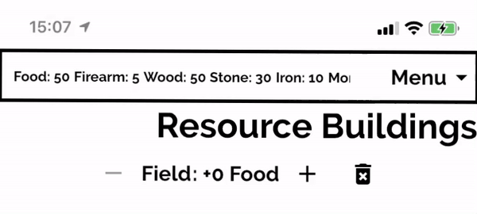
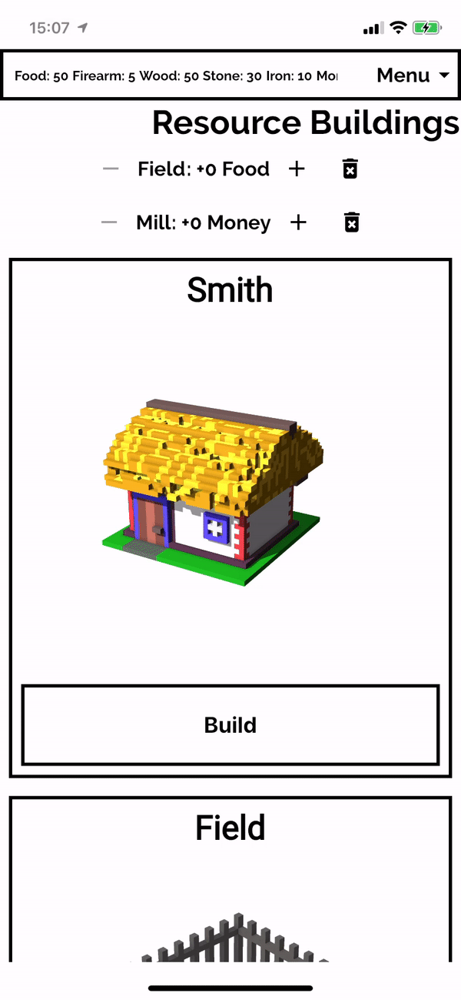

Here my custom Scaffold with app bar in action:


With the widget as a title:


For  [my interfactive fiction game](https://locadeserta.com)  I used default Material App Bar, but it took too much space on the screen and I wanted to customize it in a special way. So, I decided to create my own app bar with following features:

- Very few Widget props to create it. Title, list of actions. That is all I wanted to provide.
- App Bar must expand when user clicks on Menu button.
- App Bar must minimize when user clicks outside of the menu.
- When expanded, list of Menu Items must be shown.
- All the space expanded not occupied by the expanded Menu, must be blurred and dimmed.

Here is my app bar in action:


With the widget as a title:


### And here is the dartpad with gist:

https://dartpad.dev/31c5f5035d02ece1c18433a4caf3444d

# Just a Couple of Widget Props to create it
I usually start designing new widgets from API point of view. What props should I require for my widget? What can be hidden from widget consumer?

For my NarrowScaffold widget I decided to have only several widget properties:

- String: Widget title. The title just rendered in Text widget.
- Widget:  titleView. A ready-to-use widget for the title section. Optional. Overwrites the title.
- List actions[]. A list of menu items. Must be shown when user expands the menu by pressing the button. Each menu item has its own callback, which is executed on menu item tap.
- Widget body. A body which should be shown to the user below the app bar.

```
NarrowScaffold(
          body: Center(
            child: Text(message),  
          ),
          title: 'My Custom App Bar Title',
          actions: [ ]),
```
All the implementation details are hidden from the consumer. But we must still implement them.

To show app bar and body one under the other, I decided to use widget  [Stack](https://api.flutter.dev/flutter/widgets/Stack-class.html). It allows to position its children by given them coordinates.

The build method of the NarrowScaffold started to look like this:

```
Scaffold(
      backgroundColor: Theme.of(context).backgroundColor,
      body: SafeArea(
        child: Stack(
          children: [
          // body,
          // app bar
           ]
      ),
  ),
)
```
The children are stacked by such rule: first element comes 'lower' the later elements. So, if you want menu to render on top of body, then you have to place it at the end of children collection.

By knowing the app bar height (as a constant), we can add a padding to our body widget, to make it fully visible to the user. Or you can wrap it with the Positioned widget:

```
Scaffold(
      backgroundColor: Theme.of(context).backgroundColor,
      body: SafeArea(
        child: Stack(
          children: [
          Padding(
                padding: EdgeInsets.only(top: APP_BAR_HEIGHT + 8),
                child: BorderedContainer(
                  child: widget.body,
                )),
          // app bar
           ]
      ),
  ),
)
```
# Add outside tap handler to minimize the app bar
Now let's think about the menu button and how to expand/minimize the app bar. We need to implement another feature: pressing outside the expanded app bar minimizes it.

The scaffold above must know whether it should render in minimized (normal) or in expanded modes.

This property will be a part of our state. By default the app bar renders in minimized mode.

```
  bool expanded = false;
```

To add second feature we have to add a new element to the Stack, an invisible widget which will just register the user tap and will trigger unexpand event. This invisible container must be rendered only when the app bar is expanded.

It must occupy the whole height of the screen and render on top of body but below the expanded menu, so we place it between these two elements in the children collection of the Stack.

```
Scaffold(
      backgroundColor: Theme.of(context).backgroundColor,
      body: SafeArea(
        child: Stack(
          children: [
            Padding(
                padding: EdgeInsets.only(top: APP_BAR_HEIGHT + 8),
                child: BorderedContainer(
                  child: widget.body,
                )),
            if (expanded)
              SizedBox(
                height: MediaQuery.of(context).size.height,
                child: new BackdropFilter(
                  filter: new ui.ImageFilter.blur(sigmaX: 1.5, sigmaY: 1.5),
                  child: new Container(
                    decoration: new BoxDecoration(
                      color: Colors.black.withOpacity(0.2),
                    ),
                    child: Container(child: GestureDetector(onTap: () {
                      setState(() {
                        expanded = false;
                      });
                    })),
                  ),
                ),
              ),
            // app bar
          ],
        ),
      ),
```
# Adding App Bar in two modes: expanded and minized.

Now let's implement that app bar widget. It should be able to:
- Show the title
- Show the menu button
- React to expanded change event from parent
- Expand itself when user presses Menu button.
- Auto minimize when user selects some action or presses Menu button again.

From consumer point of view it will look like this:

```
 AppBarCustom(
      title: widget.title,
      titleView: widget.titleView,
      appBarButtons: widget.actions,
      expanded: expanded,
      onExpanded: (expand) {
        setState(() {
          expanded = expand;
        });
      },
    ),
```

For appBarButtons we cannot use just usual Button or other Flutter widgets as we have to intercept the user action. This interception is required to minimize the AppBar when user selects something from the menu. Also, from API consumer point of view, all we need to provide is menu item text and a callback to call. How will it look on the screen is hidden now by the NarrowScaffold.

We create a special object which has text and notifies when it is clicked:

```
class AppBarObject {
  final VoidCallback onTap;
  final String text;

  AppBarObject({@required this.text, @required this.onTap});
}
```

Now we can send a collection of menu objects to our NarrowScaffold widget:

```
NarrowScaffold(
          body: Center(
            child: Text(message,
                style: TextStyle(
                    color: Colors.black,
                    fontSize: 30,
                    fontWeight: FontWeight.bold)),
          ),
          title: 'My Custom App Bar Title',
          actions: [
            AppBarObject(
              text: "The First Menu Item",
              onTap: () => {
                setState(() {
                  message = 'The First Menu';
                })
              },
            ),
```

And they will be passed to the AppBarCustom via constructor properties.

The render method for AppBarCustom is quite big, so I will just note here main points:

- height of the app bar is determined by the **expanded** bool widget prop:
```
 height: widget.expanded
              ? (widget.appBarButtons.length * 50).toDouble() + APP_BAR_HEIGHT
              : APP_BAR_HEIGHT,
```
- if widget is expanded then we have to show the menu with user actions:

```
                SizedBox(
                  height: (widget.appBarButtons.length * 50).toDouble(),
                  width: MediaQuery.of(context).size.width,
                  child: ListView(
                    scrollDirection: Axis.vertical,
                    children: widget.appBarButtons
                        .map((obj) => _appBarObjectToButton(obj, context))
                        .toList(),
                  ),
                ),
```

Children of the ListView are special buttons:

```
class AppBarButton extends StatelessWidget {
  final VoidCallback onTap;
  final Color color;
  final String text;

  AppBarButton({this.onTap, this.color, this.text});

  @override
  Widget build(BuildContext context) {
    return FlatButton(
      splashColor: color,
      onPressed: onTap,
      child: Padding(
        padding: const EdgeInsets.all(8.0),
        child: Center(
          child: Text(
            text,
            style: TextStyle(
              fontWeight: FontWeight.bold,
              color: color,
            ),
          ),
        ),
      ),
    );
  }
}
```

And we use some Functional Programming magic to connect our internal buttons with the outer callbacks, provided to the NarrowScaffold widget:

```
 Widget _appBarObjectToButton(AppBarObject object, BuildContext context) {
    return AppBarButton(
      onTap: _callbackerHandler(object.onTap),
      text: object.text,
      color: Theme.of(context).primaryColor,
    );
  }

  _callbackerHandler(VoidCallback callback) {
    return () {
      _toggleExpandedMenu();
      callback();
    };
  }
```

Callback handlers automatically minimize menu, when menu items are selected and then call the callback function.

The height of the expanded menu flexible, it occupies the same height as Column with menu items.

# Bonus

You can also specify 'titleView' property, it will be rendered in the title bar instead of Text() widget. Here is a SingleChildScrollView used as a titleView widget:




# Summary

Our custom Scaffold can now:

- Contain menu with actions
- Be expanded/minimized
- Contain any amount of menu items
- Create a beautiful effect, which blurs the widgets below it when menu is expanded
- Get a very simple API, just strings are special callback objects.

The dartpad is located here: [https://dartpad.dev/31c5f5035d02ece1c18433a4caf3444d](https://dartpad.dev/31c5f5035d02ece1c18433a4caf3444d)

The gist is here: [https://gist.github.com/gladimdim/31c5f5035d02ece1c18433a4caf3444d](https://gist.github.com/gladimdim/31c5f5035d02ece1c18433a4caf3444d)

My interfactive fiction + city building game (dev version) is here:
[Loca Deserta](https://locadeserta.com/game) 