Всім привіт!

Сьогодні ми зробимо першу у вашому житті справжню крос платформену програму на Flutter. На відміну від React Native, ми не будемо використовувати JS милиці і іншу єресь для того, щоб ваша програма запустилась на всіх основних платформах з одних і тих же вихідних файлів.

Щоб не робити тривіальні програми в стилі Counter/ToDo App, як це люблять розробники React, ми напишемо лайтову версію для програвання інтерактивних історій взятих прямо з https://locadeserta.com.

Весь програмний код знаходиться тут:
https://github.com/gladimdim/litelocadeserta

# Установка Flutter

На відміну екосистеми JavaScript і інших супутніх систем (React Native), інсталяція дуже гарно описана і працює на всіх платформах. Також не треба ставити ніяких приблуд, по типу https://expo.io на свої пристрої. Тому я просто дам лінку:

https://flutter.dev/docs/get-started/install

# Створення проекту
Flutter поставляється з чудовими консольними інструментами. Створення нової програми починається з:

```
flutter create litelocadeserta
```

Flutter створить всі необхідні директорії, конфіги і інше.

Наразі Flutter інструменти підтримують створення проектів для iOS, Android. Для десктопних платформ (технічне прев'ю) і веба (бета) необхідно переключитись на мастер гілку:

```
flutter channel master
flutter upgrade
flutter doctor
```
І включити підтримку десктопів та веб:

```
flutter config --enable-windows-desktop
flutter config --enable-linux-desktop
flutter config --enable-web
flutter config --enable-macos-desktop
```

Після цього, якщо ви запустите команду

```
flutter devices
```

То маєте побачити свою десктоп платформу в списку доступних пристроїв:


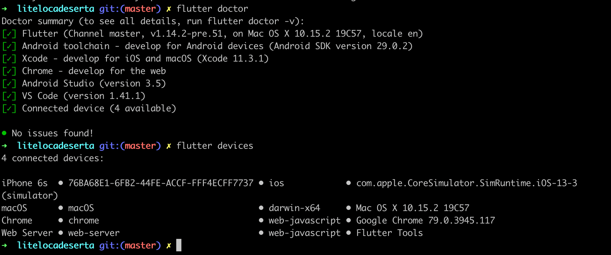

Платформи Windows та Linux ще не додані в сам репозиторій Flutter, але згідно офіційної документації, ми можемо просто скопіювати запускатори з теки examples з репозиторію https://github.com/google/flutter-desktop-embedding

Більше інформації знаходиться тут: https://github.com/flutter/flutter/wiki/Desktop-shells

# Додавання macOS проекту

Якщо ви побачили macOS в списку доступних пристроїв для запуску програми, то можете згенерувати запускатор для нашої гри:

```
flutter create .
```

А потім запустити нашу програму, написаної на Flutter, в якості native application:

```
flutter run -d macOS
```

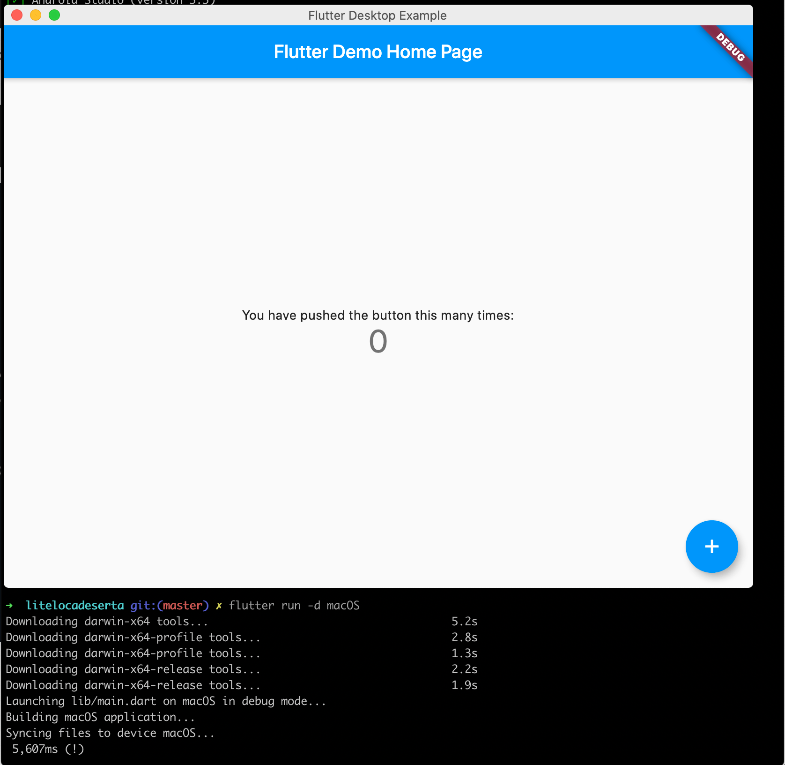

# Запуск під веб

Команда flutter create . також створила все необхідне для запуску програми у вебі:

```
flutter run -d chrome
```


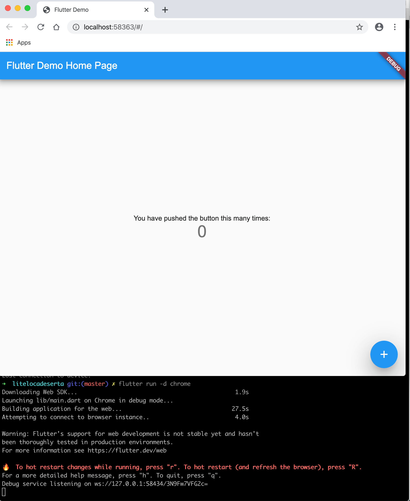

# Додавання сторонніх пакетів

Додати новий пакет досить просто. Для цього треба зайти на https://pub.dev, знайти потрібний пакет і переглянути "Installing" табу. Зазвичай все зводиться до додавання в pubspec.yaml одного рядку:

```
dependencies:
  gladstoriesengine: ^0.2.3
``` 

І потім викачка змін:

```
pub get
```

Якщо ж ви використовуєте офіційні плагіни для VS Code або Android Studio, то плагін сам побачить зміни в цьому файлі і автоматично викачає зміни:

Ось що відбулося після збереження змін в файлі:
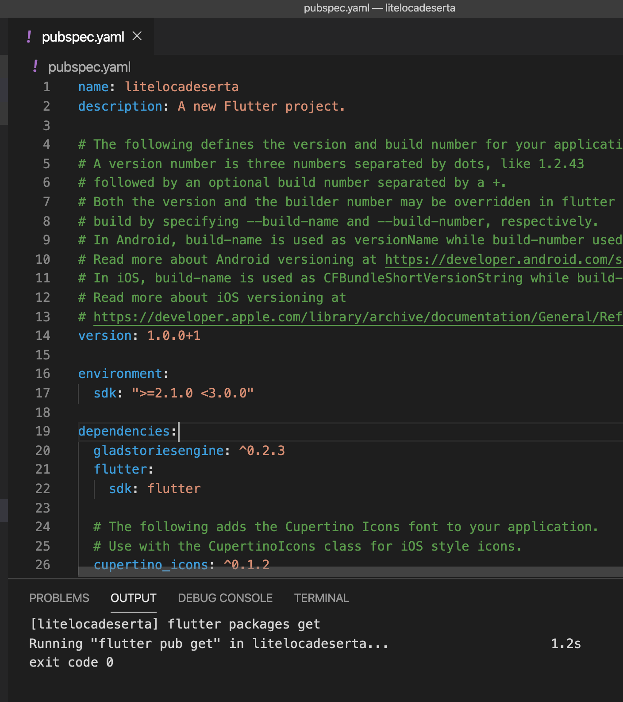

Для програвання інтерактивних історій, створених у форматі  [GladStories](https://github.com/gladimdim/GladStoriesEngine) ми візьмемо офіційний пакет: https://pub.dev/packages/gladstoriesengine

pub.dev дуже зручний у користуванні, адже одразу показує, з якими платформами сумісний пакет, як його встановити і інші деталі:

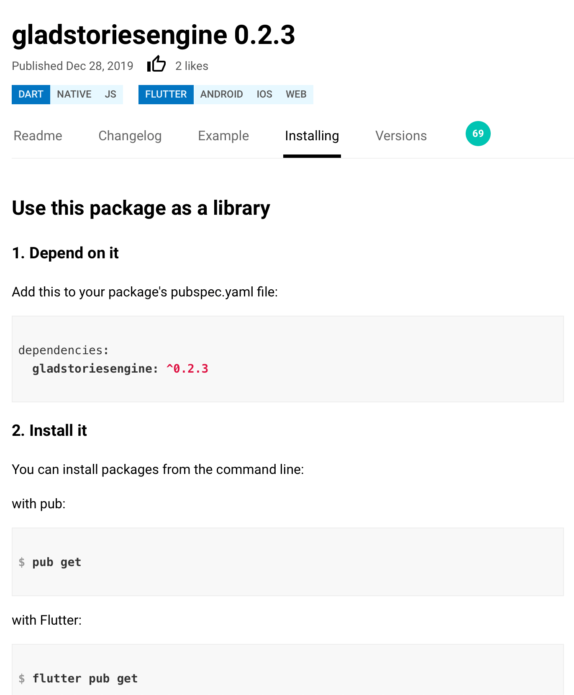

# Перші кроки

Перед тим, як почати писати новий код, я раджу ознайомиться з офіційної документацією про віджети: https://flutter.dev/docs/development/ui/widgets-intro . На далі я вважаю, що ви знаєте чим відрізняється Stateless від Stateful віджета (перший просто рендерить вхідні дані, другий може змінювати свій власний стан і оновлювати свій рендер).

## Додаємо свій віджет

Знаходимо файл lib/main.dart, видаляємо звідти всі коментарії, щоб не заважали.

Метод build занінюємо на:

```
 Widget build(BuildContext context) {
    return Scaffold(
      appBar: AppBar(
        title: Text(widget.title),
      ),
      body: GameView(),
    );
  }
```
Dart, це вам не JavaScript, тому одразу сповістить вас, що він не знає, що таке GameView().

### Тепер трошки серьйозної розмови.

Flutter, це живе середовище. Якщо ви запустили Flutter програму, то вам не треба кожен раз перезбирати і запускати її після змін в файлах. Флатер робить це автоматично. При цьому він зберігає стан виконання програми. Тобто, якщо ви зайшли в якусь частину програми, ввели якісь дані, завантажали щось із інтернету, то після live reload, всі ці зміни будуть досі доступні вам!

Через таку особливість, Flutter розробники часто додають неіснуючі ще віджети до програми, для того, щоб швидко накидати основний layout компонент. Автори Flutter, навіть, додали спеціальний віджет: https://api.flutter.dev/flutter/widgets/Placeholder-class.html спеціально для таких потреб.

## Асинхроний віджет

Тепер ми імплементуємо GameView, додавши новий файл lib/game_view.dart.

Відкриваємо його і вводимо три букви: stf . Редактор автоматично запропонуємо нам створити болванку Stateful Widget:

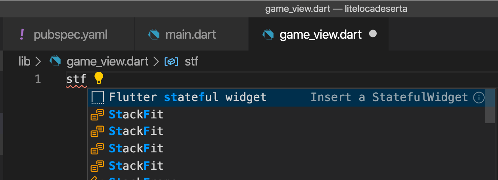

Натискаємо перший пункт і у нас з'явиться каркас нашого віджета. Але з багатьма помилками:


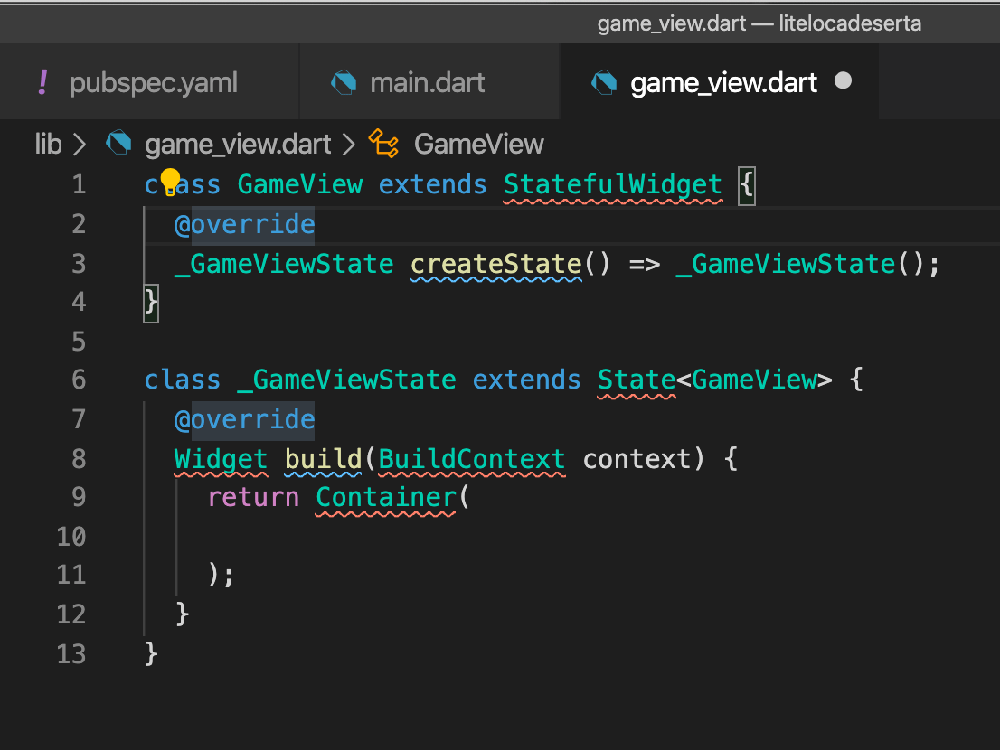

Натискаємо на лампочку і додаємо пропущені імпорти:

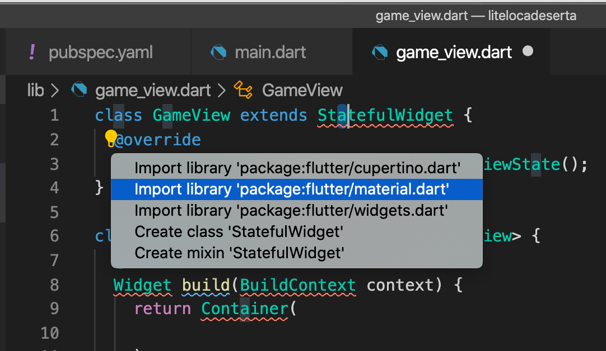

Тепер повертаємося в main.dart і додаємо пропущений імпорт через ту саму лампочку:

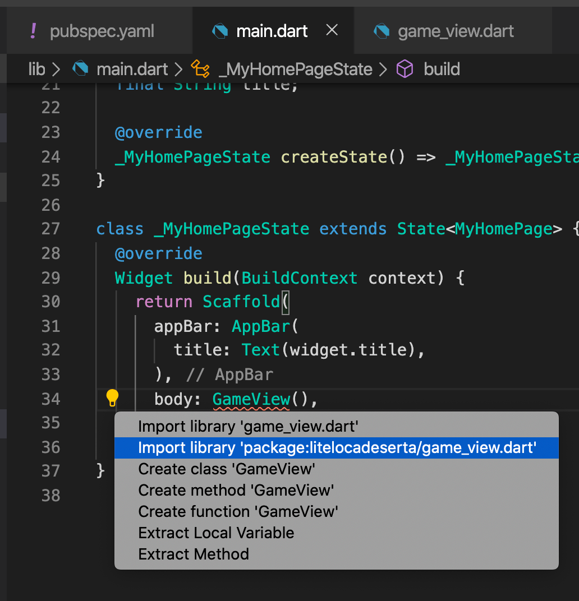

Запускаємо нашу програму через Debug -> Start Debugging, і бачимо, що наш новий віджет рендериться на екрані.


Ми будемо викачувати наші дані для інтерактивної історії з інтернету. Тому нам необхідно загорнути Container в віджет FutureBuilder. Це спеціальний віджет, який вміє працювати з асинхроними подіями, і дозволяє будувати різні віджети в залежності від стану асинхронної операції.

Flutter має надзвичайно гарні плагіни, тому це зробити дуже легко: поставте курсор на Container та натисніть cmd + .

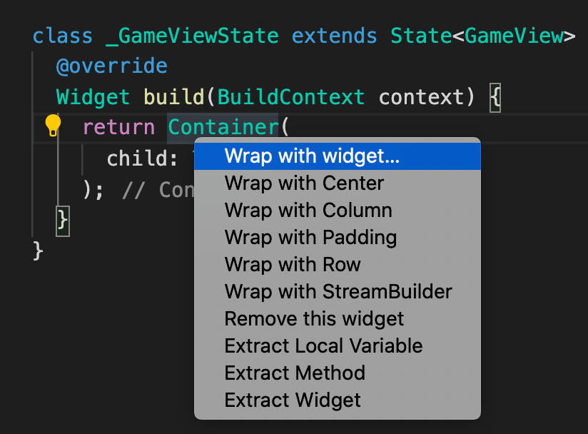

Виберіть Wrap with Widget  і введіть FutureBuilder, додавши необхідні параметри для його конструктора:

```
return FutureBuilder(
      future: _fetchData(),
      builder: (context, snapshot) => Container(
        child: Text('Ми тут!'),
      ),
    );
```

І тепер маємо додати метод _fetchData, який буде завантажувати дані із інтернету.

```
import 'package:flutter/material.dart';
import 'package:async/async.dart';
import 'package:gladstoriesengine/gladstoriesengine.dart';
import 'package:http/http.dart' as http;

class GameView extends StatefulWidget {
  @override
  _GameViewState createState() => _GameViewState();
}

class _GameViewState extends State<GameView> {
  final AsyncMemoizer _storyGet = AsyncMemoizer();
  @override
  Widget build(BuildContext context) {
    return FutureBuilder(
      future: _fetchData(),
      builder: (context, snapshot) => Container(
        child: Text('Ми тут!'),
      ),
    );
  }

  Future _fetchData() async {
    return _storyGet.runOnce(() async {
      var result = await http
          .get('https://locadeserta.com/stories/published/krivava_pastka.json');

      return result;
    });
  }
}

```

Забігаючи наперед скажу, що тут треба використовувати AsyncMemoizer. Бо без нього цей віджет буде викачувати дані при кожному rebuild події в програмі. Так як нам треба викачати json всього один раз, ми запам'ятовуємо результат виконання асинхронної операції, і вона буде виконана лише раз (перший).

Тепер нам треба змінити builder, так як асинхрона операція завершується не одразу, а може зайняти деякий час. Для цього в зміній snapshot існують спеціальні прапорці, по яким можна визначити, чи асинхрона операція закінчилась.

Змінюємо builder:

```
builder: (BuildContext context, snapshot) {
        switch (snapshot.connectionState) {
          case ConnectionState.none:
          case ConnectionState.active:
          case ConnectionState.waiting:
            return CircularProgressIndicator();
            break;
          case ConnectionState.done:
            var story = Story.fromJson(snapshot.data.body);
            return Text(story.title);
        }
        return null;
      },
```

Ми оброблюємо стан виконання Future. Якщо він не завершений, то показуємо круглий прогрес бар. Якщо закінчили, то завантажуємо JSON в Story.fromJson для парсингу і обробки.

Тепер ми можемо бачити назву історії:

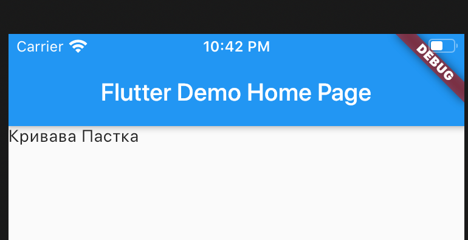

# Будуємо віджет Story

Тепер у нас є дані, то ж можна створити наступний віджет, який уже буде безпосередньо займаться програванням історії.

StoryView на вхід отримує екземпляр класу Story. Цей клас містить всі необхідні методи для роботи з інтерактивною історією: програвання абзаців, задавання питань, отримання відповідей на питання. Це все не входить в рамки нашого проекту, тому ВЖУХ і віджет готовий:

```
  Widget build(BuildContext context) {
    return StreamBuilder<List<HistoryItem>>(
      stream: widget.story.historyChanges,
      initialData: widget.story.history,
      builder: (context, snapshot) {
        var history = snapshot.data;
        return Column(
          children: [
            _buildTextSection(history, context),
            if (widget.story.canContinue()) createContinue(context),
            if (!widget.story.canContinue())
              ...createOptionList(widget.story.currentPage.next),
          ],
          crossAxisAlignment: CrossAxisAlignment.stretch,
        );
      },
    );
  }
```

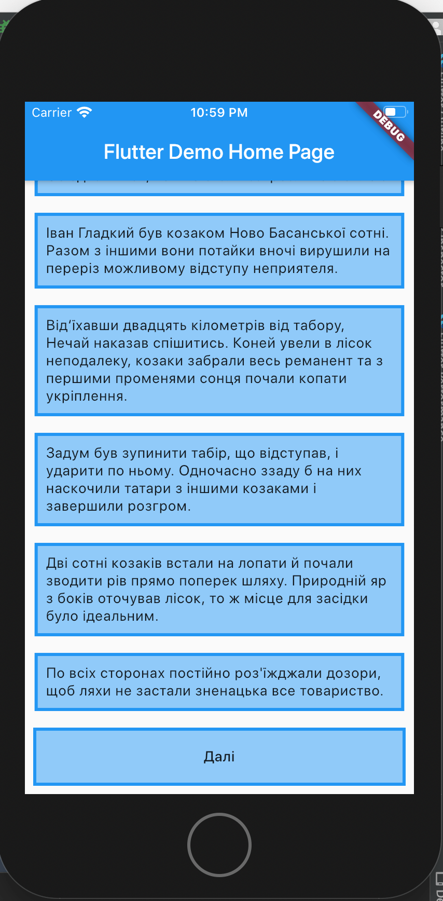

Що тут відбулося. StreamBuilder - це спеціальний віджет, який працює з  потоками. Він нам треба, бо Story містить потік з програними абзацами в історії. Кожен раз, коли гравець змінює історію, то в цей потік додається новий масив з усіма пройденеми абзацами, виборами в діалогу і тд. І віджет має змогу відбудувати себе заново, але з уже новими даними із history stream Story.

В Dart недавно додали можливість вставляти if, '...' прямо в рендер колекцій, що дуже зручно. На всі інші віджети можете не зважати, вони там для красоти. Наприклад, рамочки на контейнерах, або анімація натискання на кнопочку. Можете просто подивиться, як це зроблено на гітхабі.

# Запускаємо на macOS!

А тепер ми беремо цей самий код без жодних змін і запускаємо як рідну програму на Apple. **Ще раз**. Це не запуск якогось містку React Native, який переводить ваші CSS/JS/HTML в нативні контроли і щось там намагається перформить на 60 FPS. Flutter - це одразу рідний код. Ніяких містків.

Перед запуском, необхідно додати macos entitlement, щоб мати можливість робити запити Http. Для цього в файл macos/Runner/DebugProfile.entitlements додайте

```
<key>com.apple.security.network.client</key>
<true/>
```

Запускаємо на macOS:

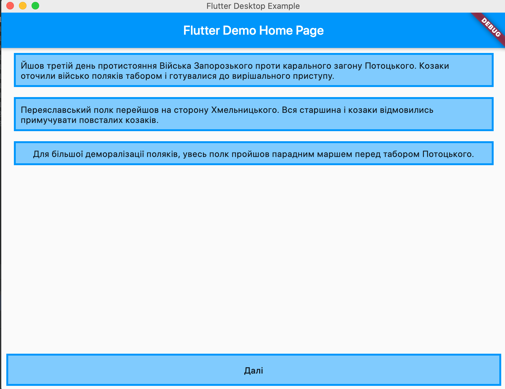

# Запускаємо на Web!

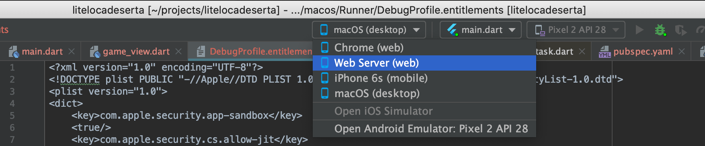

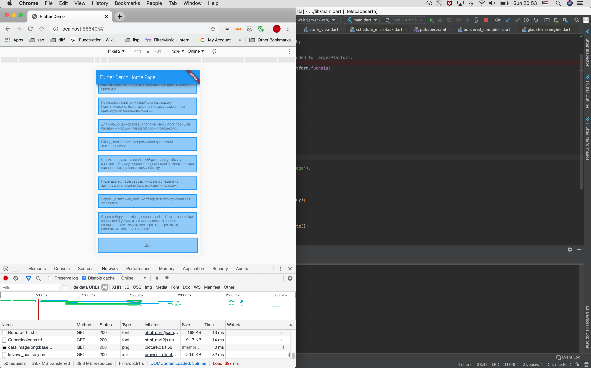

Працює!

# Запускаємо на Windows!

Ідемо до бабусі, або до адептів .NET і запускаємо наш проект і там (спочатку поставте Visual Studio + C++ пакет, flutter doctor все скаже, що вам треба доставити):


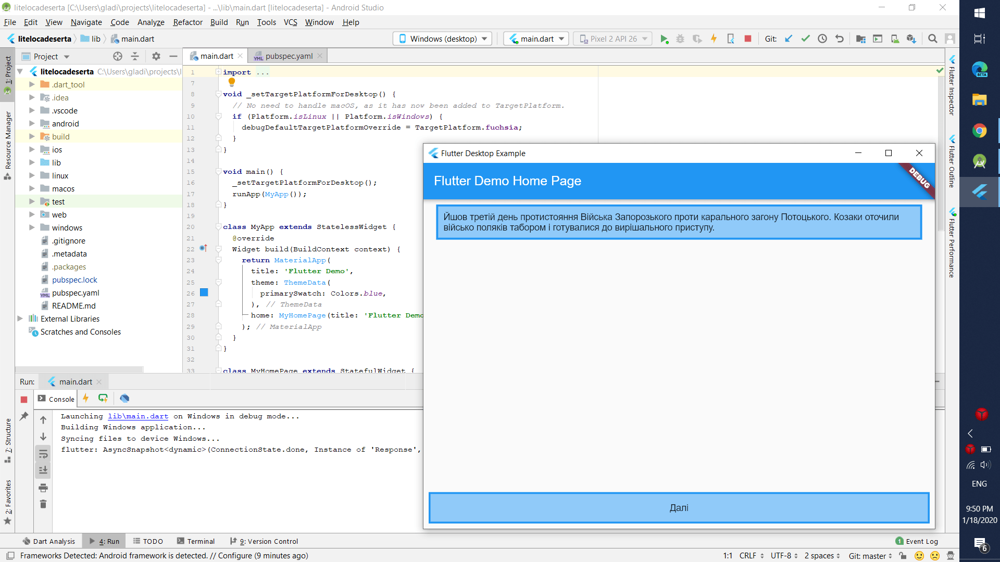

# Запускаємо на Linux!

```
flutter doctor
```

Вам скаже, що немає clang++. Установити його можна так:
```
sudo apt-get install clang
```

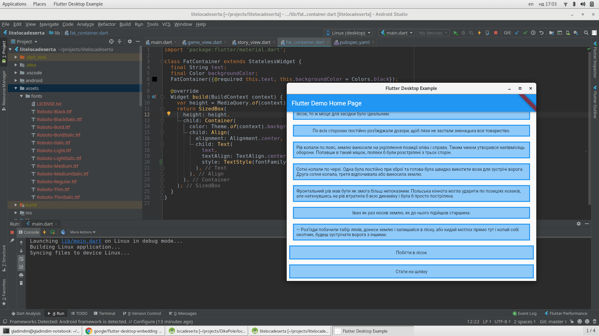

# Всі разом на macOS

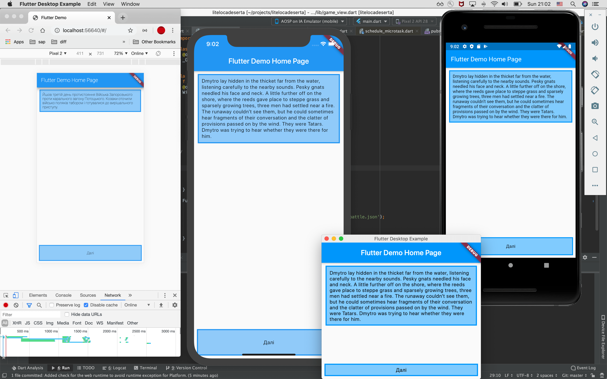


# Епілог або чому вам пора стрибати на потяг Flutter

- Забудьте JavaScript. Дурман від нього нарешті почав розсіюваться. Костильні технології по типу Cordova, React Native, Ionic, electron уходять в минуле. На арену вийшов інший надзвичайно сильний гравець, який своєю зручністю в розробці завойовує все більше програмістів. TypeScript не виправдав своїх сподівань і перебуває у повній стагнації (але час компіляції TypeScript проекту і досі дорівнює часу компіляції iOS білда)

- Dart мова надзвичайно легка у вивчені. Якщо ви знали С подібні мови, то проблем не буде. Також, на відміну від інших нових мов, вона не страждає ML-щиной, або іншими дивними захворюваннями синтаксису із теорій категорій.

- Забудьте про HTML+CSS. CSS Mafia не досягне вас у всесвіті CSS. Якщо ви, як і я, стали її жертвою і досі не знаєте як стабільно відцентрувати вертикально текст за допомогою CSS (тільки щоб працювало в існуючому ВЕЛИКОМУ проекті і на всіх браузерах Safari, Chrome, Mobile Chrome, Mobile Safari). CSS ніколи не досягне 60 FPS, розробка інтерфейсу користувача через HTML і його DOM модель була помилкою, яку просто гасили бензином і цей пухирь розрізся до абсолютно кретиничних рішень, таких як Shadow DOM, SSR, Virtual DOM (і його двадцять алгоритмів tree diffing) і інше.

- Нарешті нормальний інструментарій. Вам не треба буде знати двадцять термінальних команд і сотню ключів для них, щоб скомпілювати і запустити ваш проект (на відміну від JavaScript екосистеми, де кожна лібка тягне за собою бінарні тули, для роботи з нею). Все працює через команду flutter, і вам, скоріш за все, знадобиться лише дві її команди: flutter build, flutter run.

- Flutter Doctor - це 🤯. Якщо у вас щось не працює із сетапу,  то просто запустіть:

```
flutter doctor
```

І він вам скаже всі помилки інсталяції, які ви пропустили. Наприклад, коли я збирав цей проект на Windows, то команда мені дала лінку на закачку Visual Studio, вказала які пакети і підпакети доставити. Потім навіть сповістила, що Visual Studio очікує рестарту вінди!

**Якщо вам цікаво і далі читати про Flutter**, то підписуйтесь на мій RSS, заходьте до нас в телеграм канал: https://t.me/artflutter, або в Discord сервер: https://discord.gg/n8WUCja , і читайте мою попередню статтю про кастомну панель програми: https://www.gladimdim.org/flutter-stvorennya-svogo-scaffold-vidzheta-z-vipadayuchim-menyu-ck5ilswps03oaqks1iz023x3n

**Повну версію інтерактивної книги-гри ви** можете знайти тут: https://locadeserta.com. Доступна онлайн, на iOS та Android.
