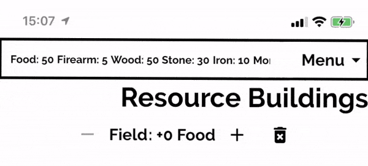
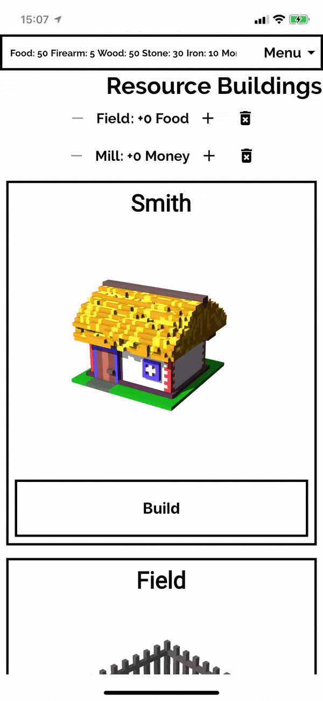

Я для своєї гри, написаної на Flutter,  [Дике Поле](https://locadeserta.com)  спочатку використовував стандартний Material App Bar, але він займав багато місця зверху і до нього не можливо було додати випадаюче меню. Тому я вирішив зробити свій власний Scaffold віджет, який би міг робити наступне:

- Всього декілька вхідних змінних для конструктора віджета. Заголовок, список елементів для випадаючого меню.
- Панель програми по тапу на кнопку Меню має розкриватися і показувати всі задані елементи меню.
- Панель програми має закритись назад, якщо користувач натиснув десь поза межами меню.
- Коли панель програми розкрита, то вся частина дисплею, яка не закривається меню, має бути розмита і трошки затемнена.

Ось як воно виглядає в дії:


І разом з Row в якості заголовка програми:



### А тут копія програми, яку ви можете спробувати онлайн:

https://dartpad.dev/31c5f5035d02ece1c18433a4caf3444d

# Почнемо з простого
Зазвичай, я починаю проектування своїх віджетів з точки зору програміста-користувача. Я визначаю мінімальний набір вхідних для конструктора віджета даних, які я б хотів надавати віджету.  Надалі уже вся реалізація віджета має бути захована в ньому самому.

Для нашого NarrowScaffold віджета нам знадобляться лише такі параметри конструктора:

- String: Widget title. Рядок, який буде рендериться в Text віджеті в заголовку програми..
- Widget:  titleView. Готовий Widget, який буде показуватися в заголовку програми. Опціональний. Якщо він є, то параметр String title ігнорується.
- List actions[]. Список для меню. Він має показуватися, коли користувач натиснув кнопку Меню. Кожен елемент списк має мати callback функцію, яка буде викликана NarrowScaffold віджетом, якщо користувач вибрав елемент меню.
- Widget body. Тіло програми, яке в принципі і є програмою :)

Ось так воно має виглядати з точки зору користувача віджета:
```
NarrowScaffold(
  body: Center(
    child: Text(message),  
  ),
  title: 'My Custom App Bar Title',
  actions: [ ]),
```
Вся реалізація буде захована всередині віджета.

# Реалізація

І так, ми маємо розмістити на екрані мінімум два віджета: перший - це тіло програми, другий - це заголовок програми, де і знаходиться кнопка меню.

Щоб розмістити ці віджета ми використаємо віджет [Stack](https://api.flutter.dev/flutter/widgets/Stack-class.html). Він дозволяє через  [Positioned](https://api.flutter.dev/flutter/widgets/Positioned-class.html) віджет виставляти місце, куди має рендериться конкретний дочірний віджет.

Метод build нашого віджета буде виглядати наступним чином:

```
Scaffold(
      backgroundColor: Theme.of(context).backgroundColor,
      body: SafeArea(
        child: Stack(
          children: [
          // body,
          // app bar
           ]
      ),
  ),
)
```

Дочірні віджети рендеряться по такому правилу: перша дочка в списку буде рендериться під іншими дочками, які знаходяться в колекції. Тобто, щоб Widget A перекрив Widget B, треба, щоб колекція виглядала наступним чином:

[Widget B, Widget A]

Також, знаючи бажану висоту панелі програми, ми можемо через  [Padding](https://api.flutter.dev/flutter/widgets/Padding-class.html) віджет зробити відступ для тіла програми, щоб панель не перекрила її. Або ж використати Positioned віджет.

```
Scaffold(
      backgroundColor: Theme.of(context).backgroundColor,
      body: SafeArea(
        child: Stack(
          children: [
          Padding(
                padding: EdgeInsets.only(top: APP_BAR_HEIGHT + 8),
                child: BorderedContainer(
                  child: widget.body,
                )),
          // app bar
           ]
      ),
  ),
)
```
# Додаємо згортання меню, якщо користувач натиснув поза його межами.

Тепер давайте покращимо наш віджет і додамо прозорий контейнер, який би перехоплював натискання користувача і закривав меню (якщо воно відкрите). Тепер NarrowScaffold має знати, чи відкрите меню чи ні, щоб відповідно передавати ці налаштування далі вглиб віджет дерева.

Цю зміну додаємо в наш стан віджета:

```
  bool expanded = false;
```

А сам контейнер додаємо в колекцію children між тілом і заголовком. Також цей контейнер має займати всю висоту пристрою і розмивати віджет, який намальований під ним.

```
Scaffold(
      backgroundColor: Theme.of(context).backgroundColor,
      body: SafeArea(
        child: Stack(
          children: [
            Padding(
                padding: EdgeInsets.only(top: APP_BAR_HEIGHT + 8),
                child: BorderedContainer(
                  child: widget.body,
                )),
            if (expanded)
              SizedBox(
                height: MediaQuery.of(context).size.height,
                child: new BackdropFilter(
                  filter: new ui.ImageFilter.blur(sigmaX: 1.5, sigmaY: 1.5),
                  child: new Container(
                    decoration: new BoxDecoration(
                      color: Colors.black.withOpacity(0.2),
                    ),
                    child: Container(child: GestureDetector(onTap: () {
                      setState(() {
                        expanded = false;
                      });
                    })),
                  ),
                ),
              ),
            // app bar
          ],
        ),
      ),
```
# Додаємо App Bar з двома режимами роботи: розкрите меню і мінімізоване.

Ну а тепер головне: віджет панель програми.

Віджет має:
- показувати заголовок
- показувати кнопку меню
- реагувати на натискання кнопки, або коли expanded змінюється.
- Автоматично ховатися, якщо користувач натиснув на якийсь із елементів в меню.

З точки зору API це має виглядати так:

```
 AppBarCustom(
      title: widget.title,
      titleView: widget.titleView,
      appBarButtons: widget.actions,
      expanded: expanded,
      onExpanded: (expand) {
        setState(() {
          expanded = expand;
        });
      },
    ),
```

Для наших appBarButtons (елементи меню), ми не можемо просто додати якісь кнопки по типу IconButton, FlatButton. Нам необхідно слухати події натискання на них і реагувати відповідно: закривання меню і виклик зворотної функції, яку програміст передав ще в NarrowScaffold віджет. Якщо б ми просто прокидували список віджет-кнопок, то наше меню не могло б перехоплювати події і реагувати на них. Ми б мали в NarrowScaffold додавати ще одну зміну стану: згорнути/розгорнути меню. Але це додає зайве навантаження на програміста, якому немає діла до внутрішнього стану такого віджета.

Для цих потреб ми створимо клас-контейнер:

```
class AppBarObject {
  final VoidCallback onTap;
  final String text;

  AppBarObject({@required this.text, @required this.onTap});
}
```

І тепер ми можемо передати список з його екземплярами в NarrowScaffold:

```
NarrowScaffold(
  body: Center(
    child: Text(message,
        style: TextStyle(
            color: Colors.black,
            fontSize: 30,
            fontWeight: FontWeight.bold)),
  ),
  title: 'My Custom App Bar Title',
  actions: [
    AppBarObject(
      text: "The First Menu Item",
      onTap: () => {
        setState(() {
          message = 'The First Menu';
        })
      },
    ),
```

Ця колекція буде прокинути в глиб віджета до AppBarCustom.

Рендер AppBarCustom доволі великий, тому тут я покажу лише важливі елементи:

- висота панелі залежить від кількості елементів в меню. В мініфікованому режимі висота це наша задана константа.
```
 height: widget.expanded
      ? (widget.appBarButtons.length * 50).toDouble() + APP_BAR_HEIGHT
      : APP_BAR_HEIGHT,
```
- якщо віджет розкрито, тоді ми маємо показати меню з елементами колекції AppBarObjects:

```
SizedBox(
  height: (widget.appBarButtons.length * 50).toDouble(),
  width: MediaQuery.of(context).size.width,
  child: ListView(
    scrollDirection: Axis.vertical,
    children: widget.appBarButtons
        .map((obj) => _appBarObjectToButton(obj, context))
        .toList(),
  ),
),
```

Доньки ListView, це наші специфічні проксі-кнопки:

```
class AppBarButton extends StatelessWidget {
  final VoidCallback onTap;
  final Color color;
  final String text;

  AppBarButton({this.onTap, this.color, this.text});

  @override
  Widget build(BuildContext context) {
    return FlatButton(
      splashColor: color,
      onPressed: onTap,
      child: Padding(
        padding: const EdgeInsets.all(8.0),
        child: Center(
          child: Text(
            text,
            style: TextStyle(
              fontWeight: FontWeight.bold,
              color: color,
            ),
          ),
        ),
      ),
    );
  }
}
```

І, використовуючи трошки приколів функціонального програмування, ми зв'язуємо AppBarObject зі звичайною кнопкою, яка показується в меню NarrowScaffold widget:

```
 Widget _appBarObjectToButton(AppBarObject object, BuildContext context) {
    return AppBarButton(
      onTap: _callbackerHandler(object.onTap),
      text: object.text,
      color: Theme.of(context).primaryColor,
    );
  }

  _callbackerHandler(VoidCallback callback) {
    return () {
      _toggleExpandedMenu();
      callback();
    };
  }
```

Ми перехоплюємо натискання на екран для того, щоб сховати меню і тільки після цього викликаємо справжній оброблювач події, яку задав нам програміст в конструкторі NarrowScaffold.

Висота цього віджета гнучка, вона залежить від кількості елементі в меню.

# Бонус

Ви також можете передати конкретний віджет, який буде показаний замість простого текстового віджету в панелі програми. Ось, наприклад, SingleChildScrollView в якості titleView:




# Підсумки

Наш кастомний Scaffold:

- містить меню з вибором дій для користувача
- може розкриватися / схлопуватися
- вміщає будь-яку кількість меню елементів
- Створює прикольний ефект, коли меню розкрите і весь інший екран стає розмитим і трошки приглушеним.
- надає надзвичайно простий вхідний інтерфейс для побудови такої складної структури віджетів.

Живий онлайн приклад тут: [https://dartpad.dev/31c5f5035d02ece1c18433a4caf3444d](https://dartpad.dev/31c5f5035d02ece1c18433a4caf3444d)

Копія на гітхабі: [https://gist.github.com/gladimdim/31c5f5035d02ece1c18433a4caf3444d](https://gist.github.com/gladimdim/31c5f5035d02ece1c18433a4caf3444d)

Моя інтерактивна-історія гра, де ви можете помацати все живцем на iOS/Android/Web. (там також почав робити гру в стилі city building):
[Loca Deserta](https://locadeserta.com/) 