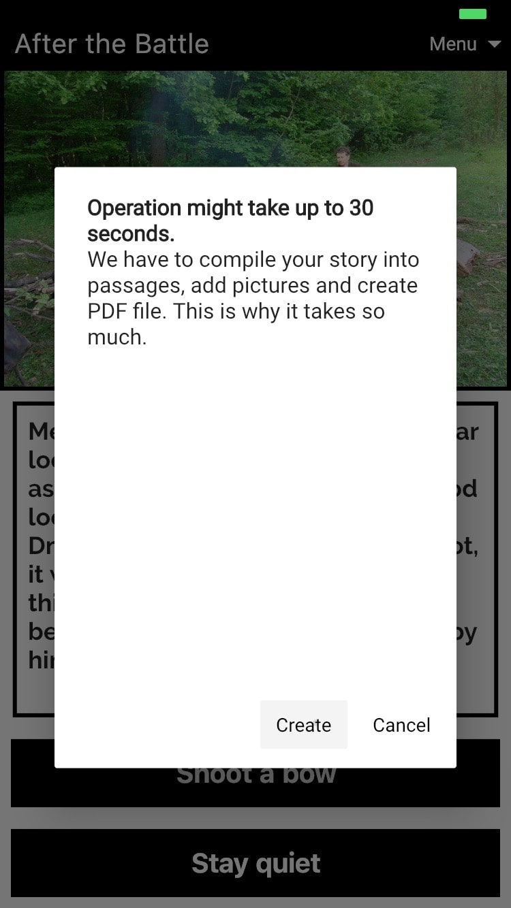

In this post I will show you, how to use **compute** function from the [Flutter framework ](https://flutter.dev/) to push CPU-heavy computation from main thread (which does the UI stuff) to another thread. This will unlock the main thread and your application will be responsive, while the app is still calculating something in the background.

# Introduction

This article will show a real-life example from my [Interactive Fiction application ](http://locadeserta.com/index_en.html). We will write first naive way of creating PDF documents (which lockes the main thread) and later enhance it to process images in a separate thread.

**The PDF Package**

Flutter has a lot of packages available for developer:  [https://pub.dev/](https://pub.dev/) . There is a package called [PDF](https://pub.dev/packages/pdf)  which suites 100% of my needs. I can use the same Widget approach to build a  PDF.

Here is an example of using PDF Widgets to build a document:
```
pdf.addPage(Page(
    pageFormat: PdfPageFormat.a4,
    build: (Context context) {
      return Center(
        child: Text('Hello World',
        style: TextStyle(font: ttf, fontSize: 40)),
      ); // Center
    })); // Page

```
Center, Context, Text, etc... are not Flutter Widgets, they are PDF widgets :-)

If you look at a sample code used to inject image into the PDF:

```
final img = decodeImage(File('test.webp').readAsBytesSync());
final image = PdfImage(
  pdf.document,
  image: img.data.buffer.asUint8List(),
  width: img.width,
  height: img.height,
);

pdf.addPage(Page(
    build: (Context context) {
      return Center(
        child: Image(image),
      ); // Center
    })); // Page

```

You can notice the first line calls **decodeImage** function (it is available in package image/image.dart).

It turns out, that decoding of the image takes a lot of CPU time (specially in debug mode). On my iPhone 6S it takes about 10-15 seconds to decode image in DEBUG Mode. Released build does it in about 1 second.

# First implementation without multithreading and with locked UI

The following code processes the user tap on "export" button and creates a PDF file:

```
  _onExportPressed(BuildContext context) async {
    final creator = PdfCreator(story: currentStory.storyHistory);
    final pdf = await creator.toPdfDocument(
        widget.catalogStory.title, widget.catalogStory.author);

    final file = await _localFile;
    await file.writeAsBytes(pdf.save());
    ShareExtend.share(file.path, "pdf");
  }
```

StoryHistory is a class which has all the passages from interactive fiction story + the images generated for the story.

**toPdfDocument** function loads TTF fonts for supporting non Latin text (like Cyrillic), creates a PDF document and adds pages to it:

```
  Future<Document> toPdfDocument(String title, String author) async {
    ByteData font = await rootBundle.load("fonts/Raleway/Raleway-Bold.ttf");
    final ttf = Font.ttf(font.buffer.asByteData());
    final pdf = Document();
    var child = await toPdfWidget(ttf, pdf);
    pdf.addPage(
      Page(
        pageFormat: PdfPageFormat(21.0 * PdfPageFormat.cm,
            story.getHistory().length / 4 * 29.7 * PdfPageFormat.cm,
            marginAll: 2.0 * PdfPageFormat.cm),
        build: (Context context) {
          return child;
        },
      ),
    );

    return pdf;
  }
```

The  most interesting part is done in **toPdfWidget** call:

```
  Future<Widget> toPdfWidget(Font ttf, Document pdf) async {
    return Column(
      crossAxisAlignment: CrossAxisAlignment.stretch,
      children: story
          .getHistory()
          .map((historyItem) => historyToPdf(historyItem, ttf, pdf))
          .toList(),
    );
  }
```

The function iterates over history in the Story and adds each item to the Column children collection.

So far, so good, no performance problems. PDF package generates all these text widgets in milliseconds.

But generating Images for PDF pages takes about 10-15 seconds in DEBUG Mode.

Here is the code:

```
case PassageTypes.IMAGE:
        var imageFile = _images[historyItem.value[1]];
        // next line takes about 10-15 seconds
        final img = ImageUI.decodeImage(imageFile.buffer.asUint8List());
        final image = PdfImage(
          pdf.document,
          image: img.data.buffer.asUint8List(),
          width: img.width,
          height: img.height,
        );
        return Container(
          padding: EdgeInsets.all(8.0),
          decoration: BoxDecoration(
            border: BoxBorder(
              width: 2.0,
              left: true,
              right: true,
              bottom: true,
              top: true,
            ),
          ),
          child: Image(
            image,
          ),
        );
```

And when user presses "Export" button the UI is completed locked and does not react to user interactions:




## But I used async await everywhere... does not it solve such issues???

I naively thought, that by using async await everywhere would not lock the main thread. But Dart is single-threaded and all the stuff is done in the main single thread. You can spawn [Isolates](https://api.dartlang.org/stable/2.4.1/dart-isolate/dart-isolate-library.html), but working with them requires a lot of dances.

# compute!
Thankfully, the Flutter team added a  [compute](https://api.flutter.dev/flutter/foundation/compute.html) function. It hides all that dances from developer:

```
var result = await compute(globalFunction, "my argument");
```

compute accepts a reference to a function. **It must be either a global function or a static method of the class!** You cannot use instance methods, the compute will raise a runtime exception. The second argument to the compute function will be passed as an input to the globalFunction. If you require more than one argument, then refactor you function to accept Map, which encapsulated them. You can pass only primitive values or primitive classes (whatever it means...).

# Unlock the main thread!

Even though I added a warning dialog to the UI, the user experience remained terrible: the app is not responsive for about 5 seconds.

Let's refactor our code and use **compute** function.

As you remember, the decoding of images locks the main thread:

```
// this will lock your thread for couple seconds
 final img = ImageUI.decodeImage(imageFile.buffer.asUint8List()); 
```
So we need to push it to compute:

```
// something like this
final img = await compute(ImageUI.decodeImage, imageFile.buffer.asUnit8List());
```
But then I have to convert my Widget.build method to async, which is not currently possible in Flutter.

We need to prepare everything needed by the Pdf.Widget.build method before we generate PDF document.

PdfCreator class gets a new method. It reads paths for images, loads them into a map, which later is used *synchronously* by the Pdf.Widget.build method.

```
  loadImages() async {
    var imageItems = this
        .story
        .getHistory()
        .where((historyItem) => historyItem.type == PassageTypes.IMAGE);
    var counter = 0.0; // for progress report
    // pay attention to use Future.forEach if you want to wait on all Futures to complete before finishing loadImages method execution!
    var futuresCompleted = await Future.forEach(imageItems, ((imageItem) async {
      // do not add duplicates
      if (_images.containsKey(imageItem.value[1])) {
        return;
      }
      var file = await rootBundle.load(imageItem.value[1]);
      counter += 0.3;
      print("decoding image: ${imageItem.value[1]}");
      _decodeProgress.sink.add(Tuple2(counter, imageItem.value[1]));
      // this will lock SOME thread for 1-2 seconds
      var uiImage = await compute(decodeImage, file.buffer.asUint8List());
     // save the result which is later used in build method
      _images[imageItem.value[1]] = uiImage;
    }));

    return futuresCompleted;
  }
```

Refactor our press handler to wait while we load images in a separate thread:

```
 _onExportPressed(BuildContext context) async {
    setState(() {
      savingToFile = false;
    });
    final creator = widget.creator;
   // we do not even know, but this call uses another thread!
    await creator.loadImages();
    final pdf = await creator.toPdfDocument(
        widget.catalogStory.title, widget.catalogStory.author);
    final file = await _localFile;
    setState(() {
      savingToFile = true;
    });
    await file.writeAsBytes(pdf.save());
    ShareExtend.share(file.path, "pdf");
  }
```

Injecting images is also refactored, now we just read file from the map:
```
// _images is a map populated by loadImages in separate threads.
var img = _images[historyItem.value[1]];
final image = PdfImage(
          pdf.document,
          image: img.data.buffer.asUint8List(),
          width: img.width,
          height: img.height,
        );
var result = Container(
          padding: EdgeInsets.all(8.0),
          decoration: BoxDecoration(
            border: BoxBorder(
              width: 2.0,
              left: true,
              right: true,
              bottom: true,
              top: true,
            ),
          ),
          child: Image(
            image,
          ),
        );
```

PdfCreator also exposes a Stream with events when each images is processed. I used StreamBuilder to notify user when each images is decoded:


# Conclusion
I used  [compute](https://api.flutter.dev/flutter/foundation/compute.html) function provided by the Flutter framework to offload the heavy CPU work from the UI thread into the separate thread. This allowed me to process large images in a separate thread and avoid main thread locks, when the whole app stops responding to user actions.

Huge thanks to the author of  [PDF Package](https://pub.dev/packages/pdf) David PHAM-VAN. Using the same approach to write UI and the PDF is a killer feature of Flutter!