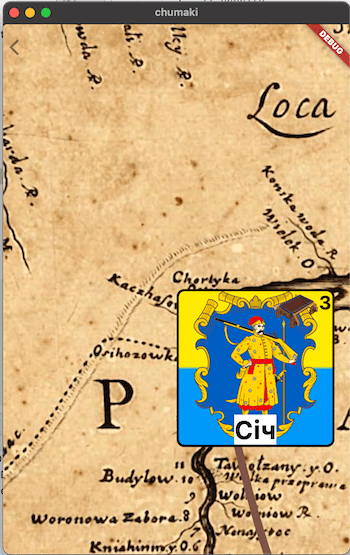

In my 4th game in the [Loca Deserta Game Universe](http://locadeserta.com/index_en.html) I am using [InteractiveViewer](https://api.flutter.dev/flutter/widgets/InteractiveViewer-class.html) widget in order to implement a map. It allows me to pan, zoom in/out, basically everything you expect from the map in a game:


When the game starts I want to animate fly-over the map from the end to the start and focus it on the very first city on the map. Also I want to fly to the given city on the map when user select its. All this with an animation.

So, let's do it.

--- 
# Getting started with InteractiveViewer

It is pretty easy to use InteractiveViewer when you just need to allow user to pan and zoom your widget. But how can you control it programmatically?

Reading the official InteractiveViewer docs you can see it has a [transformationController](https://api.flutter.dev/flutter/widgets/InteractiveViewer/transformationController.html) property.

This doc file has awesome info about using TransformationController in order to animate some changes (but on 30th of April 2021 the example there does not work :) ). In order to modify the viewport of the interactive viewer we need to set **value** property. Via the ValueNotifier the controller will update the InteractiveViewer and the viewport is adjusted.

Add controller property to our StatefulWidget:

```
TransformationController _transformationController =
TransformationController();
```

By setting the property value to some Matrix4 object we can control the viewport of the widget:

```
_transformationController.value = Matrix4.identity()..translate(x, y);
```

If you set it and call the setState, it will move the viewport to the given coordinates X, Y. But the zooming will be not done. You just move existing viewport frame from one coordinates to the others.

---
# Adding Animations

Now we animate this **value** via the AnimationController.

Add AnimationController and Animation to the ViewState properties:

```
late AnimationController _animationController;
late Animation<Matrix4> _mapAnimation;
```

And declare animations with listeners in **initState** method:

```
@override
void initState() {
var start = Matrix4.identity()..translate(0, 0);
var end = Matrix4.identity()..translate(500, 500);
_animationController =
AnimationController(duration: Duration(seconds: 5), vsync: this);
_mapAnimation =
Matrix4Tween(begin: start, end: end).animate(_animationController);
_mapAnimation.addListener(() {
setState(() {
_transformationController.value = Matrix4.inverted(_mapAnimation.value);
});
});
_animationController.forward();
super.initState();
}
```

In this method we animate using  [Matrix4Tween](https://api.flutter.dev/flutter/widgets/Matrix4Tween-class.html) by providing **begin** and **end**  Matrix4 values. You can construct manually that Matrix4 by providing 16(4x4 matrix) values to the constructor but it is better to use Matrix4.identity constructor and then call translate method. It will automatically calculate correct matrix values for the given coordinates.

Pay attention that you have to use Matrix4.inverted when assigning the value to the controller. Why? Say you pan the InteractiveViewer, the finger moves from left to right, but the map under the finger actually moves in the opposite direction. If you do not use Matrix4.inverted and assign directly then do not forget to provide negative values to the begin and end matrixes.

At the end of method we start the animation.

That's it, now you know how to set transformation to move InteractiveViewer to the given point.

---
# Bonus: Move to the specific point and center it on the screen.

The values you pass to the **Matrix.identity..translate()** describe the top left position of the viewport. But this is not very useful as a user expects  the target point to be in the center of the screen.

In my game all spots on the maps are cities with the coordinates. I also know the size of the city avatar in pixels.

So, in order to correctly animate InteractiveViewer to the given city I have to calculate shifted coordinates by the following rule:

1. Find shift needed to position viewport in the middle of the real devices. For this we use MediaQuery.of call.
2. Read city coordinates.
3. Substract center coordinates from the city point.
4. Now we need to adjust the City Avatar widget sizes in order to nicely position it in its very center. So we have to read city size and divide it by 2 in order to get the center point.

This is how the InteractiveViewer will show the City on the map without steps 3 & 4:


This is how the InteractiveViewer positions viewport if step #4 is omitted (we do not adjust shift values to widget dimensions):



And this is a drawn schema of 4 step logic:


*Pay attention, again, that if you want to 'move' viewer bottom and right you would want to increase x, y coordinates but you have to remember, that we invert these values (the canvas moves in opossite direction). So instead of adding shift you have to subtract it. If you want the viewer to move up and left, then you have to add shift values.*

```
Point<double> calculateCenterPoint() {
final width = widget.screenSize.width;
final height = widget.screenSize.height;
final sichPoint = Sich().point;
// shift values to center Widget's top left point in the center of smartphone
final middleX = width / 2;
final middleY = height / 2;
return Point<double>(
sichPoint.x - middleX + Sich().size * CITY_SIZE / 2, // adjusting center point again but relative to City Avatar
sichPoint.y - middleY + Sich().size * CITY_SIZE / 2,  // adjusting center point again but relative to City Avatar
);
}
```

Final result. The City Avatar is positioned just like the player expects: center of the avatar is in the center of the view:


---

# And here it is in action in my game map:


