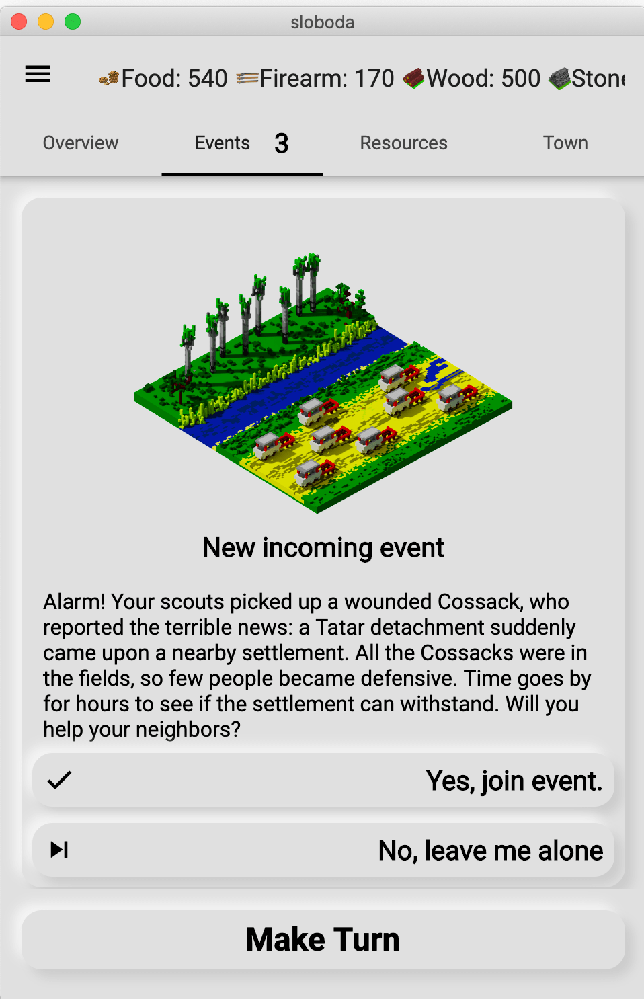
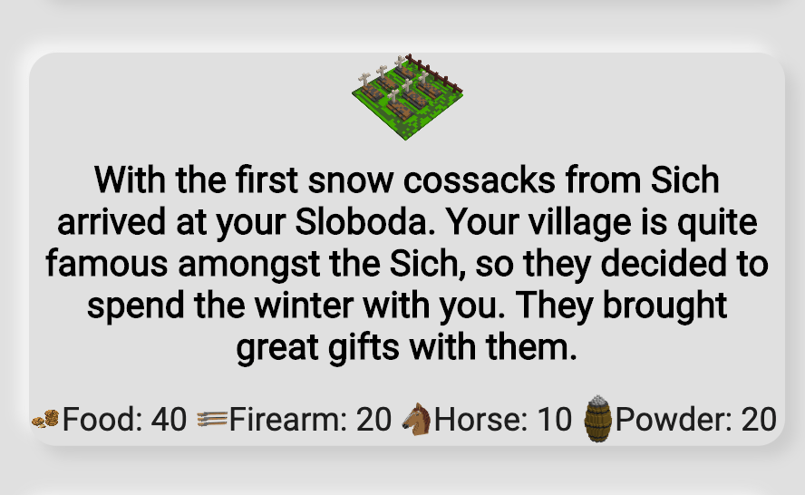
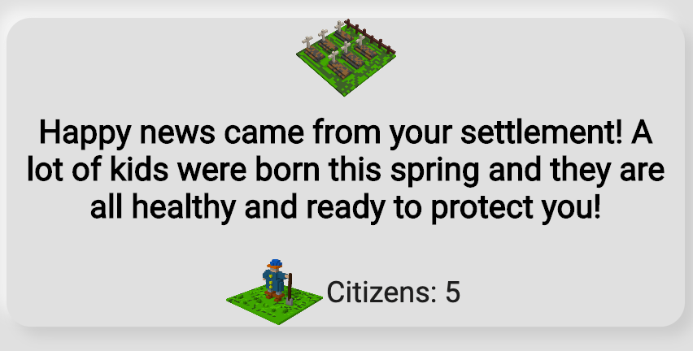
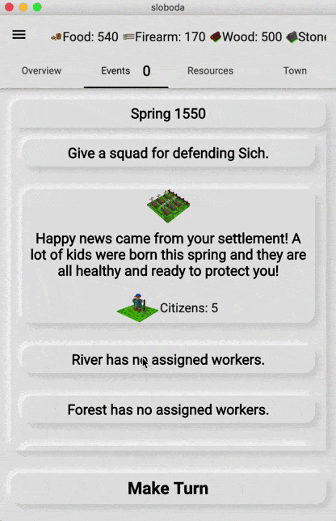
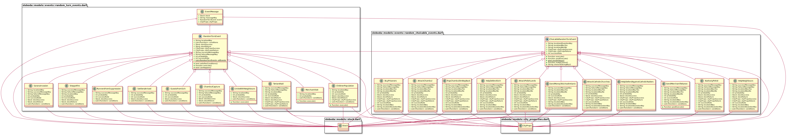

*Instead of writing another state/todo/counter/animation I decided to create some real-world content related to Dart&Flutter: Event System in my turn-based city building game **Sloboda**.*

*Sloboda translates from Ukrainian as a settlement of free people*

During development of turn-based [game in citybuilding genre](https://locadeserta.com/sloboda), I got the requirement to add Random Events. This should make game more unpredictable and each user, depending on his City, can get different gaming experience. Say, your city has a lot of gold and men. Nice target for  [Tartar Raids](https://en.wikipedia.org/wiki/Crimean_Tatars)! Is your city popular in the area and also has a Church? Nice place for refugees from the occupied by Poland Ukrainian lands! Also, in order to make events even more unpredictable, I decided to add random chance of occurrence. Say, steppe fire can occur with the 20% chance in summer. Or you can with a 10% chance find a herd of wild steppe horses.

Additional difficulties are introduced with interactive events. Some of them require player's decision. Player can agree to take part in the event. Also there can be events that either occur or not (steppe fire). Every choice can alter the City in a good or bad ways. Steppe fire can destroy buildings. Military raid to Crimea can be successful (you gain resources) or a complete failure (you lose army and resources).

If player can make a choice, then such event is Choicable. In all other cases it is just a random event.

Example of the Choicable event in UI:



Example of a Random Event:



To add even more unpredictness to the game, event can result in success or failure as well. For example:  [locust invasion](https://en.wikipedia.org/wiki/Locust) , if successful, results in resource loss. If failed, you can catch some wild horses, who have nothing to eat and came to your settlement. The success/fail rate is configurable as well.

Example of the successful event:



## Lets summarise requirements for the Event System:

1. Event can be Choicable or normal.
2. Event has a random chance of occurrence.
3. Event can occur only if some factors are satisfied. It can depend on season, city properties, population level or depend on previous events as well.
4. Each event (choicable and normal) has a random chance of success.
5. Choicable event, if activated by user, has another random chance of success.
6. Each event (choicable and normal), can affect the settlement (get/lose resources).
7.  Events consequences can be applied immediately or on next turn.
8. Events must inform player about success, failure, end of the event. All messages must be localized.

# Implementation

For now, the game has only two types of events: RandomTurnEvent and ChoicableRandomTurnEvent. The first class is responsible for normal events, the later gives player a choice to activate itself.

The following abstract class completely describes requirements:

```dart
abstract class RandomTurnEvent {
  // key to localization
  String localizedKey;

  // list of functions that check conditions of the event trigger
  List<Function> conditions;

  // contains a list of resources in case of success
  Stock stockSuccess;

  // contains a list of resources in case of failure
  Stock stockFailure;

  // image for success
  String successIconPath = "images/events/success_event.png";

  // image for failure
  String failureIconPath = "images/events/failed_event.png";

  // contains a list of city properties changes in case of success
  CityProps cityPropsSuccess;

  // contains a list of city properties changes in case of failure
  CityProps cityPropsFailure;

  // keys to the localized strings
  String successMessageKey;
  String failureMessageKey;

  // probability of event activation. From 0 to 100.
  int probability = 0;

  // probability of even success. From 0 to 100.
  int successRate = 0;
}
```

Add couple methods to the class.

- Check the conditions to trigger the event:
```dart
  bool satisfiesConditions(Sloboda city) {
    for (var func in conditions) {
      if (!func(city)) {
        return false;
      }
    }
    return true;
  }
```
- Checks the randomness and conditions whether the event can be triggered.
```dart
  bool canHappen(Sloboda city) {
    bool canHappen =
        Random().nextInt(100) < probability && satisfiesConditions(city);
    debugPrint(
        'Event: $localizedKey satisfies: ${satisfiesConditions(city)}, will happen: $canHappen');
    return canHappen;
  }
```
- Execute event if everything was satisfied

```dart
  Function execute(Sloboda city) {
    var r = Random().nextInt(100);
    return () {
      bool success = r <= successRate;
      return EventMessage(
          event: this,
          stock: success ? stockSuccess : stockFailure,
          cityProps: success ? cityPropsSuccess : cityPropsFailure,
          imagePath: success ? successIconPath : failureIconPath,
          messageKey:
              success ? this.successMessageKey : this.failureMessageKey);
    };
  }
```

Function execute returns another function. This will be described later :)

With a help of just three methods and dozens of class properties we completely implemented Random Event without choice.

Example of how this abstract class can be used to create real instances.

```dart
class SaranaInvasion extends RandomTurnEvent {
  String localizedKey = 'randomTurnEvent.saranaInvasion';
  String successMessageKey = 'randomTurnEvent.successSaranaInvasion';
  String failureMessageKey = 'randomTurnEvent.failureSaranaInvasion';
  int probability = 50;
  int successRate = 40;

  Stock stockSuccess = Stock(
    values: {
      RESOURCE_TYPES.FOOD: -50,
      RESOURCE_TYPES.HORSE: -10,
    },
  );

  Stock stockFailure = Stock();

  List<Function> conditions = [
    (Sloboda city) {
      return city.currentSeason is SpringSeason;
    },
  ];
}

```

The described new event class has only one condition: the current season is Spring. With the random rate 50% Locust will attack settlement. And with the random rate 40% the attack will be successful.

To create more events we just need to extend the RandomTurnEvent, fill the properties and the event is ready!

More sophisticated example of event conditions:

```dart
List<Function> conditions = [
    (Sloboda city) {
      return city.currentSeason is AutumnSeason;
    },
    (Sloboda city) {
      return city.props.getByType(CITY_PROPERTIES.GLORY) > 20;
    },
    (Sloboda city) {
      try {
        city.cityBuildings.firstWhere((element) => element is Church);
        return true;
      } catch (e) {
        return false;
      }
    }
  ];
```

The conditions are following: settlement has a built Church, glory level is higher than 20 and the season is Autumn. If everything is satisfied then the event will be triggered.

# Random Choicable Events that requires player input

By using the power of OOP, we can reuse the whole class RandomTurnEvent and add only methods and properties that are related to the choice.

Only three new properties are needed.

```dart
abstract class ChoicableRandomTurnEvent extends RandomTurnEvent {
  String localizedQuestionKey;
  String localizedKeyYes;
  String localizedKeyNo;

```
They are used to show different messages to the player: question, texts in case user agrees or disagrees.

One of the features of turn based game is that an action performed by player in current turn takes effect only in next turns. For example: you sent a raid to enemy. The result of such raid cannot be determined immediately, as it takes time to perform a raid. And the result is applied only on the next game turn.

For this, we will add new method **postExecute**. It will be a connection between current and the next game turns:

```dart
 Function postExecute(Sloboda city) {
    var r = Random().nextInt(100);
    return () {
      bool success = r <= successRate;
      return EventMessage(
          event: this,
          stock: success ? stockSuccess : stockFailure,
          cityProps: success ? cityPropsSuccess : cityPropsFailure,
          messageKey:
              success ? this.successMessageKey : this.failureMessageKey);
    };
  }
```
Method returns a function. It will be executed when the next game turn is performed.

The player (or more precisely, **EventsWidget** in Flutter) interacts with such method:

```dart
  Function makeChoice(bool yes, Sloboda city) {
    if (yes) {
      return this.postExecute(city);
    } else {
      return () {};
    }
  }
```

This method is called directly by the Flutter Widget when the user selects option in the dialog. If the user agreed to perform event, then it (a reference to function) will be queued. This function is executed on next turn, when the event must affect the Settlement.

**Sloboda** class contains all event handlers, resource and property management API.

- Player's decision handler
```dart
  void runChoicableEventResult(ChoicableRandomTurnEvent event) {
    Function f = event.makeChoice(true, this);
    _nextRandomEvents.add(f);
  }
```

- When the next game turn is performed, then the saved functions are executed at the beginning:

```dart
 void _runAttachedEvents() {
    for (var _event in _nextRandomEvents) {
      EventMessage event = _event(); // result of the Event
      this.stock + event.stock;
      this.addProps(event.cityProps);
    ....
```

## Example of an Event with Choice

```dart
class BuyPrisoners extends ChoicableRandomTurnEvent {
  String successMessageKey = 'randomTurnEvent.successBuyPrisoners';
  String failureMessageKey = 'randomTurnEvent.failureBuyPrisoners';
  String localizedKeyYes = 'randomTurnEvent.BuyPrisonersYes';
  String localizedKeyNo = 'randomTurnEvent.BuyPrisonersNo';

  int probability = 100;

  Stock stockSuccess = Stock(values: {
    RESOURCE_TYPES.MONEY: -40,
  });

  Stock stockFailure = Stock(values: {
    RESOURCE_TYPES.MONEY: 20,
  });

  CityProps cityPropsFailure = CityProps(
    values: {
      CITY_PROPERTIES.GLORY: 10,
      CITY_PROPERTIES.CITIZENS: 15,
      CITY_PROPERTIES.FAITH: 10,
    },
  );
  CityProps cityPropsSuccess = CityProps(
    values: {
      CITY_PROPERTIES.CITIZENS: 5,
    },
  );

  int successRate = 30;

  String localizedKey = 'randomTurnEvent.BuyPrisoners';
  String localizedQuestionKey = 'randomTurnEvent.BuyPrisonersQuestion';

  List<Function> conditions = [
    (Sloboda city) {
      return city.currentSeason is AutumnSeason;
    },
    (Sloboda city) {
      return city.stock.getByType(RESOURCE_TYPES.MONEY) > 40;
    },
    (Sloboda city) {
      return ChoicableRandomTurnEvent.onceInYears<BuyPrisoners>(city, 3);
    }
  ];
}
```

# Launching Events

**Sloboda** class has the event queue:

```dart
  final Queue<RandomTurnEvent> pendingNextEvents = Queue();
```
During each turn, Sloboda generates next events and takes first three from the list.

```dart
  _queueNextEvents() {
    List<RandomTurnEvent> choicableEvents =
        getChoicableRandomEvents().take(3).toList();
    pendingNextEvents.addAll(choicableEvents);
  }
```

The same queue is used in widget that shows dialog to the player:

```dart
 Widget build(BuildContext context) {
    final city = InheritedCity.of(context).city;
    final Queue<RandomTurnEvent> pendingEvents = city.pendingNextEvents;
    return Column(
      children: <Widget>[
        if (pendingEvents.isNotEmpty)
          Expanded(
            flex: 3,
            child: PendingEventsView(
              events: pendingEvents,
            ),
          ),
```

When the player makes choice, then appropriate instance of the event is added to the **EventsLog** with the player's decision:

```dart
  void addChoicableEventWithAnswer(bool yes, ChoicableRandomTurnEvent event) {
    events.add(
      CityEvent(
        season: currentSeason.previous,
        yearHappened:
            currentSeason is WinterSeason ? currentYear - 1 : currentYear,
        sourceEvent: EventMessage(
          stock: null,
          event: event,
          messageKey: event.choiceToStringKey(yes),
        ),
      ),
    );

    if (yes) {
      runChoicableEventResult(event);
    }

    pendingNextEvents.remove(event);

    _innerChanges.add(this);
  }
```

### Registry of all Events
Unfortunately, **Dart** has no way to tell developer what are the subclasses of a class, like it is done in **Smalltalk**. That is why each new event class is added to static list of possible events:

```dart
static List<RandomTurnEvent> allEvents = [
    KoshoviyPohid(),
    TartarsRaid(),
    SaranaInvasion(),
    ChildrenPopulation(),
    SteppeFire(),
    RunnersFromSuppression(),
    SettlersArrived(),
    GuestsFromSich(),
    ChambulCapture(),
    MerchantVisit(),
    UniteWithNeighbours(),
    HelpNeighbours(),
    BuyPrisoners(),
    AttackChambul(),
    TrapChambulOnWayBack(),
    HelpDefendSich(),
    SendMoneyToSchoolInKaniv(),
    SendMerchantToKanev(),
    AttackCatholicChurches(),
    HelpDefendAgainstCatholicRaiders(),
  ];
```

# Demo:



# UML of Event related classes



# Summary

Designed classes are very agile. Each event can specify its own conditions, affect on settlement. For example, MerchantVisit class has its own implementation of **postExecute** method. It has to calculate amount of fish and fur and trade it for gold:

```dart
Function postExecute(Sloboda city) {
    var r = Random().nextInt(100);
    return () {
      bool success = r <= successRate;
      var furTotal = city.stock.getByType(RESOURCE_TYPES.FUR);
      var fishTotal = city.stock.getByType(RESOURCE_TYPES.FISH);
      var stock = Stock(values: {
        RESOURCE_TYPES.FUR: -furTotal,
        RESOURCE_TYPES.FISH: -fishTotal,
      });

      if (success) {
        stock.addToType(RESOURCE_TYPES.MONEY, (furTotal + fishTotal) * 2);
      }
      return EventMessage(
          event: this,
          stock: stock,
          cityProps: null,
          messageKey:
              success ? this.successMessageKey : this.failureMessageKey);
    };
  }
```

And the main thing. From **Flutter** Widget point of view it does not matter what type of event should be shown to user:

```dart
// Somewhere above is Column :)
 ..._events[key].reversed.map((event) {
var textStyle;
if (city.currentSeason.isNextTo(event.season)) {
  textStyle = Theme.of(context).textTheme.headline6;
}
return Padding(
    padding: const EdgeInsets.all(8.0),
    child: SoftContainer(
      child: Column(
       children: <Widget>[
          if (event.sourceEvent.imagePath != null)
            Image.asset(
              event.sourceEvent.imagePath,
              width: 64,
            ),
          FullWidth(
            child: Text(
              SlobodaLocalizations.getForKey(
                  event.sourceEvent.messageKey),
              textAlign: TextAlign.center,
              style: textStyle,
            ),
          ),
          if (event.sourceEvent.stock != null)
            StockMiniView(
              stock: event.sourceEvent.stock,
              stockSimulation: null,
            ),
          if (event.sourceEvent.cityProps != null)
            CityPropsMiniView(
              props: event.sourceEvent.cityProps,
            ),
        ],
      ),
    ));
}).toList()
```

# So, play it online at https://locadeserta.com/sloboda or read my interactive stories: https://locadeserta.com

# The game is developed in public: https://github.com/gladimdim/sloboda/

There are releases available for macOS, Windows, Android: https://github.com/gladimdim/sloboda/releases