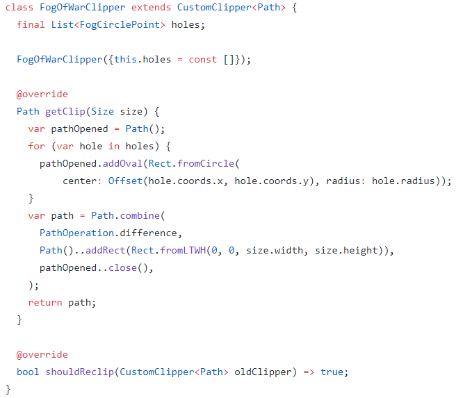

# Introduction

In this article I will show how to use CustomClipper widget in order to implement Fog of War for the map.

The next version of my [city building game](https://locadeserta.com/sloboda/) will include a map. On it you have to capture different houses, spots, resources. But the game limits your vision by applying [Fog of War](https://en.wikipedia.org/wiki/Fog_of_war).

It looks like this:


Only small part of the map is interactive. You cannot tap on a 'grey' area of the map as the player has not yet opened it.

# Requirements
- uncovered parts of map should not be interactive
- spots on map define if they open map and what is the radius of the 'hole'
- hidden parts of map should have a black and white color
- each point on map, once captured, cuts new 'holes' in the fog of war
- should perform well
- should work with  [InteractiveViewer](https://api.flutter.dev/flutter/widgets/InteractiveViewer-class.html)  widget

# Break the solution into layers

The map without the fog of war is a Stack widget that has houses. All these houses are interactive: player can select them and do some  actions:


If we apply Fog of War, then each occupied house should clear fog of war in a given radius AND widgets inside this hole must be tappable!


# First implementation

First naive implementation is to use a  [Stack](https://api.flutter.dev/flutter/widgets/Stack-class.html)  widget. The first child is a interactive map, then next children are Containers with white color as a background.

Stack applies following logic: if two widgets overlap then the last child specified in children list is rendered on top of all the previous. Once we know it we can write something like this:

```
Stack(
  children: [
     buildMap(),
     generateGrid(),
  ]
)
```

**generateGrid** creates a Container with background transparent color:


The 'holes' in the grid are quite simple: if the cell of the grid touches with at least one corner the opened spot then it should not be drawn. In this way we just don't render cells:


The formula used to determine whether the corner of a cell is inside the given circle is a Pythagoras Theorem :)

The map looks like this:


To make it more antialiased we can reduce the size of the cell but this will lead to even more cells to be drawn.

Pros of this method:
- straightforward code
- easy to understand
- good if you want 'squarish' design

Cons:
- bad performance. Flutter has to recalculate all the cells each time build is called.
- squarish design
- strange black lines on edges of the cells

Actually the performance was so bad that even my Snapdragon 865 on Galaxy Tab S7 could not handle scrolling on that map. Say you wanted to have 100 cells of fog of war per row. This leads to total number 100*100 = 10000 widgets...

# Another way of doing it

We can also use ColorFiltered widget in order to make some parts of the Fog of War widget invisible but it does not satisfy our need: the player should be able to tap on the controls located under the hole. With ColoredFilter it is not possible as the fog of war widget still occupies the hole and the events don't go through (IgnorePointer widget will also not help here). More about this you can read at this StackOverflow question:  [Create Widget with hole inside](https://stackoverflow.com/questions/60357361/create-widget-with-transparent-hole-inside) .

# The best way of doing it

The best way is to use [CustomClipper](https://api.flutter.dev/flutter/rendering/CustomClipper-class.html) widget. It allows to draw the shape of the widget of any form, even with REAL holes inside itself!

The initial solution was taken and adjusted from this article: [How to cut a hole in an overlay](https://www.flutterclutter.dev/flutter/tutorials/how-to-cut-a-hole-in-an-overlay/2020/510/). You can read this article in order to understand how CustomClipper works. TLDR: it does not render itself in areas where two shapes overlap (this leads us to a bad issue which is solved at the bottom :) ).

Here is an adjusted solution for game's needs.


The CustomClipper accepts list of Spots on the map. Then draws ovals at the spot locations and creates holes via

```
path.fillType = PathFillType.evenOdd;
```

But what happens if two circles overlap each other? Then the evenOdd logic will not work as we now have three shapes overlapping each other. This leads to such funny issues:


# The best CORRECT way of doing it

The solution to the bug is to use a little bit different approach. Instead of relying on evenOdd fill type it is better to have two shapes:

- huge rectangle area that covers the whole widget
- a single shape with all the circles (opened parts of the map)

Then we **combine** two paths with the **difference** algorithm:



And now the game renders holes in the fog of war correctly:
