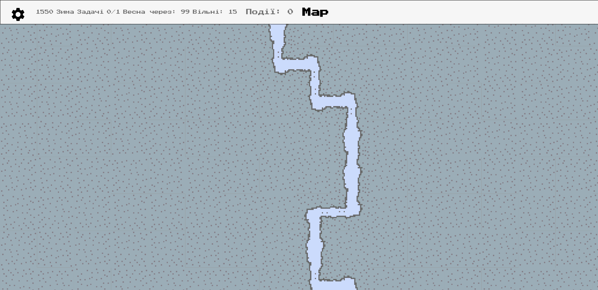
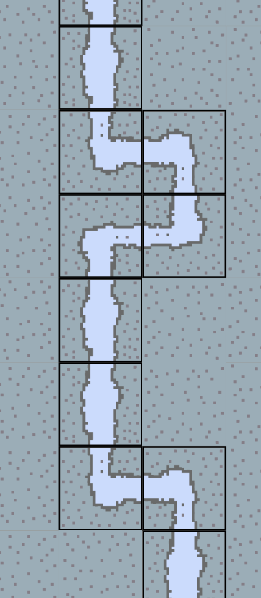

# Introduction

In this article I will show you how you can use **OOP **and **LinkedList **to generate 2D Map with terrain details in Dart and Flutter.

The map feature is intended to be included in my city building game  [Loca Deserta: Sloboda](https://locadeserta.com/sloboda).

In part 1 we will implement map generation logic with two terrain types: Grass and River.

# Final result
Generated map looks like this:



As you see, the river can flow left and right and its main current is from top to bottom of the map. You can read later about this specific logic.

# Implementation

## Generate empty map

Let's start from the very beginning: generating empty map with given size.

The main class will contain several properties. The constructor accepts two values: width and height of the map. Pay attention that width is a column count and height is the row count.

```
class WorldMap {
  final int width;
  final int height;
  List<List<String>> tiles;
  WorldMap({this.width = 20, this.height = 20}) {
    _generate();
  }
}
```

### Fill with dummy data
The constructor will auto call the **_generate **method that will prepare for us the needed data structures. Our main structure will be a two dimension array that contains Strings. We will code grass as "G" and river as "R" for now.

```
void _generate() {
    tiles = List();
    for (var i = 0; i < height; i++) {
        tiles.add(List.filled(width, " G"));
    }
  }
```

The space was added for better readability of the rendered grid. Add **toString() **method to print the **WorldMap** in a readable manner:

```
  String toString() {
    String result = "";

    for (var i = 0; i < height; i++) {
      for (var j = 0; j < width; j++) {
        result = result + tiles[i][j].toString();
      }
      result = result + "\n";
    }
    return result;
  }
```

Now run the code and see how it prints:

```
void main() {
  var map = WorldMap(width: 10, height: 10);
  print(map.toString());
}
```
Result:

```
 G G G G G G G G G G
 G G G G G G G G G G
 G G G G G G G G G G
 G G G G G G G G G G
 G G G G G G G G G G
 G G G G G G G G G G
 G G G G G G G G G G
 G G G G G G G G G G
 G G G G G G G G G G
 G G G G G G G G G G
```

### Add river

The world map is filled with grass tiles. Adding river can be done after that. There are certain rules that needs to be followed when generating river:

- river always starts from top
- river always flows to bottom
- river cannot stop at left/right edge
- if river reaches left/right edges it flows down
- river flows only to nearby tile that touches the river. It does not flow diagonally
- river does not start at the corners or near the edges. It must start near the middle of the top edge.

The code that generates the **River **with given above specs.
```
 void addRiver() {
    // encode as letter R
    var river = " R";
    // starting point is 20-80% part of the width.
    var point = width ~/ 5 + Random().nextInt(width - 5);
    if (point > width) {
      point = width; 
    }
    // initiate starting point
    tiles[0][point] = river;
    var i = 0;
    var last = point;
    // main cycle goes from top to down
    while (i < height - 1) {
      var decision = flowTo();
      // 0 means flow down
      if (decision == 0) {
        tiles[++i][last] = river;
        continue;
      }
      // shift -1 means flow left, +1 - right
      // add shift to the last point to move the river
      var shift = decision + last;
      // check edge cases
      if (shift < 0) {
        shift = 0;
      }
      if (shift > width) {
        shift = width;
      }
      // encode Grass tile as River
      tiles[i][shift] = river;
      // remember last position
      last = shift;
    }
  }
```

Method **flowTo** randomly picks direction for river. You can change this function to make rivers flow in a given direction. For now all direction are equal, but later I will modify this method to make rivers flow in almost straight line.

```
 int flowTo() {
    var next = Random().nextInt(3);
    if (next == 0) {
      return -1; // left
    } else if (next == 1) {
      return 0; // down
    } else {
      return 1; // right
    }
  }
```

Add call to **addRiver** and run the code:

```
void main() {
  var map = WorldMap(width: 10, height: 10);
  map.addRiver();
  print(map.toString());
}
```

Result:

```
 G G G G G R R G G G
 G G G G G R R G G G
 G G G G R R R G G G
 G G G G R R R R R G
 G G G G G G G G R G
 G G G G R R R R R R
 G G G R R G G G G G
 G G R R G G G G G G
 G R R G G G G G G G
 G R G G G G G G G G
```

## Using OOP features

Currently our tiles are encoded with letters. This is easy to do but does not have any flexibility. To draw the turns of the river we must know in and out direction for each tile. We could create another structure that map to the original world map with this data but it could de-sync and would require a lot of FP madness to implement.

Instead we will use good old OOP.

Each tile we will be an instance of class MapTile:

```
class MapTile extends LinkedListEntry<MapTile> {
  final int x;
  final int y;

  MAP_TILE_TYPES type;

  MapTile({this.x, this.y});
}
```

Tiles know their coordinates and their type:

```
enum MAP_TILE_TYPES { RIVER, GRASS }
```

We could just subclass **MapTile** and omit **MAP_TILE_TYPES** type property. This would be perfectly fine. But as we are making it a part of the game we need to serialize/deserialize in order to save and restore the map. And this type will be used to determine which class to use to represent serialized structure. More about this in next article.

**GrassMapTile**:

```
class GrassMapTile extends MapTile {
  final int x;
  final int y;
  MAP_TILE_TYPES type = MAP_TILE_TYPES.GRASS;

  String toString() {
    return " G";
  }

  GrassMapTile({this.x, this.y}) : super(x: x, y: y);
}
```

**RiverMapTile**:

```
class RiverMapTile extends MapTile {
  final int x;
  final int y;

  MAP_TILE_TYPES type = MAP_TILE_TYPES.RIVER;

  String toString() {
    return " R";
  }

  RiverMapTile({this.x, this.y}) : super(x: x, y: y);
}
```

Modify the original WorldMap class to have **List** of **MapTiles** and add river property:

```
class WorldMap {
  final int width;
  final int height;
  List<List<MapTile>> tiles;
  LinkedList<MapTile> river;

  WorldMap({this.width = 20, this.height = 20}) {
    _generate();
  }
}
```

**River** is an instance of **LinkedList** because it naturally describes how the river functions: it flows from top to bottom. Each river tile knows where it flows next. With this structure we can easily iterate only through the River tiles without the need to process the whole MxN grid.

## The main challenge of connecting River tiles
The Grass tiles do not need to be adjusted to nearby cells as grass does not care what is near it.

But it is not so with River tile. Check the following example. To render the river turns to left and right, or from left/right to bottom each tiles needs to know input and output direction:



To implement such behavior we need to add two more properties to **MapTile**:

```
enum FLOW_DIRECTION_TYPES { UP, BOTTOM, DOWN, LEFT, RIGHT }

class MapTile extends LinkedListEntry<MapTile> {
  FLOW_DIRECTION_TYPES inDirection;
  FLOW_DIRECTION_TYPES outDirection;
}
```

During the render process each tile will know what exact picture to take in order to correctly join all river tiles.

### Initializing direction and enhanced River algorithm

Now comes the most difficult part. There is a lot of code so everything is commented:

```
void addRiver() {
    // initial offset left-right to start the river from the middle points.
    var offset = width ~/ 5;
    var point = offset + Random().nextInt(width - offset);
    if (point > width) {
      point = width;
    }
    // river LinkedList is initialized empty, all tiles are added later.
    river = LinkedList<MapTile>();

    // First point of the river is always in the first row and it always flow Up -> Down
    tiles[0][point] = RiverMapTile(x: 0, y: point)
      ..inDirection = FLOW_DIRECTION_TYPES.UP
      ..outDirection = FLOW_DIRECTION_TYPES.DOWN;
    // the linked list is started!
    river.add(tiles[0][point]);
    var i = 0;

    // River goes from first row to last. All rows must be filled with at least 1 River tile.
    while (i < height - 1) {
      // make a decision where should next River Tile flow
      var decision = leftDownRight();

      // calculate position for next River Tile
      var nextPoint = decision + point;
      // catch edge cases when we went out of grid range
      if (nextPoint < 0) {
        point = 0;
      }
      if (nextPoint >= width) {
        nextPoint = width - 1;
      }
      if (nextPoint < 0) {
        nextPoint = 0;
      }
      /**
       * There could be a case when river flows:
       * Left -> Left -> Right -> Right -> Right.
       * As you see it flows to a tile already occupied by River.
       * In this If statement we catch such random occasion and
       * force river to just flow down.
       */
      if (tiles[i][nextPoint].type == MAP_TILE_TYPES.RIVER) {
        // move river to next row
        i++;
        // tell previous river tile to flow down
        river.last.outDirection = FLOW_DIRECTION_TYPES.DOWN;
        // next river tile input direction will be UP
        // but here I used antiType to make it more abstract
        tiles[i][point] = RiverMapTile(x: i, y: point)
          ..inDirection = antiType(river.last.outDirection);
        // add river tile to LinkedList. Now it is the last tile.
        river.add(tiles[i][point]);
        continue;
      }
      point = nextPoint;
      tiles[i][point] = RiverMapTile(x: i, y: point);
      FLOW_DIRECTION_TYPES out;
      /**
       * Based on decision set out direction to correct enum value
       * There are if i == 1 checks. This is needed in order to
       * correct the very first river tile. It is not processed in the main loop
       * as it is an edge case so we have to do it manually.
       */
      if (decision < 0) {
        out = FLOW_DIRECTION_TYPES.LEFT;
        if (i == 1) {
          river.last.outDirection = FLOW_DIRECTION_TYPES.RIGHT;
        }
      } else if (decision == 1) {
        out = FLOW_DIRECTION_TYPES.RIGHT;
        if (i == 1) {
          river.last.outDirection = FLOW_DIRECTION_TYPES.LEFT;
        }
      } else if (decision == 0) {
        out = FLOW_DIRECTION_TYPES.DOWN;
        if (i == 1) {
          river.last.outDirection = FLOW_DIRECTION_TYPES.DOWN;
        }
      }
      // tell the previous river tile how it connects to next tile
      river.last.outDirection = out;
      // The in direction of next tile is always an antiType of out direction of previous tile.
      tiles[i][point].inDirection = antiType(river.last.outDirection);

      river.add(tiles[i][point]);
    }

    // the very last river tile always goes down
    river.last.outDirection = FLOW_DIRECTION_TYPES.DOWN;
  }
```

Decision making algorithm is also improved. It gives more probability for DOWN decision (as rivers naturally flow down):

```
  int leftDownRight() {
    var next = Random().nextInt(100);
    if (next < 60) {
      return 0;
    } else if (next < 80) {
      return -1;
    } else {
      return 1;
    }
  }
```

### Render as widget

The data structure is ready. Now we need to render it as a widget.

We wrap **Stack** widget with two SingleChildScrollViews in order to have an ability to scroll in both directions.

```
Widget build(BuildContext context) {
    return SingleChildScrollView(
      scrollDirection: Axis.horizontal,
      child: SingleChildScrollView(
        scrollDirection: Axis.vertical,
        child: Stack(
          children: [
            SizedBox(
              width: widget.tileSize * widget.map.width,
              height: widget.tileSize * widget.map.height,
            ),
            ...mapToTiles(widget.map),
          ],
        ),
      ),
    );
  }
```

The first child of **Stack** is a **SizedBox** with the width and height that will match the size of the whole Grid. This empty widget is needed in order to expand **Stack** widget to the needed size values (**Stack** widget takes the size of the largest child).

**mapToTiles** method call iterates over all MapTiles and wraps result of **toWidgetTile** call into **Positioned** widget:

```
 List<Widget> mapToTiles(WorldMap map) {
    List<Widget> widgets = [];
    for (var row = 0; row < map.height; row++) {
      num top = row * widget.tileSize;
      for (var col = 0; col < map.width; col++) {
        var left = col * widget.tileSize;
        var child = Positioned(
          top: top,
          left: left,
          child: SizedBox(
            width: widget.tileSize,
            height: widget.tileSize,
            child: Container(
              child: map.tiles[row][col].toWidgetTile(),
            ),
          ),
        );
        widgets.add(child);
      }
    }
    return widgets;
  }
```

#### Render GrassMapTile

GrassMapTile defines toWidgetTile method like this:

```
  Widget toWidgetTile() {
    return RotatedBox(
      quarterTurns: randomRotation(),
      child: Image.asset(
        "images/background/map/grass_tile.png",
        fit: BoxFit.fitWidth,
      ),
    );
  }
```

#### Render RiverMapTile

Rendering river is more sophisticated. We need to pay attention to **in** and **out** direction properties of each **RiverMapTile**.

To render river that flows from Up to Bottom is simple: we just add a  [Image.asset](https://api.flutter.dev/flutter/widgets/Image/Image.asset.html) widget with appropriate image.

But how to render river that flows from left to right? Easy! Just rotate the up-to-bottom image sprite by 90 degrees.

There is special widget calle [RotatedBox](https://api.flutter.dev/flutter/widgets/RotatedBox-class.html) for just making it possible.

The same trick is done for river angles. We have only one sprite for angled river. All other sprites reuse the same image but with different **RotatedBox** rotations.

```
 Widget toWidgetTile() {
    var rotate = 0;
    var image = "images/background/map/river_tile.png";
    if (inDirection == FLOW_DIRECTION_TYPES.UP &&
        outDirection == FLOW_DIRECTION_TYPES.BOTTOM) {
      rotate = 0;
      image = "images/background/map/river_tile.png";
    }
    if (inDirection == FLOW_DIRECTION_TYPES.UP &&
        outDirection == FLOW_DIRECTION_TYPES.LEFT) {
      rotate = 0;
      image = "images/background/map/river_angle.png";
    }
    if (inDirection == FLOW_DIRECTION_TYPES.RIGHT &&
        outDirection == FLOW_DIRECTION_TYPES.LEFT) {
      rotate = 1;
      image = "images/background/map/river_tile.png";
    }

    // ...a lot of other cases... //

    return Container(
      decoration: BoxDecoration(
        border: Border.all(
          color: Colors.black,
          width: 1.0,
        ),
      ),
      child: RotatedBox(
        quarterTurns: rotate,
        child: Image.asset(
          image,
          fit: BoxFit.fitWidth,
        ),
      ),
    );
```

# Final result
Generated map looks like this:


# Summary

We used a grid to represent a map structure. For river we used **LinkedList** as it maps one to one to the river in physical world (a directed flow). Each tile knows how to render itself as a widget. We don't have to create a separate Widget class that renders input data. Instead we used input data to render itself. This is very different from what is told to you by FP folks. But, as for me, when I have an object that represents a map tile, it makes more sense for me to ask that object to render itself as a **Widget**. Or, as called in Smalltalk: we send a message to object to give us its View. Instead of creating a function like renderMapTileAsWidget(MapTile tile) that uses switch case to jump to different widgets.

# Next Part 2.
[In next part we will add more type of terrains: Forest and Camp. ](https://dmytrogladkyi.com/#/catalog/posts/flutter_generation_and_render_2d_map_part2) 
