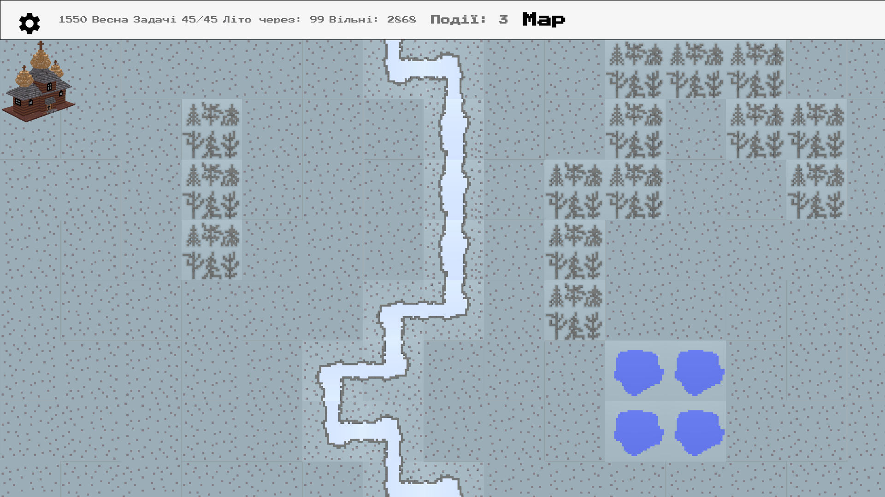
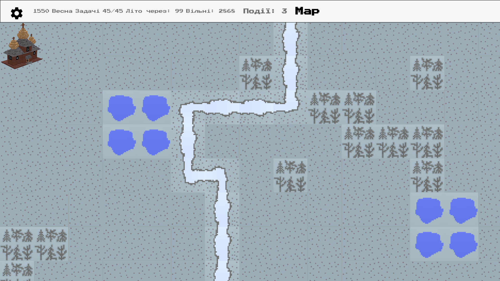

# Introduction
In  [Part 1](https://dmytrogladkyi.com/#/catalog/posts/flutter_generation_and_render_2d_map_part1) we created all needed methods to generate map with Grass and River. In this part we will add Forest spots to the map. A lot of code is reused from Part 1 but it is gradually enhanced step-by-step.

# Final Result

The forest is added in different points and different shapes:



# Implementation

## Refactor previous methods

Before we start jumping into Forest, we need to enhance code written in previous part.

One of the things I did not like about it was that we directly accessed **tiles** list via indexes. We had to play with rows/columns/x/y variables and place them into correct spots.

With refactoring all manipulations with tiles is now done via special methods:

```
  MapTile tileAtPoint(Point point) {
    return tiles[point.y][point.x];
  }

  void setTileAtPoint(Point point, MapTile tile) {
    tiles[point.y][point.x] = tile;
  }

  void setTile(MapTile tile) {
    tiles[tile.y][tile.x] = tile;
  }
```

We no longer operate with pure x/y/row/col variables. All coordinates are instances of class  [Point](https://api.flutter.dev/flutter/dart-math/Point/Point.html)  (from **dart:math**).

For example, getting random point on map returns Point:

```
  Point _getRandomPoint() {
    var col = Random().nextInt(width - 1);
    var row = Random().nextInt(height - 1);
    return Point(col, row);
  }
```
With these enhancements the code looks less mathy and more OOPish.

## Forest specifications
- Forest can occupy empty tiles (that are currently grass)
- It cannot occupy or cross the river
- Forest can grow in other not yet occupied tiles.

## addForest method
Implementing these requirements is pretty straightforward given that you also already wrote some useful utility functions :)

```

  void addForest() {
    ForestMapTile forest;

    // amount of tries to pick the spot for forest
    var tries = 10;
    while (tries-- > 0) {
      var point = _getRandomPoint();
      var tile = tileAtPoint(point);
      if (tile.type != MAP_TILE_TYPES.GRASS) {
        continue;
      }
      // first tile of the new forest spot
      forest = ForestMapTile(x: point.x, y: point.y);
      setTile(forest);

      // with 75% change grow the forest in random direction
      while (willGrow(75)) {
        var nextPoint = _nextPoint(Point(forest.x, forest.y));
        var nextTile = tileAtPoint(nextPoint);
        if (nextTile.type == MAP_TILE_TYPES.GRASS) {
          forest = ForestMapTile(x: nextPoint.x, y: nextPoint.y);
          setTileAtPoint(nextPoint, forest);
        }
      }
      // forest growing is done
      break;
    }
  }
```

**willGrow** method is enhanced and allows to provide % for success as input argument

```
  bool willGrow(int chance) {
    var next = Random().nextInt(100);
    return next <= chance;
  }
```

Another useful method is **_nextPoint**. It returns a nearby point to the given input point:

```
Point _nextPoint(Point point) {
    var decision = leftDownRight();
    var nextX = point.x;
    var nextY = point.y;
    if (decision == 0) {
      nextY = nextY + 1;
    }
    if (decision == -1) {
      nextX = nextX - 1;
    }
    if (decision == 1) {
      nextX = nextX + 1;
    }
    // truncate out of bounds values back to point inside the map
    if (nextX >= width) {
      nextX = width - 1;
    }

    if (nextY >= height) {
      nextY = height - 1;
    }

    if (nextX < 0) {
      nextX = 0;
    }

    if (nextY < 0) {
      nextY = 0;
    }

    return Point(nextX, nextY);
  }
```

### Adding forest to the map

Another method **addForests** is used to generate multiple forest spots:

```
  void addForests() {
    width.timesRepeat(addForest);
  }
```

**timesRepeat** is an  [Extension](https://dart.dev/guides/language/extension-methods) for int type:
```
extension TimesRepeat on int {
  void timesRepeat(Function f) {
    for (var i = 0; i < this; i++) {
      f();
    }
  }
}

```

# Create map with river and forest

Now you can call **addRiver** and **addForests** methods to initialize map:

```
final WorldMap map = WorldMap(width: 20, height: 20)
    ..addRiver()
    ..addForests();
```

The map generated map looks something like this:


# Next

In Part 3 we will generate lakes and further refactor existing functions. Stay tuned!