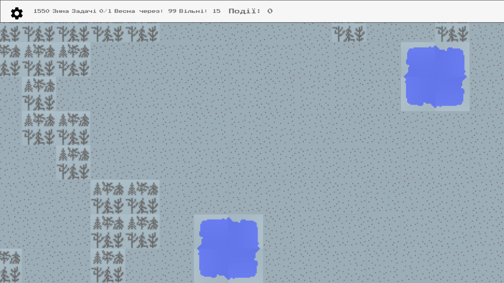
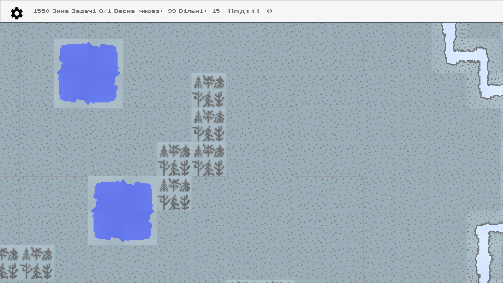

# Introduction

In [Previous Part 2](https://dmytrogladkyi.com/#/catalog/posts/flutter_generation_and_render_2d_map_part2) we added generation for Forests. In this post we will add Lakes.

# Final result

The map with several lakes looks like this:



# Implementation

## Requirements

There are different ways to render the lakes. A lake could occupy one cell, or have asymmetric view like this:

```
G G G G G
G L L L G
G L L G G
```
But such morphs require a lot of different types of lakes to be created: a sprite when lake cell is surrounded by other lakes (in the middle). A sprite when left, diagonal and top sprites are also lakes...and so on.

For this game I will simplify lake shape to be 2x2 grid:

```
GGGGG
GLLGG
GLLGG
```

## Find a suitable spot for Lake

The lake can take only the shape of the square 2x2 size. To add it to map we need to:

- Find initial spot on map
- Check whether grid 2x2 is free there
- Repeat until we can add lake

This logic is covered in **isRectangleFree** method:

```
 bool isRectangleFree(Point start, Point stop) {
    // false if tile is not inside the map
    try {
      tileAtPoint(start);
      tileAtPoint(stop);
    } catch (e) {
      return false;
    }

    for (var i = start.x; i <= stop.x; i++) {
      for (var j = start.y; j <= stop.y; j++) {
        var tile = tileAtPoint(Point(i, j));
        if (tile.type == MAP_TILE_TYPES.GRASS) {
          continue;
        } else {
          return false;
        }
      }
    }
    return true;
  }
```

In try catch we use a side effect in **tileAtPoint** method: it will raise out of bounds exception if the point is outside the Map. Two for loops check whether all tiles in that rectangle are free. If at least one is already occupied, then the Rectangle is occupied.

### Create LakeMapTile class to represent cell with lake

```
Widget toWidgetTile(BuildContext context) {
    var rotate = 0;
    if (inDirection == DIRECTION_TYPES.UP &&
        outDirection == DIRECTION_TYPES.RIGHT) {
      rotate = 0;
    }

    if (inDirection == DIRECTION_TYPES.LEFT &&
        outDirection == DIRECTION_TYPES.DOWN) {
      rotate = 1;
    }

    if (inDirection == DIRECTION_TYPES.UP &&
        outDirection == DIRECTION_TYPES.LEFT) {
      rotate = 2;
    }

    if (inDirection == DIRECTION_TYPES.RIGHT &&
        outDirection == DIRECTION_TYPES.UP) {
      rotate = 3;
    }
    return RotatedBox(
      quarterTurns: rotate,
      child: Image.asset(
        "images/background/map/lake_tile.png",
        fit: BoxFit.fitWidth,
      ),
    );
  }
```

A tile knows how to render itself for debugging purposes (**toString**) and how to render in Flutter widget (**toWidgetTile**).

### Add one lake

We add **addLake** method. It takes 10 tries in order to find a spot for the lake. Then populates all four tiles with **LakeMapTile** instance. Each lake tile get in/out direction set in order to correctly rotate the lake sprite to make it look like the lake occupies the whole 2x2 grid. The rotation starts from 0x0 point and goes clockwise to the 1x0

``` 
void addLake() {
    var tries = 10;
    while (tries-- > 0) {
      var point = _getRandomPoint();
      if (!isRectangleFree(point, Point(point.x + 1, point.y + 1))) {
        continue;
      }
      var lake1 = LakeMapTile(x: point.x, y: point.y)
        ..inDirection = DIRECTION_TYPES.UP
        ..outDirection = DIRECTION_TYPES.RIGHT;
      setTile(lake1);
      var lake2 = LakeMapTile(x: point.x + 1, y: point.y)
        ..inDirection = DIRECTION_TYPES.LEFT
        ..outDirection = DIRECTION_TYPES.DOWN;
      setTile(lake2);
      var lake3 = LakeMapTile(x: point.x + 1, y: point.y + 1)
        ..inDirection = DIRECTION_TYPES.UP
        ..outDirection = DIRECTION_TYPES.LEFT;
      setTile(lake3);
      var lake4 = LakeMapTile(x: point.x, y: point.y + 1)
        ..inDirection = DIRECTION_TYPES.RIGHT
        ..outDirection = DIRECTION_TYPES.UP;
      setTile(lake4);
      break;
    }
  }

```

### Add unit tests

Debugging the generated Map 20x20 is quite cumbersome and we need to make sure that the lakes can be generated correctly. To verify that the logic works correctly we need to add unit tests:

```
 test("Empty map has all rectangles free", () {
      var map = WorldMap();
      expect(map.isRectangleFree(Point(5, 5), Point(10, 10)), isTrue);
    });

    test(
        "isRectangleFree returns false if at least one tile inside it is occupied.",
        () {
      var map = WorldMap();
      map.setTileAtPoint(Point(8, 7), ForestMapTile());
      expect(map.isRectangleFree(Point(5, 5), Point(10, 10)), isFalse);
    });

    test("isRectangleFree returns false for out of map bounds points", () {
      var map = WorldMap(width: 10, height: 10);
      expect(map.isRectangleFree(Point(-1, 5), Point(5, 5)), isFalse);
      expect(map.isRectangleFree(Point(1, 5), Point(-5, 5)), isFalse);
      expect(map.isRectangleFree(Point(1, 5), Point(15, 5)), isFalse);
      expect(map.isRectangleFree(Point(15, 5), Point(5, 5)), isFalse);
    });

    test(
        "isRectangleFree returns true if there is Occupied tile but outside the rectangle",
        () {
      var map = WorldMap();
      map.setTileAtPoint(Point(8, 8), ForestMapTile(x: 8, y: 8));
      expect(map.isRectangleFree(Point(5, 6), Point(7, 7)), isTrue);
    });
```

## Add several lakes

```
  void addLakes() {
    8.timesRepeat(addLake);
  }
```

### Generate full map

```
  final WorldMap map = WorldMap(width: 20, height: 20)
    ..addRiver()
    ..addForests()
    ..addLakes();
```

# Final result
Map generated with Forest, River and Lakes looks like this:


