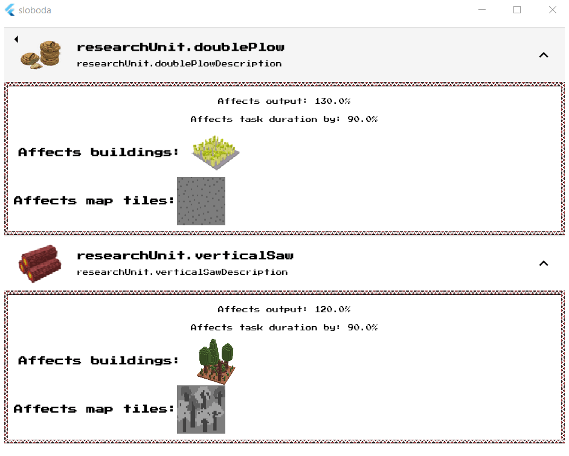

# Введення

В своїй грі  [Дике Поле: Слобода](https://locadeserta.com/citybuilding) я вирішив додати можливість витрачати зароблені очки Слави для покращення виробничих процесів. Щось накшталт Досліджень в інших іграх, коли гравець може відкривати гілки, нові будівлі, військові підрозділи, тощо. Так як гра у мене заточена під економіку, то розпочати я вирішив з суто виробничих процесів. Весь код в цій статті, як і в грі, написаний на Dart в поєднанні з Flutter.

Також в кінці статті ви знайдете відмінності в OOP та FP підході, та чому, на мою думку, OOP перемагає FP.

# Вимоги до Досліджень

Перед тим як створити дизайн, необхідно записати конкретні вимоги.

Дослідження має:

- визначати кількість очків слави для відкриття
- визначати кількість ресурсів для відкриття
- назву
- опис
- іконку
- список ефектів, які накладаються на будівлю або комірку на мапі.

# Створення класу ResearchUnit

Цей клас буде відповідати всім вимогам.

```
class ResearchUnit {
  final String localizedKey;
  final String descriptionKey;
  final num gloryRequired;
  final Stockable stockRequired;
  final List<ResearchUnitEffect> effects;
  final String iconPath;
  bool unlocked;

  ResearchUnit({
    this.effects,
    this.localizedKey,
    this.descriptionKey,
    this.gloryRequired,
    this.stockRequired,
    this.unlocked = false,
    this.iconPath,
  });
}
```

# Вимоги до ефектів
Кожна з одиниць досліджень має масив ResearchUnitEffect, який визначає, що і як змінюється в слободі, якщо батьківське дослідження відкрите.

Вимоги до ефектів:

- визначає список типів будівель, на які він впливає
- визначає список типів комірок мапи, на які він пливає
- коефіцієнт впливу на вхідні вимоги виробництва
- коефіцієнт впливу на вихідні вимоги виробництва
- коефіцієнт впливу на тривалість виробництва
- ефект може сказати, чи повпливає він на Будівлю чи на Комірку мапи.
- ефект може сказати, які будуть вхідні/вихідні вимоги до виробництва, якщо цей ефект буде накладено.

Приклад коефіцієнту впливів. Скажімо, у нас є Лісопилка, яка виготовляє 30 дощок, для цього їй треба 10 дерева. Одна така задача триває 45 секунд.

В моделі лісопилки це описано через спеціальний клас Taskable:

```
  Taskable defaultTask = Taskable(
    workers: 1,
    duration: Duration(seconds: 45),
    input: Stock(values: {RESOURCE_TYPES.WOOD: 10, RESOURCE_TYPES.FOOD: 5}),
    output: Stock(values: {RESOURCE_TYPES.PLANKS: 30}),
  );
```

Якщо коефіцієнт впливу на вхідні вимоги дорівнює 0.5. То це означає, що кількість дерева (вхідний ресурс для лісопилки) зненшується вдвічі, з 10 на 5.

# Створення класу ResearchUnitEffect

Цей клас буде відповідати всім вимогам, описаним вище:
```

class ResearchUnitEffect {
  final List<RESOURCE_BUILDING_TYPES> resourceBuildingTypes;
  final num inputCoefficient;
  final num outputCoefficient;
  final num taskCoefficient;

  final List<MAP_TILE_TYPES> mapTileTypes;

  ResearchUnitEffect(
      {this.resourceBuildingTypes = const [],
      this.inputCoefficient,
      this.outputCoefficient,
      this.taskCoefficient,
      this.mapTileTypes = const []});

  void affectCity(Sloboda city) {}

  bool canAffect(dynamic object) {
    if (object is ResourceBuilding) {
      return canAffectBuilding(object);
    }
    if (object is ResourceSpot) {
      return canAffectResourceSpot(object);
    }
    return false;
  }

  bool canAffectBuilding(ResourceBuilding building) {
    return resourceBuildingTypes.indexOf(building.type) >= 0;
  }

  bool canAffectResourceSpot(ResourceSpot spot) {
    return mapTileTypes
        .intersection(spot.suitableTypes, (a, b) => a == b)
        .isNotEmpty;
  }
}
```

Цікавою особливостю Dart є його динамізм.

Наприклад метод:

```
  bool canAffect(dynamic object) {
    if (object is ResourceBuilding) {
      return canAffectBuilding(object);
    }
    if (object is ResourceSpot) {
      return canAffectResourceSpot(object);
    }
    return false;
  }
```

має вхідним параметром **object **з типом **dynamic**. Так як ефект може впливати як на Будівлю так і на Комірку, а це зовсім різні класи, то для споживачів цього АРІ спеціально зроблено такий метод, щоб не треба було перед кожним викликом **canAffectBuilding/ResourceSpot** визначати який саме метод використати. Це перекладено на сам ефект. Якщо ефект взагалі не знає, що за клас об'єкта йому передали, то він просто поверне false.

### Тести для canAffect

Так як функціонал може бути доволі складним, то перед написанням коду для методів, краще написати тести.

Скажімо, у нас є таке дослідження:

```
    var effect = ResearchUnitEffect(
      resourceBuildingTypes: [
        RESOURCE_BUILDING_TYPES.SAWMILL,
        RESOURCE_BUILDING_TYPES.FOREST
      ],
      mapTileTypes: [MAP_TILE_TYPES.FOREST],
      inputCoefficient: 0.5,
      outputCoefficient: 2,
      taskCoefficient: 0.5,
    );
```

Можемо одразу написати тести для **canAffect**:

```
    test("Can use dynamic method to tell whether it affects it", () {
      var spot = ResourceSpot.generateWood();
      expect(effect.canAffect(spot), isTrue,
          reason: "Dynamic method called correct spot method");

      expect(effect.canAffect(ResourceSpot.generateFish()), isFalse,
          reason: "Dynamic method called correct spot method");

      expect(
          effect.canAffect(
              ResourceBuilding.fromType(RESOURCE_BUILDING_TYPES.SAWMILL)),
          isTrue,
          reason: "Dynamic method called correct building method");

      expect(
          effect.canAffect(
            ResourceBuilding.fromType(RESOURCE_BUILDING_TYPES.MARKETPLACE)),
          isFalse,
          reason: "Dynamic method called correct building method.");
    });

```

### Тести для affect* методів

І одразу напишемо тести, які накладають ефект на виробничі властивості:

```
test("Can affect input value of the resource building", () {
      var building = ResourceBuilding.fromType(RESOURCE_BUILDING_TYPES.FOREST);
      var newStock = effect.affectBuildingInput(building);
      expect(
        newStock.getByType(RESOURCE_TYPES.FOOD),
        equals(7.5),
        reason: "New input stock is decreased.",
      );
    });

    test("Can affect output value of the resource building", () {
      var building = ResourceBuilding.fromType(RESOURCE_BUILDING_TYPES.FOREST);
      var newStock = effect.affectBuildingOutput(building);
      expect(
        newStock.getByType(RESOURCE_TYPES.WOOD),
        equals(20),
        reason: "New input stock is increased.",
      );
    });

    test("Can affect the duration of the Task.", () {
      var building = ResourceBuilding.fromType(RESOURCE_BUILDING_TYPES.FOREST);
      var duration = effect.affectBuildingTaskDuration(building);
      expect(
        duration.inSeconds,
        equals(10),
        reason: "Duration was decreased.",
      );
    });
```

## Імплементація affect* методів

Майже все готово, лише треба написати три методи, які змінють вхідні, вихідні та тривалість задач:

```
  Stockable affectBuildingInput(ResourceBuilding building) {
     num adjuster = 1.0;
    if (canAffect(object) && inputCoefficient != null) {
      adjuster = inputCoefficient ;
    }
    return building.defaultTask.input * adjuster;
  }

  Stockable affectBuildingOutput(ResourceBuilding building) {
      num adjuster = 1.0;
    if (canAffect(object) && outputCoefficient != null) {
      adjuster = outputCoefficient ;
    }
    return building.defaultTask.output * adjuster;
  }

  Duration affectBuildingTaskDuration(ResourceBuilding building) {
       num adjuster = 1.0;
    if (canAffect(object) && taskCoefficient != null) {
      adjuster = taskCoefficient ;
    }
    return building.defaultTask.duration * adjuster;
  }

```

Як видно, всі три методи майже ідентичні, вони лише працюють з різними коефіцієнтами та параметрами об'єкту.

Узагальнимо логіку в один окремий метод:

```
 _affectObject(dynamic object, dynamic whatToAffect, num coef) {
    num adjuster = 1.0;
    if (canAffect(object) && coef != null) {
      adjuster = coef;
    }
    return whatToAffect * adjuster;
  }
```
Тут ми покладаємося на той факт, що споживачі цього АРІ можуть передати нам будь-який об'єкт. В такому випадку коефіцієнт буде 1 і логіка нічого не змінить.

Перепишемо три методи:
```
  Stockable affectBuildingInput(ResourceBuilding building) {
    return _affectObject(
        building, building.defaultTask.input, inputCoefficient);
  }

  Stockable affectBuildingOutput(ResourceBuilding building) {
    return _affectObject(
        building, building.defaultTask.output, outputCoefficient);
  }

  Duration affectBuildingTaskDuration(ResourceBuilding building) {
    return _affectObject(
        building, building.defaultTask.duration, taskCoefficient);
  }
```

## Все разом

Дизайн уже майже готовий. Ось приклад повного Дослідження:

```
 ResearchUnit(
      localizedKey: 'researchUnit.doublePlow',
      descriptionKey: 'researchUnit.doublePlowDescription',
      gloryRequired: 5,
      stockRequired:
          Stock(values: {RESOURCE_TYPES.WOOD: 50, RESOURCE_TYPES.FOOD: 100}),
      effects: [
        ResearchUnitEffect(
          resourceBuildingTypes: [RESOURCE_BUILDING_TYPES.FIELD],
          mapTileTypes: [MAP_TILE_TYPES.GRASS],
          outputCoefficient: 1.3,
          taskCoefficient: 0.9,
        )
      ],
      iconPath: 'images/resources/food/food_64.png',
    ),
```

# Додаємо Дослідження до головного класу

В грі за все відповідає клас Sloboda. Будь-яка зміна інвентаря, кількості козаків, робочих, тощо, відбувається через цей клас.

```
class Sloboda {
    ...
  List<ResearchUnit> researches = defaultResearchUnits();
    ...
}
```

Ось і все. Тепер Слобода містить список досліджень, які наявні в грі.

# Додаємо UI

Нам треба зробити, щоб гравець міг бачити список досліджень, які у них вимоги, на що і як впливають.

Для цього створюємо окремий віджет, який виведе в ListView всі доступні дослідження:

```
  Widget build(BuildContext context) {
    return ListView(
      children: widget.city.researches
          .map((research) => research.toListTileView(context))
          .toList(),
    );
  }
```

Кожен ResearchUnit тепер має знати, як себе показати гравцеві в списку:


```

// class ResearchUnit
Widget toListTileView(BuildContext context) {
    return ExpansionTile(
      initiallyExpanded: false,
      leading: Image.asset(iconPath),
      title: TitleText(
        this.localizedKey,
        textAlign: TextAlign.left,
      ),
      subtitle: Text(
        this.descriptionKey,
      ),
      children: [
        Column(
          mainAxisAlignment: MainAxisAlignment.start,
          crossAxisAlignment: CrossAxisAlignment.stretch,
          children: effects.map((e) => e.toWidget(context)).toList(),
        ),
      ],
    );
  }
```

Віджет являє собою розкриваємий UI елемент. Він показує іконку, свою назву і текст-опис:



Кожен ResearchUnitEffect в свою чергу знає, як показати себе в інтерфейсі користувача:

```
Widget toWidget(BuildContext context) {
    return OrnamentContainer(
      child: Center(
        child: Padding(
          padding: const EdgeInsets.all(8.0),
          child: Column(
            children: [
              if (inputCoefficient != null)
                Padding(
                  padding: const EdgeInsets.all(8.0),
                  child: Text("Affects input: ${inputCoefficient * 100}%"),
                ),
              if (outputCoefficient != null)
                Padding(
                  padding: const EdgeInsets.all(8.0),
                  child: Text("Affects output: ${outputCoefficient * 100}%"),
                ),

// і так далі
```

# Відмінності між OOP та FP підходами.

Можна було помітити, що ми змішали два різні домени: модель даних і модель репрезантації на екрані (View). Якби ми писали на FP, то у нас би був метод, який би отримував ResearchUnitEffect, та малював би його як віджет:

```
Widget researchUnitEffectWidget(ResearchUnitEffect effect);
```

Але, як на мене, краще коли сам об'єкт відповідає на запитання: "як тебе показати гравцеві? :

```
Widget ResearchUnitEffect.toWidget()
```

Таким чином ми просто змінюємо контекст, в якому хочемо використати цей об'єкт без використання сторонніх функцій.

Скажімо, якщо б написано було в стилі FP, то мені якимось чином треба знати назву функції, які конвертує мою модель в екраний віджет. А якщо таких функцій сотні, як мені взнати, яку використати? **Утворюється невеличкий розрив**, який ми якось маємо згладити (казками, що FP легше тестувати і іншою ФП ахінеєю).

**Якщо ж ми ідемо світлим шляхом OOP**, то ми просто кажемо об'єкту: подай себе у вигляді для споживання на екрані. І все. Нам не треба знати яку саме функцію використати. Більше про основи OOP (не бред, який пішов з С++), можна взнати від авторів ООР з **Xerox PARC Group**:  [Object-Oriented Programming, lecture by Daniel Ingalls](https://www.youtube.com/watch?v=Ao9W93OxQ7U)

Саме тому всі моделі даних в грі знають, як показати себе на екрані. З точки зору ФП, я змішую абсолютні різні поняття (модель та її вигляд на екрані), але з точки зору ООР все вірно. 