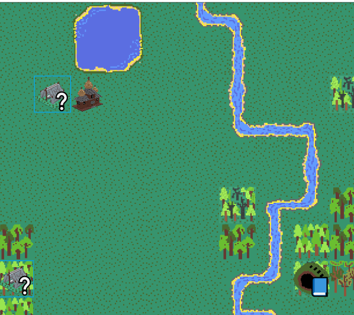
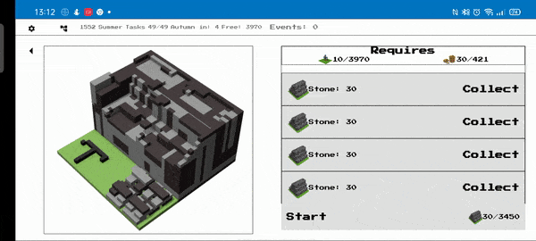

# Introduction
My game got a lot of features in recent months. Many events are happening behind the main view of the game and player can easily miss them.

[In 2.5.0 version](https://locadeserta.com/sloboda) I added events to the map. But if player is busy doing some production in the settlement view then he/she might miss them!

## Events on the  map:



Events on the map usually give a lot of value and it is pitty that the player can miss them (some of them do not reappear and are one-time events).

To solve this problem I decided to add in-game notifications.

# Requirements

The in-game notifications must:

- show player that something happen
- be dismissible
- do not clutter the screen
- do not spam the player
- game developer should be able to show different notifications for different events.

# Implementation

My game state approach already includes different actions that can happen in game. In my previous article [Adding sound to game](https://dmytrogladkyi.com/#/catalog/posts/flutter_add_sound_to_game) we used them to play different sounds based on the event type.

We can reuse the same approach and implement notifications!

## Initial code

I create a new class **NotificationManager** that will show different notifications on screen. It exposes a singleton instance that we can access whenever we want.

Method **attachToCity** is used to subscribe to **Sloboda** (settlement) **changes** stream with events. All events that happen in game are pushed to this stream.

```
class NotificationManager {
  NotificationManager._internal() {}
  static final NotificationManager instance = NotificationManager._internal();

  List<SLOBODA_ACTIONS> actions = [
    SLOBODA_ACTIONS.NEW_SEASON,
    SLOBODA_ACTIONS.EVENT_IF_ADD,
    SLOBODA_ACTIONS.EVENT_CHOICABLE_ADD,
  ];

  Future attachToCity(Sloboda city) {
    city.changes.where((event) => actions.contains(event)).listen(
      (event) {
        switch (event) {
          case SLOBODA_ACTIONS.NEW_SEASON:
            showNotification(
                "${SlobodaLocalizations.seasonLabel}: ${SlobodaLocalizations.getForKey(city.currentSeason.toLocalizedKey())}",
            );
            break;
          case SLOBODA_ACTIONS.EVENT_CHOICABLE_ADD:
             showNotification(
                SlobodaLocalizations.notificationNewEvent,
            );
            break;
          case SLOBODA_ACTIONS.EVENT_IF_ADD:
            showNotificationWithIcon(
                SlobodaLocalizations.notificationNewIfEvent,
                Icon(Icons.book_sharp), 
            );
            break;
          default:
            break;
        }
      },
    );
  }
```

## Fix spamming player with multiple events

This approach has one problem: it can happen that more than 1 event is generated in 1 second and the notifications overlap each other on screen! So the player will see only the last one message but all previous will be unvisible.

### Normalizing sequence of events into auto disposable Queue.

Imagine that three events E1, E2, E3 have been generated at the same time. For the player we need to show them one after the other with some time difference:

```
Convert (E1,E2,E3) to: E1 -> (timeout) -> E2 -> (timeout) -> E3. 
```

Timeout value must be configurable.

At first I jumped on [RX Debounce](http://reactivex.io/documentation/operators/debounce.html) and [RX Throttle](https://www.learnrxjs.io/learn-rxjs/operators/filtering/throttle). But all of them are losing the notification events. That is why I decided to create a Queue of events that would auto dispatch notifications to the player after given timeout is finished.

class **NotificationManager** gets an instance of the **Queue**  and a function to start queue's processing:

```
class NotificationManager {
  Queue<Function> queue = Queue();
  final Duration defaultDuration = Duration(seconds: 2);
  startQueue() {
    if (queue.isEmpty) {
      return;
    }
    if (timer == null) {
      timer = Timer.periodic(defaultDuration, (localTimer) {
        Function first = queue.removeFirst();
        first();
        if (queue.isEmpty) {
          localTimer.cancel();
          timer = null;
        }
      });
    }
  }
}
```

The switch case that calls notifications is also modified to add notifications to Queue:

```
Future attachToCity(Sloboda city) {
    city.changes.where((event) => actions.contains(event)).listen(
      (event) {
        switch (event) {
          case SLOBODA_ACTIONS.NEW_SEASON:
            queue.add(
              () => showNotification(
                "${SlobodaLocalizations.seasonLabel}: ${SlobodaLocalizations.getForKey(city.currentSeason.toLocalizedKey())}",
              ),
            );
            break;
          case SLOBODA_ACTIONS.EVENT_CHOICABLE_ADD:
            queue.add(
              () => showNotification(
                SlobodaLocalizations.notificationNewEvent,
              ),
            );
            break;
          case SLOBODA_ACTIONS.EVENT_IF_ADD:
            queue.add(
              () => showNotificationWithIcon(
                SlobodaLocalizations.notificationNewIfEvent,
                Icon(Icons.book_sharp),
              ),
            );
            break;
          default:
            break;
        }
        startQueue();
      },
    );
  }
```

Notice that we add a lambda function to the queue and later just call it in Timer.periodic.

In Timer.periodic body we check whether there is some closure to be called. If yes - we call it. If not - then we cancel the Timer and reset its pointer to null. If the new event is generated by the game but the previous Timer is still active than appropriate closure will be added to the queue and Timer will auto pick it when its queue is due:

Game generates:
```
E1,E2 --> 1 second --> E3
```
Timer with Queue processes:
```
E1 -> 2 seconds-> E2 -> 2 seconds -> E3 --> Timer = null, Queue is empty
```

## UI Part

For UI part I decided to use [Bot Toast](https://pub.dev/packages/bot_toast) package that has a lot of configurations.

Widget part is pretty simple:

```
  void showNotification(String str) {
    BotToast.showAttachedWidget(
      target: Offset(0, offset.toDouble()),
      duration: defaultDuration,
      attachedBuilder: (_) => Card(
        color: Colors.amber,
        child: Padding(
          padding: const EdgeInsets.all(8.0),
          child: Text(
            str,
          ),
        ),
      ),
      preferDirection: PreferDirection.topRight,
    );
  }
```

And now notifications come one after the other:




# Conclusion

By using my state management approach we were able to implement completely two different features: Sound and Notifications by using absolutely identical approaches:

- subscribe to City events stream
- react to it by playing sound or showing in-game notification

This solution is expandable: if you add another City Event then just go to switch case and add appropriate Notification/Sound to it.

It is pretty simple but always works :)


