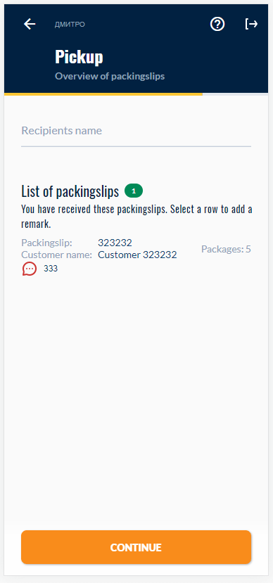

A week ago I asked on my Twitter [to show the examples of Flutter Web 💙🕸️](https://twitter.com/DmytroGladkyi/status/1463950103165734913).

I got lots of different examples that I would like to show here.

Let's go!

# [This Site](https://dmytrogladkyi.com)

The site you are reading is 100% on Flutter 💙🕸️

The site is open source and is current a part of my #metapersona effort to make blogging fun again (and serverless :) )

[https://github.com/gladimdim/metapersona](https://github.com/gladimdim/metapersona)

---

# [Path Finding Algorithm by Elias Andualem](https://elias8.github.io/#/)

An awesome example of the maze algorithms all done with Flutter in the Web!

**Did this sometime ago just for fun :). I will probably rework on it in the future to improve the performance and add new algorithms.**

Link to Author's Twitter: [https://twitter.com/elias_andualem8](https://twitter.com/elias_andualem8)

---

# [Sander Roest's Barcode scanners](https://dalosy-projecten-bv.github.io/demo-proof-of-delivery-pwa/#/)

**This is a proof of delivery application that’s running production since early 2021 on Zebra’s TC57 devices with built-in barcode scanners.**

Link to Author's Twitter: [https://twitter.com/jsroest](https://twitter.com/jsroest)

---

# [Mike Rydstrom's Epic Flexfold Demo](https://rydmike.com/demoflexfold/#/)

**Not a production app, more like a showcase of #Flutter Web capabilities,
my old web build of the Flexfold Demo app still available here https://rydmike.com/demoflexfold/#/ and this Tweet thread explains it**

[His tweet with explanation](https://twitter.com/RydMike/status/1308281235723055107)

Link to Author's Twitter: [https://twitter.com/RydMike](https://twitter.com/RydMike)

---

# [Pradeep Kumar's online portfolio](https://pktintali.github.io/)

**My Responsive Portfolio with Internationalization (Currently in 3 languages) http://pktintali.github.io**

Link to Author's Twitter: [https://twitter.com/pradeep_tintali](https://twitter.com/pradeep_tintali)

---

# [Alberto Bonacina's Password App Generator](https://wassword.albertobonacina.com/)

***My password generator app on Android, and this is the web version https://wassword.albertobonacina.com***

Link to Author's Twitter: [https://twitter.com/polilluminato](https://twitter.com/polilluminato)

---

# [Abhilash Chandran ](https://abhilash-chandran.com/#/projects)

**Surprise Surprise.. Another personal page.. Face savouring food
https://abhilash-chandran.com
Still wip.. Not mobile friendly, yet..!***

Link to Author's Twitter: [https://twitter.com/scabhilash](https://twitter.com/scabhilash)

--- 

# Set of Flutter Web 💙🕸️ games by Dmytro Gladkyi

My game universe called [Loca Deserta](https://locadeserta.com/index_en) already contains 4 games all done with Flutter.

And the builds are deployed as 💙🕸️ PWA apps:

Hex Puzzle:

Sloboda:

Chumaki:

