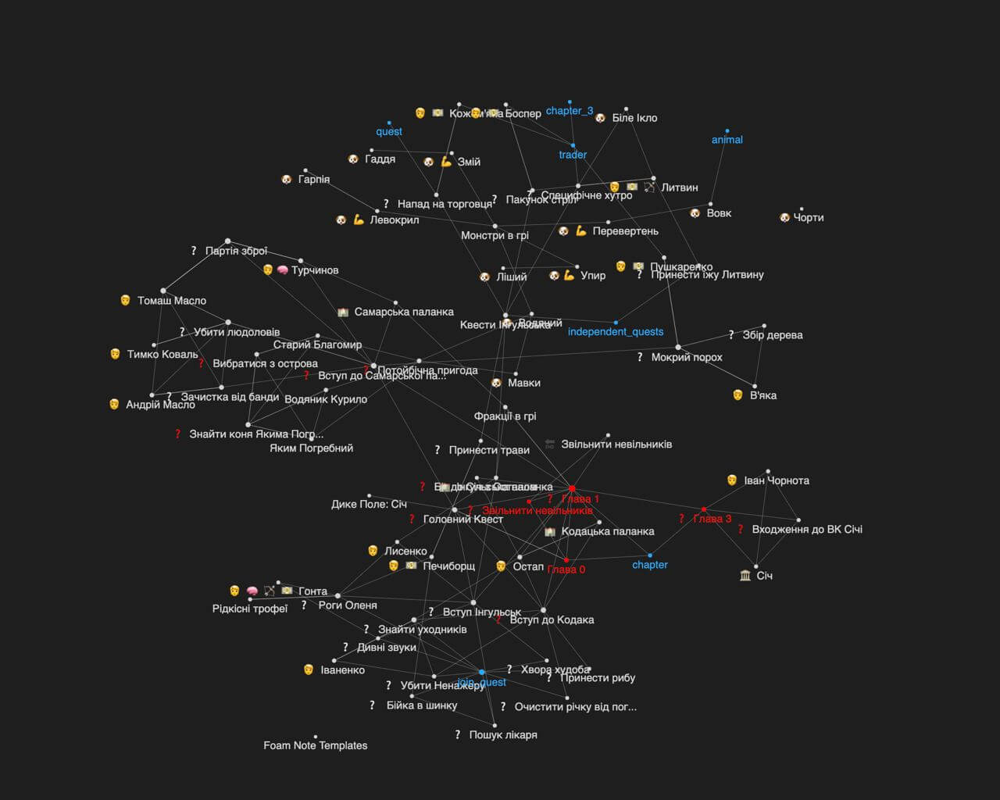
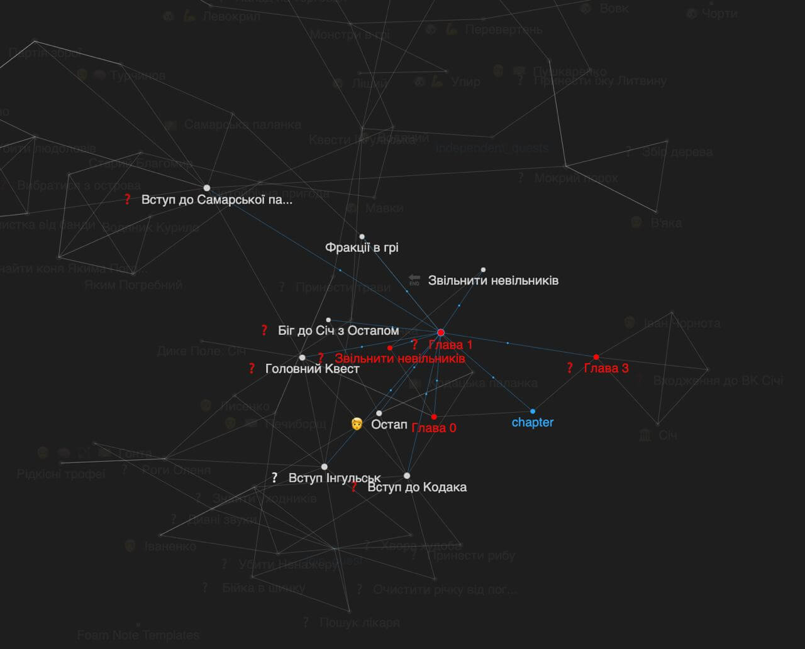

[Після топіка на Геймдев ДОУ](https://gamedev.dou.ua/forums/topic/42399/) хотів би нагадати, яка кінцева мета
Всесвіту Дикого Поля.

Як ви знаєте, цей всесвіт включає всі ігри, які ми робимо і які стосуються періоду в історії, яке у нас знають
під назвою "Козаччина". З кожною грою ми посилюємо свої скіли до рівня, коли зможемо зробити справжню велику рольову гру з максимальним
ухилом в Готіку (1-2). Зрозуміло, що сходу таку гру не зробиш. Але є факти: в далекому 1997-2001 роках її робило 7-14 людей.
З інструментарієм, який є зараз, це можна зробити і меншою кількістю людей. У "Дике Поле: Одеса-Хаджибей" ми уже додаємо відкритий світ,
та елементи РПГ у вигляді виконання квестів, які змінюють оточення та відкривають нові можливості.

В подальших іграх ми все більше будемо уходити в РПГ елементи, відмовляючись від виробничих приколів, які домінують зараз.

І ще головне: всі ігри мають бути на мобілках. Це вносить багато обмежень, але в одночас відкриває двері до будь-якого гравця.

**Цю гру ми обов'язково зробимо!**

# Витяг з головного квесту

## ❓ Головний Квест

Сидячі в Кафі, з тобою починає розмовляти побита до смерті людина, яка конає. Він каже, що незабаром нападуть козаки і у тебе буде шанс врятуватися, адже атака буде неочікувана. Але він доконує свій час, і розповідає, що він Патурнак, його схопили підлітком і хотіли продати далі, але він прийняв іслам і таким чином врятувався. Почав працювати в Кафі, згодом досяг певного положення на ринку невільників. Але завжди залишався вірним Січі.

Через послів він став агентом Кошового, допомогав обмінювати полонених з обох сторін. Але місяць тому він взнав військову таємницю: турки вирішили зробити величезний рейд на землі Війська Запорізького. Для цього вони уже сформували запаси в Очакові, чекають лише на весняну погоду, щоб переправити людей морем і напасти на Січ на початку тепла.

Військова операція тримається в секреті. Він послав вістку Кошовому, але посланця перехопили і його самого схопили також. Забили до смерті майже, сьогодні буде день страти. Він передає ГГ перстень і просить дістатися до Січі, і попередити Кошового.

Якщо він дасть йому цей перстень, то Кошовий зрозуміє, що ти кажеш правду. Але лише він його пізнає.  З іншими козаками краще не розмовляти про цей секрет, адже вони самі можуть побігти до турків і за винагороду повідомити, що їх рейд розкрито.

В цей момент розбивається стіна з дверима, ядром убиває бранця.

Починається [[chapter_0]]

Задача перед ГГ: дістатися до Січі, проникнути всередину та отримати аудієнцію з Кошовим.

Щоб попасти в Січ,  треба стати козаком однієї з паланки [[вступ_інгульськ]] [[main]] [[join_samarska_palanca]]

Щоб попасти до Кошового, треба зробити два квеста на вибір // TODO

Під час аудієнції Кошовий пізнає перстень і вислуховує тебе. Він розуміє, що це дуже вдалий момент, щоб ударити на упередження і можна захопити весь обоз армії турків. Але для цього треба, щоб поки що це був і далі секрет. Він просить почати підготовку до рейду, для цього треба зробити підготовчі квести: