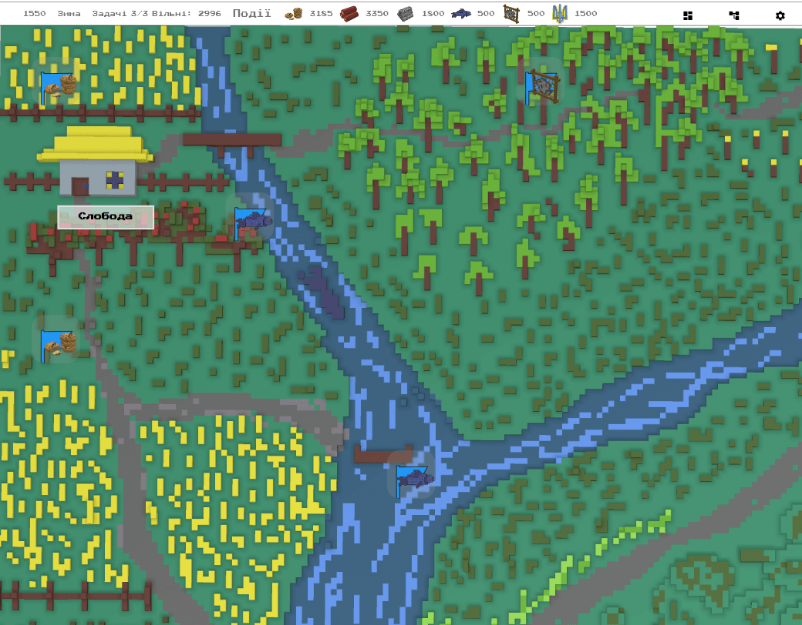

# Стисло

Повністю перероблена мапа околиць. Тепер це воксельна мапа намальована в ручну.
Збалансовано епічні події.
Всі сповіщеня в середині гри показують результат зміни інвентарю.

Відео версія: [https://www.youtube.com/watch?v=XpoF1Ybfrug](https://www.youtube.com/watch?v=XpoF1Ybfrug)

# Де взяти гру?

Гра доступна онлайн:  [https://locadeserta.com/sloboda/](https://locadeserta.com/sloboda/), але будьте уважні - тут викладаються розробницькі збірки.

Релізні випуски гри доступні на Google Play Store:  [Дике Поле: Слобода](https://play.google.com/store/apps/details?id=com.gladimdim.sloboda)

Та на App Store: [Дике Поле: Слобода](https://apps.apple.com/ua/app/sloboda/id1543669328?l=uk)

Ви також можете скачати APK та Windows збірки напряму з github:

[Реліз 3.0.5 на Github](https://github.com/gladimdim/locadeserta/releases/tag/3.0.5)

[Збірка для Android APK](https://github.com/gladimdim/locadeserta/releases/download/3.0.5/sloboda_305.apk)

[Windows 10 збірка](https://github.com/gladimdim/locadeserta/releases/download/3.0.5/sloboda_windows_305.zip)

# Нова мапа околиць

Ця мапа більше не генерується випадково з різних квадратиків, а була намальована у воксельній графіці. Ресурси та події і далі з'являються на ній, як і раніше.

Ресурси з'являються у відповідних місцях. Тобто, дерево - в лісі, гінці від Січі та розвідники - на хфігурах, або біля табору уходників на сході біля лісу та озера.

Також на мапі наявні інші об'єкти: озеро, річка, поля, садочок, табір, скійська могила та каменярня.

# Зменшений вплив катастрофічних подій

Деякі епічні події дуже сильно руйнували слободу. Тепер вони випадають не так часто і вірогідність їх впливу зменшилась.
