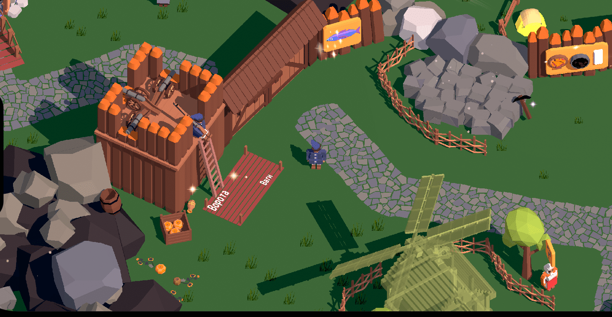

На всяк пж забичкував своє інтерв'ю з Межа.Медіа. Вийшло доволі велике. Інжой!

# Розкажи про себе

Я живу і працюю в Києві. В індустрії розробки ПЗ з 2006 року. Почав робити свою першу гру для iOS платформи в 2012 році, але закинув, бо треба було малювати арт, а мені було впадло :) Хоча гра були покровим мультиплеєром схожою на гру в шахи і мала запрограмований основний ігролад...Дуже жалкую досі, що полишив. А от десь в 2018 році я про неї згадав, і вирішив уже точно робити ігри до релізу в ап стори. Так і виникло продовження мого всесвіту "Дике Поле". Всі ігри мають сетинг XVII-XVIII століть, а саме доби Козаччини. Розробкою ігор по-"справжньому" я почав рік тому - осіню 2021 року. Взяв переробляти свою першу Слободу на рушії Unity, адже до цього користувався Flutter, який для ігор не дуже підходить. Всю розробку я веду публічно на своєму ТГ каналі: [Loca Deserta Universe](https://t.me/locadesertachumaki).

# Колектив

Розробкою займаюся лише я та моя дружина. Мені робили деякий арт інші люди, але десь влітку ми повністю перейшли з Voxel на Lowpoly арт стиль. Саме в цей момент дружина почала допомагати. 95% арту в грі - це її робота в Блендері. У мене в голові є своє бачення і ціль ігор, які я хочу робити, тому приєднуватися до когось не хочу. Також не думаю, на даний момент, щоб хтось ще приєднався до нас. Адже я і дружина працюємо, так би мовити, за свій кошт, а когось ще наймати - це збільшення часу на розробку, спілкування, виправлення, пінг-понг і тд. Хоча нам музику написала дівчина. Але там було все просто: я їй вислав пісні, які треба було зіграти на бандурі. Вона мені wav - я їй гроші.

Заробляння грошей

Всі мої минули ігри: Слобода, Чумаки, Інтерактивні Історії, Гекс безкоштовні, тому що я розумів, що ігри дуже специфічні, плюс не виглядають як мобільні ігри. Я достатньо заробляю на основній роботі, тому не додавав ніякої реклами, монеток, зливу даних користувача чи інших способів монетизації в сучасному ринку мобільних ігор. Але Слобода 2 буде платною: близько 100 грн. Цю гра повноцінна, в ній лише основний час проходження займає 3-4 години. В далеких планах зробити ремейк Готики 1, але на теренах Січі. Гра так і називається - Січ. Я над нею працюю уже, розписані перші 2 глави. Але наразі сил і досвіду на це не вистачає. Хіба що займатися цим 16 годин в день, але тоді треба звільнятися з роботи...тому Слобода 2 - платна :)

Моя суто персональна думка: безкоштовні ігри на мобілках означають, що в грі буде купа реклами, маніпулятивні механіки геймплею (типу почекати 3 години чи заплатити 20 монеток). В них насправді і гри як такої немає. Все буде крутитися навколо видурювання ще грошей з тебе. А ось коли купую одразу платну гру, то я розумію, що там буде саме гра, а не викачка грошей з мене. Максимум ще ІАР з DLC з новими мапами. Як приклад - Kingdom of Two Crowns.

# Про навчання (туторіали) в іграх
Я вважаю, що ігри не мають вести за ручку гравця. Якщо в грі є туторіал, який не можна скіпнути, я одразу видаляю гру. Клацать 15 хвилин в суто визначенні місця на екрані - це не гра. Тим більше, що це робиться для того, щоб не можна було зробити рефанд і гугл чи апл зареєстрував скачку як повноціне скачування та запуск гри. Саме тому туторіали затягнуті.

Але візьмемо для прикладу мої улюблені Моровінд та Готіка. Там навчання немає. Просто вас викидають в світ. Далі самі уже. Перші 10-15 хвилин гри втягують вас в геймплей самі по собі. Я в своє перше проходження Моровінда пропустив самий перший квест і десь лише через пару днів повернувся назад взнати ж, що то за агент такий в Балтіморі живе.

В Слободі 2 я зробив інтегроване навчання. Не буде тексту, якоїсь феї з цицьками на пів екрану, яка скаже куди що натиснути.

На стартовій локації одразу є НПЦ з окличним знаком. Я думаю, уже всі знають, що це квестодавець :) Підходите до нього і відкривається сцена із завданням. Всі завдання, які він дає, вводять гравця в курс справ. Але це зроблено інтегровано в гру. Ви не випадаєте із контексту отамана Слободи. Ви і є отаман, якому радник підказує, що зробити наступним, щоб просунутись в грі.

Для полегшення розуміння, що в грі інтерактивно, а що ні, я додав невеличкі метелики-партікли.

Вони ненав'язливо анімуються і показують гравцю, що до них можна підійди і виконати якусь дію. Так само зроблено і в Zelda. Вам гра запускає метелики на грибах, рибках чи іншій їжі, яку можна підібрати. Але ніяких стрілочок "підбери мене" не має.

На худий кінець в грі є NPC-помічники. Які розкажуть основи механіки виробництва, добування риби, чи примітивних ресурсів. Це якщо взагалі людина в подібні ігри не грала.

Мої ігри не мають цільові аудиторії жанрів "три кульки в ряд" чи "фея з цицьками щось показує на екрані". Це ігри-жуйки і мають за мету скоротати час в метро чи туалеті. Відключити мозок і просто виконувати команди для просування по ексель-файлу ігроладу.

Я більше орієнтуюся на тих, хто хоче справжні десктопні ігри, але які зроблені простіше і для мобілок.

Ще для полегшення життя гравців, на екранах завантажень завжди показується якась порада з картинкою з гри. Як це зроблено в Skyrim.

# Про Слободу 2

Всі мої ігри про добу козацтва. Це десь 16-18 століття. Я 14 років займався реконструкцією козаків часів Хмельниччини. Тому мені це все знайоме до мозолей на ногах, затертої шиї від сукняної свитки, дерев'яного язика від 3-х денної спраги в поході Холодним Яром і обпалених очей невдалим пострілом з самопалу. Я знаю чому робили саме так, які особливості життя тих часів. Я весь цей час постійно читав літературу, письменні згадки, описи України. Для мене козаки - це не васі в шароварах з наручами з чепрака. А найкращі драгуни (піхота на конях), влучні стрілки, "вогнянні люди", майстри бою в степах, майстри ведення господарства та освоєння нових земель. Чи знали ви, що козаки робили найкращий порох для гармат? Чи що в господарстві мали по 80 овець, 20 корів та 50 бортів? А не були пиятиками і жебраками.

Саме це я і хочу показати в своїй грі. Завдання, які ви отримаєте в грі, а також досягнення в Game Center, по-троху розвіять ваші уявлення про козаків Дикого Поля.

Слобода 2 - це ремейк Слободи 1, але в тому вигляді, який не зміг зробити три роки тому на Flutter. Мене дуже надихнула гра Unrailed! на Switch. Якщо пограєте в Слободу і Unrailed, то помітите, що навіть взаємодія гравця з грою така сама: ви підходите до дерева з сокирою і гравець сам починає рубати дерево. З кайлом до каміння - розколює каміння. Немає окремих UI інтерфейсів, клацання кнопочок нон-стоп.

А ще, Слобода 2 - добра. Тут немає війн, убивств, якогось екшну. Моя освіта та професія - виробничі системи. Вдень я розробляю софт для величезних заводів, фабрик, виробництв. Ввечері - кодую виробничі ланцюги в козацькій Слободі. Я б навіть не назвав це стратегією. Це більше як побудуй-селище-збери-ресурси-захоплюй-територію гра. Unrailed + Minecraft + Settlers. До речі, проблема для мене в App/Play Store визначити жанр гри з усих тих комбобоксів :)

# Скільки людей.

Основний розробник, ідея, імплементація - це я :) Весь арт - моя дружина. Музика робилась нами на замовлення. Випадково в тікток знайшов дівчину Vikuletka (https://www.tiktok.com/@vikyletkaderkach), яка на замовлення грає будь-який трек на бандурі.

Кошторис

Наразі ми плануємо запуск лише на Apple та Google магазинах. Мені здається, для стіма не дуже підходить сам ігролад. Хіба що на стім деку.

Загалом поточні витрати $400-500.

Партікли, воду, тварин та звуки я купляв. Деякі асети з Unity Store не підійшли, можливо в наступних іграх знадобляться. Додайте сюди ще переклад на 5 мов.

Всі арти, що ми зробили, доступні у вільному доступі за дуже гарною ліцухою: https://github.com/gladimdim/free_ukrainian_art . Користуйтеся на здоров'я. Там більше 400 воксель та лоу полі артів. ВЕСЬ арт Слободи 1 та Слободи 2 - там. Відсутність арту - це те, що мене зупинило в 2012 році. Я не хочу, щоб це спиняло когось ще в розробках ігор про нашу державу. Для стратегій, створення селищ і тд - арту більше ніж треба в нашій репі.

# Стім і десктоп

Мобілки є у всіх. Діти в першому класі уже сидять з андроїдами (щоб не жалко було :D ). Я спілкуюсь з багатьма дітьми. Десь до 15 років...а їм не треба десктоп. У них все є в мобілці. Так як мені не треба були приставки в 90х...2000х, а треба був РС. Так і їм - РС це якийсь гроб, треба сидіти сутулитися за ним...А мобілка завжди під рукою. Тому реліз на стімі під питанням. На десктопі, я вважаю, треба робити трошки складніші ігри і уже із залученням миші. У мене ж в грі все зав'язано на контролер. Хіба що на Стім Дек релізнутись, тут би гра лягла 100%. А ще, мобілки працюють і без світла. У мене всі ігри 100% офлайн. Навіть жодного колу на сервер немає. Вимкнули світло - ви відкрили гру і граєте. Game Center Ачівки потім загрузяться.

# Плани

Ми плануємо в Січні 2023 випустити контент патч з доробленими будівлями, які не встигли зробити. З виправленням помилок і тд. І уже в грудні, тобто одразу після релізу, я починаю працювати над великим DLC. Це буде нова мапа Хаджибей-Одеса. Де ми висадимося на березі Одеси (Хаджибея) і будемо засновувати там козацьку слободу. Але без виготовлень гармат і іншого військового спорядження. Суто легка промисловість. Ми додамо більше 8 нових виробничих ланцюгів: льон, віск, шовк, жупани, сукно, чоботи, підкови. Відповідно, додамо 24 нових будівлі. Роботи багато, але уже знаємо, як це робити.

Наступна гра буде "Козаки: Гроза Чорного Моря". Я хочу розвіяти туман, яким окутаний цей наш героїчний час. Знову таки, козак це не гоголівський дядько, який їсть вареники. А це був жах початку 17 століття для всієї Малої Азії. Цілих двох міністрів оборони османів було страчено через те, що вони не могли нічого подіяти проти козаків. Чи варто цим гордитися? У Англічан пірати і вдалі капітани отримували серів і входили в парламент. Пірати з голандії сформували корпорацію Вест Індії. Ставали губернаторами величезних колоній.

А чому б і нам не гордитися Сагайдачним, який провів серію переможних морських рейдів. Легендарний наліт на Кафу із звільненням тисячі полонених - це його робота. До того ж, це був комбінований удар з моря та суші, чого татари не чекали. А ще він збив пірначем московського воєводу з коня на дуелі під час осади москви, а ще виграв Хотинську бійню.

В цій грі ми будемо грати за екіпаж козацького байдака, який буде наводити шороху на узбережжях Криму, Малої Азії. Плануються як морські битви, так і абордажі із захопленням рабів та товарів. Так, козаки були работорговцями теж :) Додайте сюди захоплення фортець і селищ з побудовою морських баз. Почнемо з Очакова! Дуже хочу, щоб гра вийшла як і Corsairs: Conquest at Seas. Це мій ідеал для ігор піратської тематики.



Після моря буде перша спроба зробити RPG гру. Це буде початок моєї роботи над ремейком Готики - Січ. Можливо, зроблю невеличку мапу з першої глави гри, де ви дійдете до Січі. Така-собі стартер гра.

# Сучасна тематика

У мене вся голова і 14 років життя були заняті подіями визвольної війни Хмельницького. Перша світова, друга та сучасна війна...Я про них мало чого знаю, щоб розробляти гру. Про російську війну зараз уже роблять інші команди ігри. Glory to Heroes, Байрактар. Хоч вони і не для мобілок їх випускають, але уже є кому робити. А от козаки...поки що про них роблю лише я. Буде моєю фішкою :)

# Українські ігри

Завдяки мобілкам в ігри грають всі діти та підлітки. Але що у них на вибір? Совкодроч в танках, дебільні три-кульки-в-ряд, мокра ельфійка, бородаті вікінги...Але це все чуже. Якби б у нас був такий же спектр ігор про козаків, як зроблено для вікінгів - це б внесло вагомий внесок в нашу культуру. Взагалі ігри - це нові книги. Якщо це дійсно ігри. У вас є історія, головний герой, його розвиток, невдачі, перемоги. Українці, які б могли грати в щось "своє", менше б залазили в танки, тарков і інші ватні всесвіти, де хочеш-не-хочеш, а все пронизано їх пропагандою. московиті вкладають величезні кошти в розробку ігор. Візьміть Тарков, якийсь новий біошок про СРСР, Метро 2033, Танки, Вар Сандер. Так, студії типу на Мальті та Кіпрі, але...ми все розуміємо. Основний споживач - це ватнікі з дідами воювали. Чи кликали б болванчікі росію, якби б вони, або навколо них, пограли б в гру про Крути, чи штурм москви? Це б віддаляло їх внутрішню ойкумену від російської зарази. Тому росія вкладається в це, бо розуміє, ігри - це інструмент пропаганди. З надзвичайно глибокою і широкою пенетрацією в мозок. Уявіть, ви грали 7 років в танки-діди-воювали, палили фашистів. а тут вам з теліка кажуть, що в Україні знову фашисти, треба їх убити. У вас безумовний рефлекс спрацьовує. Чи от зараз з біошок СРСР, вам показують - а совок же це Гагарін, космос, роботи! Було б круто, якби кляті піндоси не розвалали!! Оооо а вони ж Україну захопили! Треба звільнити її заради цього майбутнього...

Додайте до цього розвиток внутрішнього ринку. Ось я для Слободи 2 наймав бандуристку. Вона заробила гроші. А тепер додаємо ще арт, саунд...українці б могли заробляти на українських іграх. Коли все рухається на ринку, тоді рухаються і гроші. Коли все стале - ну сидить у нас офіс в одесі убісофта. Ви хоч щось від них бачили? Невже в 1000 працівників немає часу ввечері намалювати ті ж моделі для УПА, російської війни, крут чи ліквідації Ватутіна під Києвом, або бій Сагайдачного з Батурліним як заставку для українського ембієнт треку. Так і роблять чергові чоботи для асасін кріда чи кинджал в CS GO. Витік мізків та енергії.

Ідемо далі. Був Відьмак. Книга. Нікому не потрібна книга. Вийшов Відьмак. Книга стала бестселером, переклад на 100 мов. Одразу іде буст на інших письменників. Тепер і вони можуть заробити. Беремо Макса Кідрука...робимо гру по його книгах. Одразу постає розвиток екосистеми. Додаємо сюди мерч: фігурки, іграшкова зброя, одяг, крос сетинги з інших ігор чи книжок...американці це вміють, у них миттєво все заробляє гроші. Нам ще це треба вчити.

(У мене в планах робити фігурки зі Слободи, але це потім)

# Зростання інтересу

У нас зараз унікальний шанс винести нашу історію на такий же щавель цікавості, як і вікінги, пірати, древні римляни чи єгиптяни. Про них все знають, всі люблять в це грати. Це пізнаваємий бренд.
Треба робити і випускати ігри про козаків, словян, сучасних українців, які воюють. Але є велика проблема. Багато студій контролюється росіянами. Вони дають гроші. А їм треба рулетки, ельфійкі та діди воювали. У нас є Козаки, Сталкер. Але їм сто год...Ті ж Козаки можна було перевидати на мобілках, змінити ігролад трохи, DLC з націями, нові мапи. Але простіше вкластись в рулетку і отримати купу бабла одразу.

Я вважаю, що інді розробники мають розпочати цей хрестовий похід по просуванню України як бренду в іграх. Великі студії не зацікавлені і не зроблять цього, поки це не буде приносити прибутку. Та вони навіть бояться щось змінювати в своїх власних франшизах. Убісофт...одне і те саме 10 років клепає без перестанку. Блізард...Гру про козаків чи УПА і подавно не зроблять. А ось інді розробники - можуть.

Починаємо з малого, прості ігри, не великі за обсягом. Без маніпулятивних механік чи стиля "байрактар-пердушка в спрайтах". Або, якщо ви робите таке, то з ціллю отримати досвід та наступну гру підняти на наступну сходинку. Щоб кожна наступна гра була краща. Мобільне залізо розвивається, айфон 14 - це як РС 2015 року. Можна робити уже A ігри. Скоро і AAА зайде. Але за бога ради, не робіть гру з 5 Ads SDK і "відточенної" воронкою реклами. Телеграм канали по юніті лише це і питають...про ігри чи ігролади навіть ніхто не думає. Краще знайдіть роботу, яка покриває вам все, а потім уже робіть гру.

