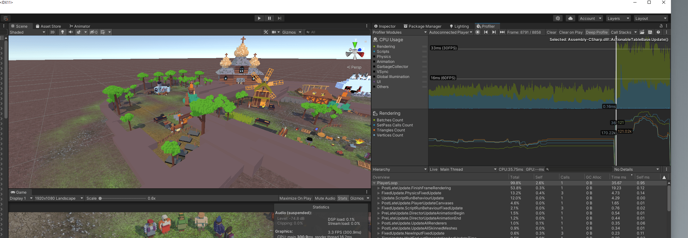
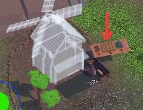
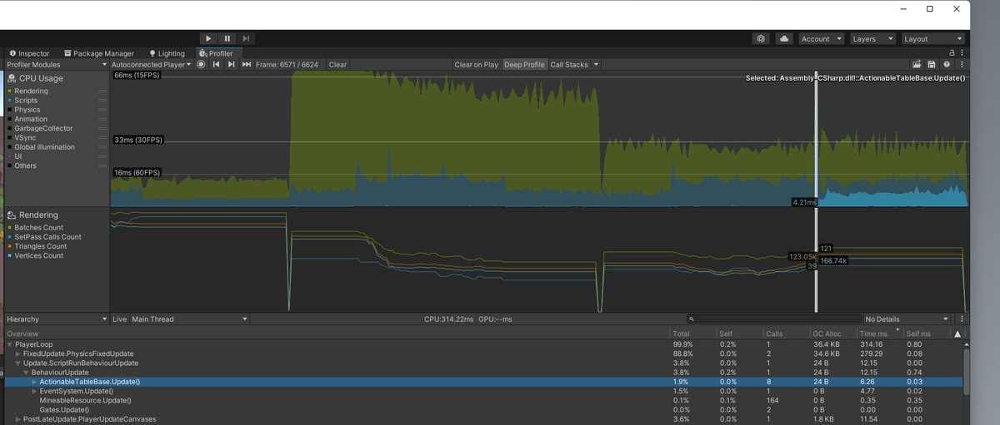
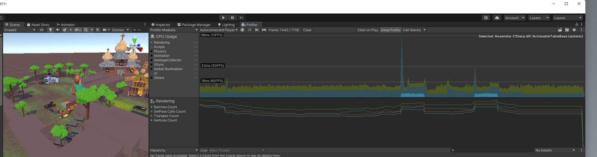
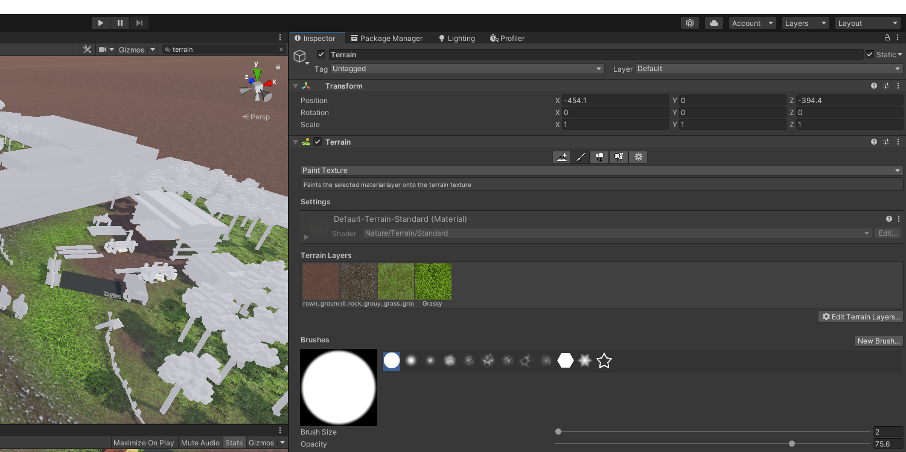
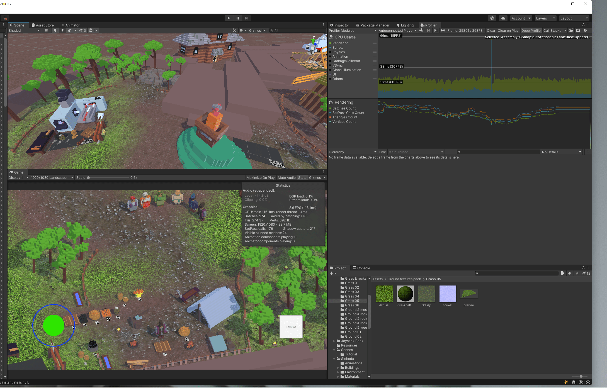
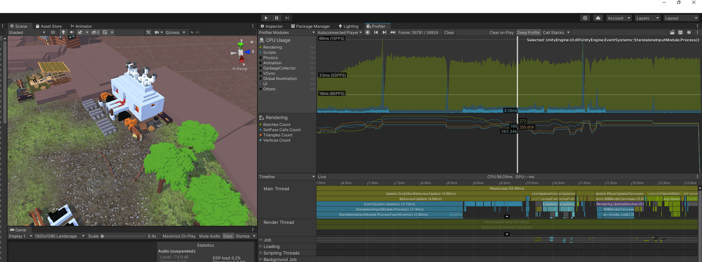
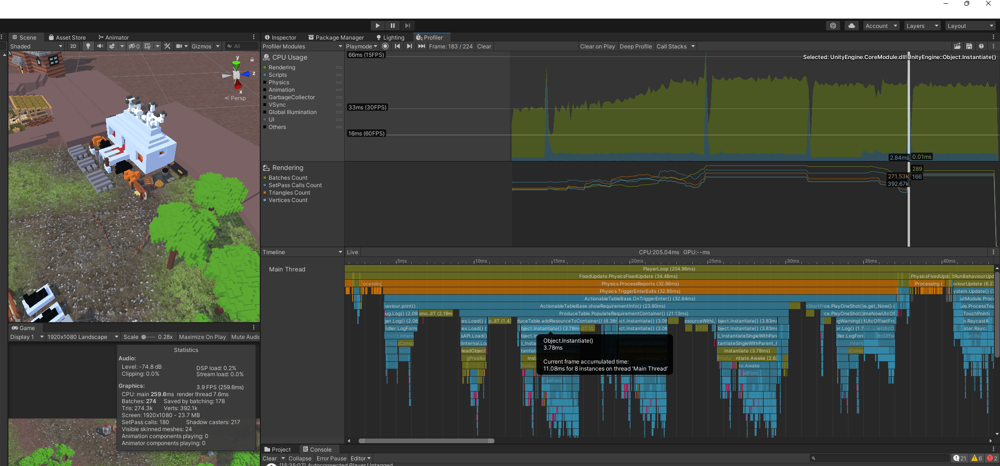
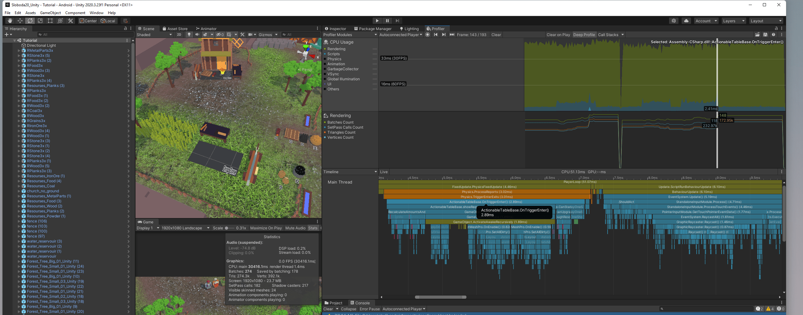
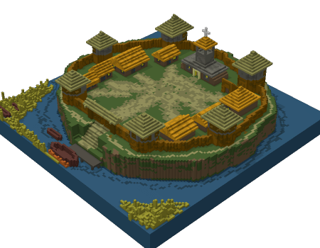

## Intro

I am doing a remake of my old game [Loca Deserta: Sloboda](https://locadeserta.com/citybuilding/index_en) The first version was done with [Flutter](https://flutter.dev) but this time I picked Unity as the game engine.

I started from scratch and implemented lots of new functionality but I have noticed that even my Galaxy S21 Ultra had lagging issues. The FPS was smooth but sometimes I had a feeling it dropped from 60 to 30 FPS.

I took a very old Nokia 6.1 with Android, launched my game and was shocked. It was a complete garbage. FPS was in a 0-15 range. Completely unusable.

# What was wrong

- Terrain layers
- Too much of heavy logic in MonoBehaviour:Update
- Instantiate calls
- Destroy calls

## How did I find bottlenecks

Of course I launched a Profiler and checked what was choking in my Nokia 6.1/Galaxy Note 8

You can see that the game ran at max 30 FPS, even fewer.



Also when I have to show building/production requirements with 3D resource models:



it spiked to 40-60ms per frame and the bottleneck was my OnTriggerEnter logic (more on this later). Also pay attention to that blue scripting timings that appear when the new resources are shown on the screen. Definitely something was wrong with my code.



### First victim - Shadows?

At first I thought it was all about shadows. I switched them off...and nothing changed. The game choked itself.

### Second victim - Quality Settings?

I tried to run it on low/very low. Better but still at 15-30 FPS for such a simple game. No!

## Divide and Conqueror

I decided to use a scientific method of divide, conqueror and guess what's wrong. Something in the scene definitely chocked the GPU (as 80% of my CPU frame time was spent on waiting on GPU results).

## Removed Terrain

I started with the biggest asset: I removed Terrain layer.

**BOOM** ! Steady 60 FPS on Galaxy Note 8! Haha! It was it:



I returned back - again 15-30...It was definitely Terrain that caused me the performance issues.

### How to fix Terrain on Mobile

So I read through the [TerrainLayer](https://docs.unity3d.com/Manual/class-TerrainLayer.html) official docs and noticed this:

```
you can use four Terrain Layers per Texture pass, with no limit on the number of passes.
This means that although you are allowed to use as many Terrain Layers as you want,
each pass increases the time spent rendering the Terrain.
For maximum performance, limit each of your Terrain tiles to four Terrain Layers.
```

And I had like 8 layers all mixed on the floor with different alpha and masks!

And for real, once I have only 4 layers like on this screen: 


Then the game runs very smooth even on ancient Android like Nokia 6.1:



Once I add even one more layer (without using it for painting!) then the performance drops.


#### Outcome for Terrain

Don't set more than 4 terrain layers even if you paint only 4 still the Unity will choke processing your Terrain.


### Spikes in MonoBehaviour:Update

This was easy to fix, it turned out I used DateTime.now to get the current time in order to process task timers in game. It seems this can be a little painfull on mobile phones so I rewrote the logic and used Time.deltaTime in order to check how much time has passed since the Upgrade/Production task started:


    void Update()
    {
        if (actionStarted)
        {
            elapsedActionTime += Time.deltaTime;
            if (elapsedActionTime > actionDuration)
            {
                actionStarted = false;
                elapsedActionTime = 0.0f;
                finalizeAction();
            }
        }
    }

Check this awesome video on how to implement timers in Unity:

[4 Easy ways to create Timers in Unity - in 2 minutes - Jason Weimann](https://www.youtube.com/watch?v=eeY24OyLGv0)

After fix, notice that the blue scripting timings are much shorter!




## Get rid of Instantiate and Destroy

When I have to show materials for build/produce requirements I instantiated prefabs and rendered them on screen. Then when the player is not near the building I destroyed them.

It turns out...Instantiate and Destroy are VERY resource consuming procedures.

See these spikes? These are Instantiate/Destroy calls. Some of them take 40-70 ms:




I knew how to fix this with Object Pooling: [Object Pooling (in depth) - Game Programming Patterns in Unity & C# - Jason Weimann](https://www.youtube.com/watch?v=uxm4a0QnQ9E)


I reimplemented the logic to create all the objects beforehand when the scene loads. And then just pull them from Object Pool and place where needed.

Check the same game scenario to show new Resource objects on screen but with Object Pooling:




# Conclusion

- Don't use more than 4 Terrain Layers
- Don't Instantiate/Destroy too often.
- Use Object Pooling where applicable
- Don't do heavy tasks in Update


My game now runs at 60FPS on Samsung S21 Ultra and 30-40 FPS on Galaxy Note 8.


I can finally continue on adding more buildings to the game :)


This is my game running on Nokia 6.1: [https://twitter.com/DmytroGladkyi/status/1481540410098991104](https://twitter.com/DmytroGladkyi/status/1481540410098991104)


# More Details on My Remake in Unity

The first version of my game has features from a 'real' full-sized game you used to have in a city building genre:

- Manufacturing lines

- Create compose materials out of simpler materials

- Research influences production

- Building and Upgrading buildings (each type of building has 3 level with all unique voxel art!)

- Local Map with random events

- Global huge map

- Conquering new areas

- Weather events

You can learn more and download my old Sloboda game here: [Loca Deserta: Sloboda](https://locadeserta.com/citybuilding/index_en)



# Follow for Progress on the Remake

You can join my Telegram Channel: [https://t.me/locadesertachumaki](Loca Deserta Game Universe). Or [https://t.me/locadesertachumaki/467](Try alpha 3 on Android, Web and Windows).

Or follow me on Twitter: [https://twitter.com/DmytroGladkyi](https://twitter.com/DmytroGladkyi)


