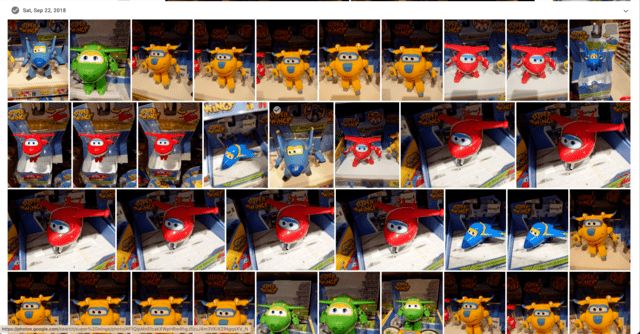
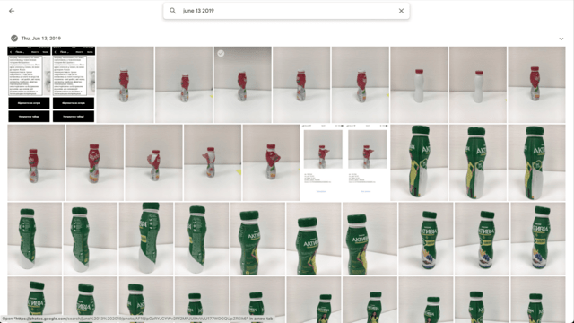
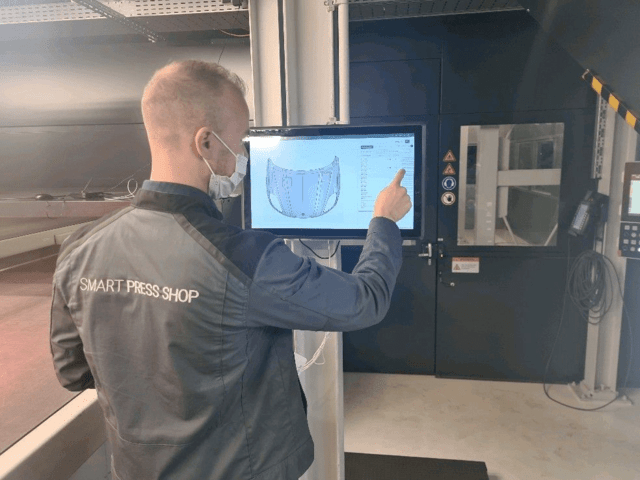

You know, some peeps say in corps you cannot do amazing things.

I failed maybe 3-5 times with my initiatives when working for some big corp.

But this time it all worked like a charm.

# History

So, ~3 years ago I wanted to make a web app with ML to recognize cartoon toys and name them.
It would help bad parents to stay in touch with their kids and name the toy in the shop by just pointing their smartphones at it.
So I went to Kids Shop and took thousands of pics of toys to feed it to Tensor Flow model training.

After I trained the model and could use it in the shop. The app announced me the name of the recognized cartoon hero.

It was pretty neat and my kids enjoyed playing with it :)

# Apply it to 'real' environment
 
My day job is creating complex software for Manufacturing Industry.

One day this idea literally hit me: why can't I use the same approach to instantly recognize defects in the manufactured goods?

Inspection operation usually involves operators and takes much longer time than desired. Operators have to visually check the items and then enter defects info.

This process is cumbersome.

With my approach of using ML models trained for the defects it was possible to cut this time to....20ms! Yes, it took 20ms to do on-device recognition.

We bought yogurt bottles, made 'defects' in them like missing cap or wrong label. Did thousands of images, trained the model and...

And it worked!

Two white screens you see is a #Flutter app (in 2019!) showing results of predictions done on the backend. We could switch between local/server ML runtimes.

It was all glued of course but was enough to impress officers in the Manufacturing department and issue us budget.

# Going live

Of course at first everything was easy and simple. For 'simplifiers' how I call them. 

But not for me as I already had 10 years of experience in the fields together with successful launches of huge manufacturings on different continents.

We had to:
- create an app to manage ML models
- create an app to manage ML model's relations with production master data.
- add different ML model
- allow BYO model
- bring YOUR OWN data for our service
- integration with Operator Dashboard
- reports
- data export

And dozens of other tasks nobody predicted had to be done.

# 2 years later

What we achieved:
- recognition on almost all Industry 4.0 forums
- our demo was the most loved and impressive.
- demo to...founding father of the company 😭

# Difference between small companies and large corps

Almost everything done in corps is hidden behind the wall. You cannot watch videos about the success.

On the screen below you can a person using the product I (we) bootstrapped and created on a real prod line.

95% of that screen is my work 💪 I am glad that the tremendous work of backenders is never seen at all. So all glory goes to me :)

# Conclusion

I was very lucky that all stars were in right position and I could find right colleagues in right place. Plus the support of upper management.

All these three pillars played well and now at least one tiny pain point of manufacturing is solved.

(For our customers, of course 😁 )

# Link to original picture:

[Visual Inspector veryfies received results and approves the defects](https://www.linkedin.com/feed/update/urn:li:activity:6870287996323696640/)
