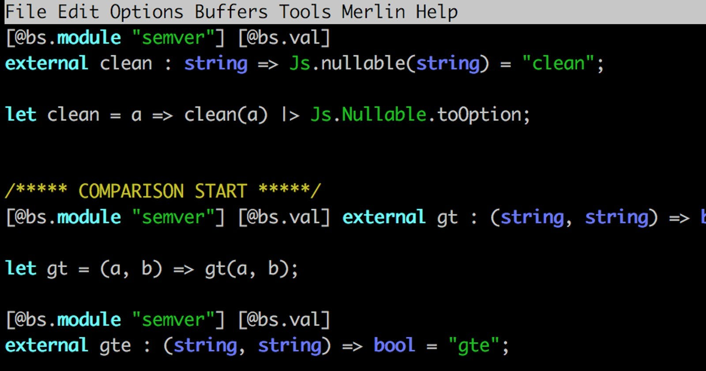
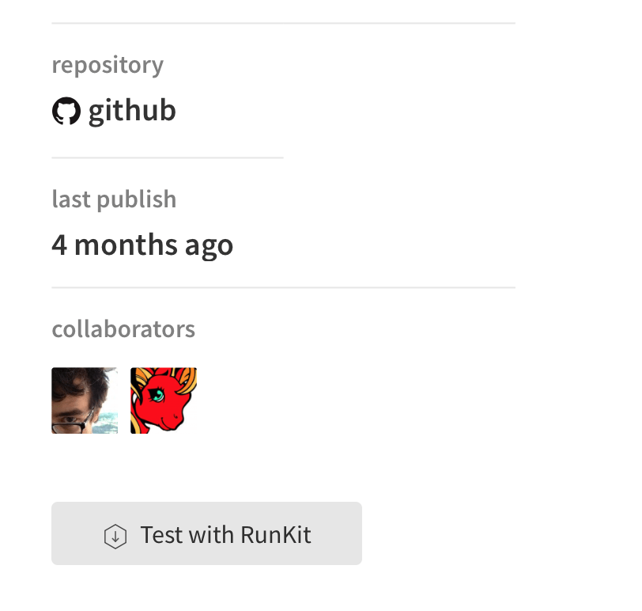

ReasonML is on the rise. The latest [https://www.reason-conf.com/](https://www.reason-conf.com/) has shown, that many people are interested in this language from Facebook.

You can very easily add ReasonML to an existing JavaScript/TypeScript project, and get the full benefits of a strongly-typed language, but a lot of libraries are written in JS and are published to NPM. To use them from ReasonML, you have to provide the bindings to the package. There are a lot of bindings created for different libraries, for example: [Bindings for MomentJS.](https://github.com/reasonml-community/bs-moment)

In this post I will show you, how to create bindings from scratch, and how to use them in your ReasonML project:





# Getting Started

ReasonML provides a very thin layer of bindings from ReasonML to/from JavaScript world. A good starting point is the official BuckleScript documentation.

We will write bindings for the NPM official semver package.

This package exposes different functions, and we can also instantiate the Semver class, like in this JavaScript example:


```
semver.satisfies('1.2.3', '1.x || >=2.5.0 || 5.0.0 - 7.2.3') _// true_</span>
```


## Create new NPM Package

Run command


```
npm init</span>
```


This will start a wizard, which creates a new NPM package. Provide any info you want, just give it a good name with the prefix ‘bs’ (BuckleScript). `bs` is a community convention for BuckleScript or ReasonML bindings.

Create a folder ‘src’:


```
mkdir src</span>
```


It will contain all of the sources of our bindings.

Create a folder ‘__tests__’:


```
mkdir __tests__</span>
```


It will contains binding tests, executed by [bs-jest library](https://github.com/glennsl/bs-jest).

## Add bsconfig.json

To make our package work with the ReasonML compiler, we have to add a bsconfig.json:

```json
{
  "name": "@gladimdim/bs-semver",
  "version": "0.2.0",
    "sources": [
	{
	    "dir" : "src",
	    "subdirs" : true
	},
	{
	    "dir": "__tests__",
	    "type": "dev"
	}
    ],
  "package-specs": {
    "module": "commonjs",
    "in-source": true
  },
  "suffix": ".bs.js",
  "bs-dependencies": [
  ],
    "bs-dev-dependencies": ["@glennsl/bs-jest"],
  "warnings": {
    "error" : "+101"
  },
  "refmt": 3
}
```


The most imports properties:


```
name: '@gladimdim/bs-semver'</span>
```


must be exactly the same as in your package.json.


```
sources: [...src....__tests__....]</span>
```


Specifies, which folders to compile to JavaScript Code. Tests folder has type “dev”, so it will not appear in suggestions nor will it be compiled into bundle.

## Edit package.json

Now open package.json, we have to add some binding-specific properties to it.


```
"scripts": {
  "clean": "bsb -clean-world", 
  "build": "bsb -make-world",
  "watch": "bsb -make-world -w",
  "test": "jest"
},</span>
```


These are scripts, used to build, compile, test and run watchers.

Provide dev deps:


```
"devDependencies": { 
  "bs-platform": "^3.0.0",  
  "jest": "22.1.2", 
  "@glennsl/bs-jest": "0.3.2" 
},</span>
```


Pay attention, you have to provide ‘real’ JavaScript NPM package deps like ‘jest’, as they contain real code, which will be used by bindings from ‘bs-jest’ during test or compilation tasks.

Now tell NPM which files to include:


```
"files": [   
  "src/semver.re", 
  "bsconfig.json"
 ]</span>
```


This is what should be published to the NPM registry. It is important to include bsconfig.json, as it is used by the build processes of your end users.

## Specify Peer Dependencies of your target NPM package

When we create bindings for the semver package, we have to tell NPM to make it a peer dependency. End users of our package will have to provide us with this peer dependency.


```
"peerDependencies": {    "semver": "^5.5.0"  },</span>
```


# How to Write Bindings

In src folder, create a file named ‘semver.re’. It will be our main and the only file with bindings.

Let’s write binding for function ‘clean’, which is exposed as a standalone function from the semver package.

Before we write the body of the clean function, we need to dive into terrible world of JS:

**YOU MUST ALWAYS CHECK IN RUNTIME WHAT THESE FUNCTIONS RETURN IN REAL LIFE.**

Each npm package page has a “Test With RunKit” button, and you can use it to call function without installing the package:




The issue with the function ‘clean’ is the following: it might return a valid semver string, or null, if it could not parse the input semver version. So, from a ReasonML standpoint, the result of this function is an Option. It either returns the string or returns Nothing (None).

We use the directives **@bs.module and @bs.val** to indicate, that next function has no ReasonML body. Instead it will be taken from the JavaScript world. For more info, read the official docs: [https://bucklescript.github.io/docs/en/intro-to-external.html](https://bucklescript.github.io/docs/en/intro-to-external.html)


```
[@bs.module "semver"] [@bs.val] 
external **clean** : string => Js.nullable(string) = "clean";
let **clean** = a => clean(a) |> Js.Nullable.toOption;</span>
```


The type signature in the second line means the following: the function ‘clean’ accepts a string as an input parameter and outputs a string or null. The directives @bs.module “semver” and “clean” will transform this into JavaScript:


```
semver.clean()</span> 
```


We could leave it as is, but we would like to make the return type of this function more ReasonML-canonical and use the Option type. That is why, on line #3 we have a body of this function. It reads in following way: the function ‘clean’ takes parameter a, sends it into ‘clean’ (JavaScript function from semver package), then pipes the result of it into toOption converter. ReasonML will inherit the type definitions from the “external clean” declaration, so you do not have to repeat them.

The output of our ReasonML function ‘clean’ will be an Option of type String.

Let’s write the binding test. Create a file semver_spec.re in __tests__ folder with the following content:

```reasonml
open Jest;

let () =
  describe(
    "semver",
    ExpectJs.(
      () => {
        test("#clean", () =>
          expect(
            Semver.clean("    =1.5.0    ")
            |> (
              result =>
                switch (result) {
                | Some(v) => v
                | None => raise(Not_found)
                }
            ),
          )
          |> toBe("1.5.0")
        );
      }
    ),
  );
```

The semver module will be automatically loaded from our semver.re file. Remember, that we do not test the Semver functionality, we test our bindings. So we just have to verify, that our binding returns the Optional type and that the result is string.

We can continue covering other simple methods from the official documentation to semver: [https://github.com/npm/node-semver](https://github.com/npm/node-semver)

# How to create types for ‘string’ enums

Function **semver.cmp(a, c, b)** accepts 3 arguments: first version, operation (string), second version.

Binding to it looks like this:

<iframe src="https://itnext.io/media/c47617728e509a475545a93c7e51971e" frameborder="0" height="0" width="0" title="comparator" class="gm n o gl ab" scrolling="auto"></iframe>

But, the second argument, called “operation”, can be a string only from specific “operations” set. For example: “<, >, ≤, ≥, ==, !==” and so on.

The usage in ReasonML would be like this:


```
Semver.cmp("1.5.0", "<", "2.3.5");</span>
```


By defining the second argument “<”, as a string it gives us the possibility of making the following runtime mistake:


```
Semver.cmp("1.5.0", "hello", "2.3.5");</span>
```


We could leave it as a string type, but in ReasonML I always prefer to have types for such important arguments.

We have to introduce a type, which has take only valid for ‘cmp’ method strings:


```
type comparator =  | LooseEqual  | LooseNotEqual  | Equal  | Empty  | NotEqual  | Gt  | Gte  | Lt  | Lte;</span>
```


And to write a function, which converts these types into strings, as JavaScript expects a string as an input:

```
let comparatorToString = comparator : string =>
  switch (comparator) {
  | LooseEqual => "=="
  | LooseNotEqual => "!=="
  | Equal => "==="
  | Empty => ""
  | NotEqual => "!=="
  | Gt => ">"
  | Gte => ">="
  | Lt => "<"
  | Lte => "<="
  };
```

Now, enhance our binding:

```
[@bs.module "semver"] [@bs.val]
external cmp : (string, string, string) => bool = "cmp";

let cmp = (a: string, c: comparator, b: string) =>
  cmp(a, c |> comparatorToString, b);
```

This ReasonML code will return a compilation error:


```
Semver.cmp("1.5.0", "hello", "2.3.0");</span>
```


We have to reuse the provided type Semver.Gt:


```
Semver.cmp("1.5.0", Semver.Gt, "2.3.0");</span>
```


The binding will convert Semver.Gt into “>” and send it to external ‘real’, JavaScript function.

# Create Type for Semver Class

Semver package also gives a possibility to instantiate Semver class:


```
const s = new semver("1.5.0");
s.minor(); // 5</span>
```


We can define a class type in ReasonML to cover all of the ‘semver’ object properties:

```
class type semverInstance =
  [@bs]
  {
    pub inc: tRelease => semverInstance;
    pub version: string;
    pub major: int;
    pub minor: int;
    pub patch: int;
    pub raw: string;
    pub build: array(string);
    pub prerelease: array(string)
  };
```

Then, we add the ‘createSemver’ function, which will help us to make everything type-safe:

```
type tSemver = Js.t(semverInstance);

[@bs.new] [@bs.module] external createSemver : string => tSemver = "semver";
```

Usage:


```
let a = Semver.createSemver("1.5.0");
Js.log(a##minor); // 5</span>
```


# Summary

I hope, this post will help you to create your own typings for other packages. There are nice bindings provided for [https://github.com/reasonml-community/bs-moment](https://github.com/reasonml-community/bs-moment), [https://github.com/glennsl/bs-jest](https://github.com/glennsl/bs-jest). You can look at their source code,to get more insights on how to write bindings. This is actually what I did :-)

## Reason Weekly Newsletter

To get latest news about ReasonML, you can follow our twitter: [https://twitter.com/@WeeklyReason,](https://twitter.com/@WeeklyReason,) and subscribe to our weekly newsletters: [https://news.reasonml.online](http://news.reasonml.online.) .

GitHub repo for the bs-semver binding: [https://github.com/gladimdim/bs-semver](https://github.com/gladimdim/bs-semver)

# Thanks

Huge thanks to [Ryan Tucker](https://twitter.com/RCTucker88) for corrections!