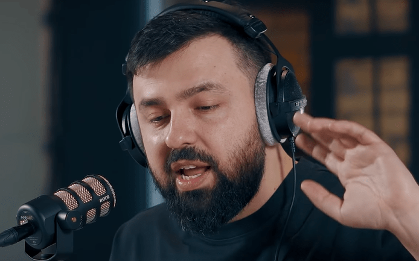
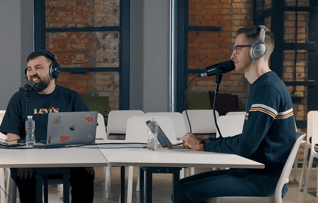
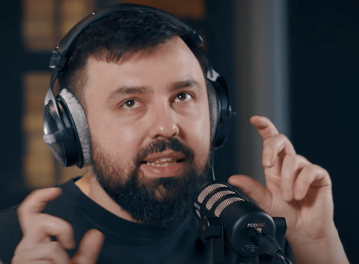

І так, якимсь дивом вийшло нове відео від "редакції" "журналістів" ДОУ без участі Софтсерва.

Так як це дуже рідкісний момент, то все-таки вирішив зробити огляд і цього подкасту :)

Далі по тайм кодах можна стрибати на відоси і читати мої коменти.

```
Це чисто розважальний контент, всі імена і назви випадково співпали.
Взагалі, цей подкаст самий веселий і кльовий, який тільки випускала команда та редакція журналістів ДОУ!
```

# [05:44-10:00 Навіщо Рекрутери](https://youtu.be/F76jxcjHq_s?t=344)


Всі, хто кажуть, навіщо рекрутери, або не наймали самі, або наймали мало. Якщо починаєш наймати багато, то це переходить в твою роботу і ти сам стаєш рекрутером лол.

Мені доводилося працювати з чудовими рекрутерами з обох боків, і вони завжди були дуже доречні. Якщо хтось думає, що він прямо такий діамант і його має хантить СТО чи VP of Eng особисто, то помиляєтесь. Бо на ринку така кількість хламу, що просто повісишся розбирати то все.

- У вас перевіряють англійську? Ну так, є такі персонажі, які після 10 років на галерах взагалі не можуть звязати два слова і потім бекають або мекають. До речі, серед нового покоління, це майже не зустрічається, англійська на доволі високому рівні знаходиться! Що не може не радувати :)

- Уточнюють по резюме позиції деякі? Якщо команду цікавлять саме такі технології чи досвід, то вони і просять рекрутерів звужувати фільтри пошуку.

Так що чого випендрюваться так, і тим паче зневажати рекрутерів - я не розумію так само, як і ведучі подкасту.

# [09:30-10:30 Про Батю](https://youtu.be/F76jxcjHq_s?t=559)



Дякую за референс :) Так як ДОУ являється повною домінантою нашого простору, то має хтось створювати новий центр тяжіння (без висерів штатних гештальт шарлатанів від мякоподаних на глагне на 4 дні)

# [15:19 GitLab сховав кальулятор по зп / Контори замовчують зпешкі](https://youtu.be/F76jxcjHq_s?t=919)


Чому контори забороняють озвучувати свої зп між колегами? Бо завжди є лох, якому платять 0.5х, але робить за всіх 3х. Завжди. Тому для компанії замовчування таких фактів дуже вдалий варіант, щоб цей лох не пішов від них, а далі працював. Ще можна накинути через рік +0.2х і лох буде працювати ще інтенсивніше.

Також це метод маніпуляцій від менеджменту. Наприклад, одному Full Time Equivalent кажеш, що йому дали найбільший бонус (130%), то він самий крутий в компанії. Потім цей же менеджер каже іншому: тобі дали самий великий бонус в команді, аж 115%!! Вибивав особисто у фіндіра, поклав свою кар'єру заради твого рейза!! Потім каже треттьому: ти отри...Ну алгоритм зрозумілий.

Якщо хочеться взнати лох чи ні, то варто походити по собесах, там все узнаєш :)

# [18:00 Про підвищення зп](https://youtu.be/F76jxcjHq_s?t=1077)


Судячи з твітора, в EU багато компаній проводять привентивні підвищення зп, щоб побити інфляцію і хоч якось втримати розробників у себе.

Раджу підписатися на [@Gergely Orosz](https://twitter.com/GergelyOrosz/status/1469012276774678530?s=20), він колишній Sr Staff Engineer в Uber, постійно постає купу інсайдів і думок. Один з найкращих твітер акаунтів. Якщо погортати його твіти, він постійно виставляє анонімні дані про нові зп по Європі. Судячи з усього, якщо вам до лютого не накинуть 20-30% зп, то вас мають. Тому вперед на leetcode!

# [37:02 Про Акції](https://youtu.be/F76jxcjHq_s?t=2220)



Мені ці всі акції і їх тримачі нагадують совків, які мали по 20 000 - 40 000 рублів (це десь 4-6 авто) на Держкасі, мріяли про майбутнє і як вони використають ці всі гроші, колись. Правда потім прийшов кінець і все пропало. Так само і з ціми бумажками: у вас є віртуальні гроші, які ви якось колись може використаєте, якщо ця тех бульбашка не лопне, і ви залишитесь ні з чим.

Я особисто маю акції, але продаю їх, як тільки приходить можливість. Життя одне, і воно зараз!

# [59:02 Про Освіту](https://youtu.be/F76jxcjHq_s?t=3542)



Знову підняли цю тему. Я про це уже дуже детально описав в своєму #metapersona профілі:

[http://dmytrogladkyi.com/#/catalog/posts/why_education](http://dmytrogladkyi.com/#/catalog/posts/why_education)

Що цікаво: ще раз підвердження, що ті, хто каже про непотрібність освіти, або зараз працюють формошлепами, або вчились в якихось гавновузах.

Там обговорюють і інший допис на ДОУ, де КПІшнік з РТФ вчився на Телебачення, а потім пішов в галеру, і О БОЖЕ. Телебачення там не треба йому! Атас!

Вкіньтесь! Вчився на програміста, пішов працювати юристом, освіта не треба! Просрав 5 років!

Взагалі, просто прочитайте ту мою нетленку. Цесарю цесареве.

# [01:19:10 Продаж DepositPhotos](https://youtu.be/F76jxcjHq_s?t=4760)


Чомусь доушники (жителі нижнього ДОУ) всі там аж обісралися, що продали так дешево, он гітлаб уже 19 лярдів, грамарлі 30. А тут фу 80 лямів.
Вам і 4 ляма через 40 років не буде снитися, а у нього все вийшло і можна уже відпочивати. Або працювати над чимось іншим, без пресингу.
За таке краще лише радіти. Всі ми могли в 2011 зробити фотобанк на пхп і зараз мати 20-30млн в кишені.

# Це все

На цьому другий огляд ДОУ закінчено. Чекаю на новорічний випуск!


