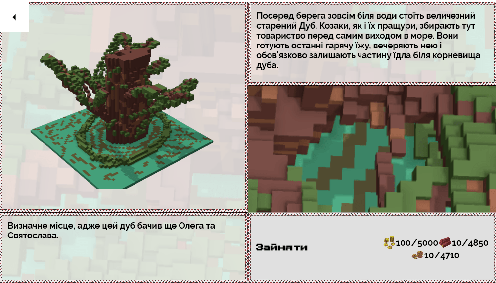

# Стисло

- Велика мапа Війська Запорозького
- Треба відкрити шлях до Чорного Моря
- Захоплення Очакова
- Більше 20 нових voxel артів
- Човни
- Біля 40 унікальних точок на мапі півдня України

Відеогляд новинок: [https://www.youtube.com/watch?v=tHyxnIOz2bY](https://www.youtube.com/watch?v=tHyxnIOz2bY)

# Де взяти гру?

Гра доступна онлайн:  [https://locadeserta.com/sloboda/](https://locadeserta.com/sloboda/), але будьте уважні - тут викладаються розробницькі збірки.

Релізні випуски гри доступні на Google Play Store:  [Дике Поле: Слобода](https://play.google.com/store/apps/details?id=com.gladimdim.sloboda)

Ви також можете скачати APK та Windows збірки напряму з github:

[Реліз 3.0.1 на Github](https://github.com/gladimdim/locadeserta/releases/tag/3.0.1)

[Збірка для Android APK](https://github.com/gladimdim/locadeserta/releases/download/3.0.1/sloboda_301.apk)

[Windows 10 збірка](https://github.com/gladimdim/locadeserta/releases/download/3.0.1/sloboda_301_windows.zip)

# Нововведення в ігролад

Колись хотіли пограти в стратегію на реальних теренах півдня України? В оновленні 3.0.1 була додана мапа Війська Запорозького (однієї з паланок, сучасна Херсонська та Миколаївська області).

Тепер ви можете захоплювати і розширяти території Війська Запорозького, а головна мета - плюндрування турецької фортеці Очаків!

Мапа відкривається і вам одразу стає доступним навколишні курені:

Кожна з точок на мапі має унікальні характеристики, але щоб ними скористатися, вам треба захопити її. Для цього треба витратити трошки ресурсів:

Після цього можна торгувати з новим куренем або уходниками:

Всі точки на мапі діляться на три типи:

- ресурсні для торговлі
- військові, для розширення земель та просування до Очакова.
- точки, які просто цікаво захопити.

До останнього типу відносяться місце загибелі Святослава та тисячолітній дуб, який колись стояв на правому березі Дніпра і слугував точкою збору для воїнів:

### Дуб:

### Старий жертовник:

### Могила Святослава Хороброго:

## Розширення території

Після захоплення, кожна точка відкриває навкруги себе мапу. Таким чином, ви можете розширювати територію паланки і врешті-решт вийти до Очакова:

## Кожна точка - унікальна.

Всього в гру було додано 20 нових voxel картинок, а також зроблено описання більше 40 куренів або хфігур:

## Військові дії

Головна мета на мапі - досягти Очакова та сплюндрувати його. В той час це було місто Османської імперії. Біля входу в лиман турки поставили фортеці, які заважали виходу козаків в Чорне Море.

Просуваюсь по Дніпру, ви врешті-решт дійдете до чих охороних веж:

Перед тим, як ви зможете захопити вежі, треба створити надійний тил для своїх військ, а саме - захопити і підтримувати курені навколо лиману:

І ось основна мета - Очаків!

## Захоплення Очакова

Штурм Очакова це дуже дорога річ. Вам треба мати багато війська, ресурсів (вози, човни, гармати, їжу). Бо перед тим, як його захопити, треба сплюндрувати дві обороні вежі на Дніпрі.

Винагорода буде дуже висока. **А також вам відкриється шлях до Чорного Моря. А це означає, що в нових версіях ми будемо плюндрувати Малу Азію та невольницькі ринки в Криму.**