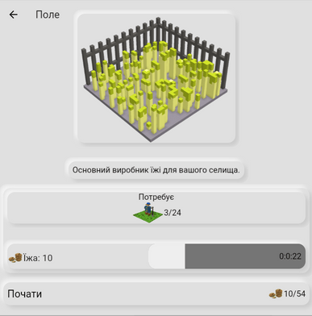
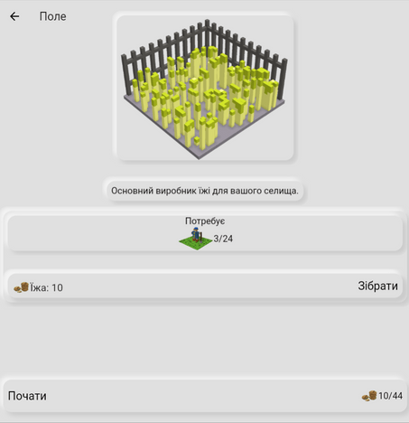
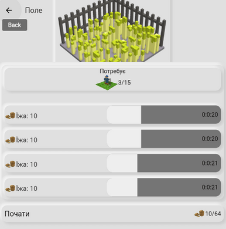
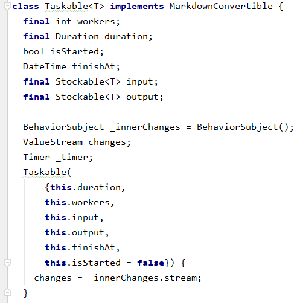
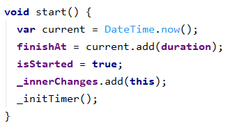
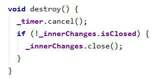
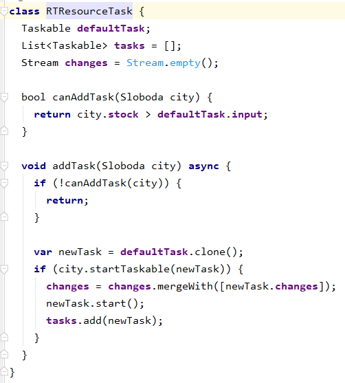
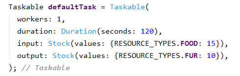
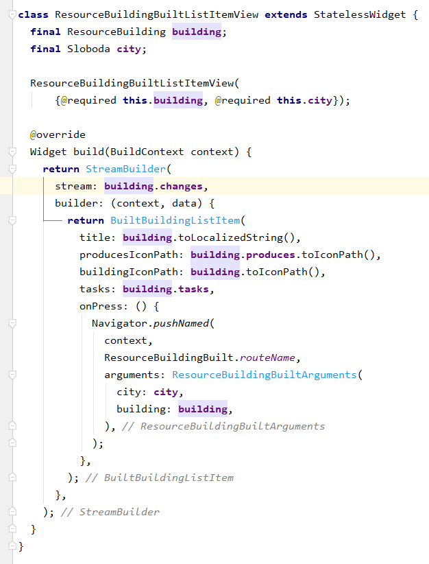

Ви уже могли читати першу статтю в моїй серії імплементацій ігрових механік:  [Дизайн та реалізація механізму подій в покроковій грі](https://dmytrogladkyi.com/#/catalog/posts/sloboda_dizajn-ta-realizaciya-mehanizmu-podij-v-pokrokovij-gri) . В цій же статті я покажу дизайн та імплементацію ігрової механіки на основі задач, яку я зробив в своїй грі  [Слобода](https://locadeserta.com/sloboda). Вихідний код гри знаходиться на GitHub:  [https://github.com/gladimdim/sloboda
](https://github.com/gladimdim/sloboda)
# В чому різниця між покровою грою і грою із задачами?

## Покрокова гра
Покрокову гру легше реалізовувати, тому для першої ітерації була вибрана саме ця механіка. У розробника завжди є єдина точка зміни стану гри - гравець натиснув кнопку "Завершити хід". Під час обробки події дуже легко обробити всі стани будівель, інвентаря, подій, статистики.

Наприклад, алгоритм обробки генерації ресурсів складається з таких кроків:

1. Перевірити, чи є достатньо ресурсів для початку виробництва.
2. Забрати ресурси зі складу.
3. Додати в склад ресурси, які згенерувала будівля.

Якщо пункт №1 не проходить перевірку, то продовжити з наступною будівлею.

Але такий підхід дуже спрощує і сам ігролад: гравець може виставити, наприклад, виробництво їжі на максимум і просто заспамити гру ходами. Через 10 ходів в інвентарі буде сотні їжі, яка уже може бути використана для інших виробництв. І за 5-10 хвилин гравець уже програв 20-30 ігрових років і має сотні ресурсів. Грає стає не цікавою. Хоч я і додав катастрофічні ігрові події, які можуть повністю вичистити склад або людей, але відновити дієздатність Слободи все одно займає 1-2 хвилини клацання на кнопку "Завершити хід".

## Гра із задачами
В цьому типу гри уже немає кнопки "Хід", натомість, всі маніпуляції з Слободою відбуваються через запуск задач для генерації ресурсів. Задачі займають якийсь час для завершення. В кінці терміну гравець може зібрати результат виконання.

Наприклад, ресурс "Поле" генерує їжу, для виробництва необхідно лише 3 вільних людей:

Коли час на виконання задачі закінчився, можна зібрати ресурси до інвентаря:

Може бути запущено багато задач на одній з ресурсних будівлях:

## Вимоги до функціоналу

### Задача має:
- Визначити свої вхідні потреби.
- Визначити вихідний результат.
- Визначити час, за який вона завершується.

### Будівля має:
- Список можливих для запуску задач.
- Список активних задач.
- Внутрішній таймер перевірки виконання задач з активного списку.
- Завершити задачу з отриманням результату.
- Почати задачу з задовільненням її вхідних потреб.
- Потік з оновленнями прогресу виконання задач для оновлення свого віджету.

# Імплементація
## Спочатку імплементуємо клас Taskable, який буде єдиним класом для всіх задач.

Він має додаткову властивість **bool isStarted**, яка визначає чи задача уже почала своє виконання.

**DateTime finishAt** містить час, коли задача буде виконана. Встановлюється автоматично в правильну дату, якщо задача стартується.

Метод **start** розпочинає виконання задачі:

І не забуваємо підчищяти за собою таймери і потоки:

## Імплепентація роботи із задачами в класі ResourceBuilding

У нас є клас **Taskable**, тепер можна розширити функціонал **ResourceBuilding** , щоб будівля могла працювати із задачами.

Для початку додамо наступний новий клас RTResourceTask. Він розширяє клас зі списком задач і потоком. В цей потік будуть кидаться повідомлення, якщо задача виконана. Це буде місток між UI, будівлею і задачами в ній:

**Taskable defaultTask** буде визначатися кожною будівлею окремо. Це буде шаблон для створення задачі, коли гравець натисне кнопку «Почати задачу».

Приклад стандартної задачі для Будинку Мисливця:

Тепер кожен раз, коли додається задача до будівлі, потік зі змінами в статусі задачі додається до потоку змін будівлі. І за допомогою **StreamBuilder** віджета можна оновлювати стан виконання задач на екрані:

# Заключення

Весь дизайн виявився напрочуд простим. Всього одним класом **Taskable** та розширенням **RTResourceTask** ресурсних будівель, вдалося змінити механіку гри з покрової на задачну.

Вихідний код гри знаходиться тут:  [https://github.com/gladimdim/sloboda](https://github.com/gladimdim/sloboda)

Сама гра доступна онлайн: http://locadeserta.com/sloboda, або в Google Play Store:  [https://play.google.com/store/apps/details?id=com.gladimdim.sloboda](https://play.google.com/store/apps/details?id=com.gladimdim.sloboda) 