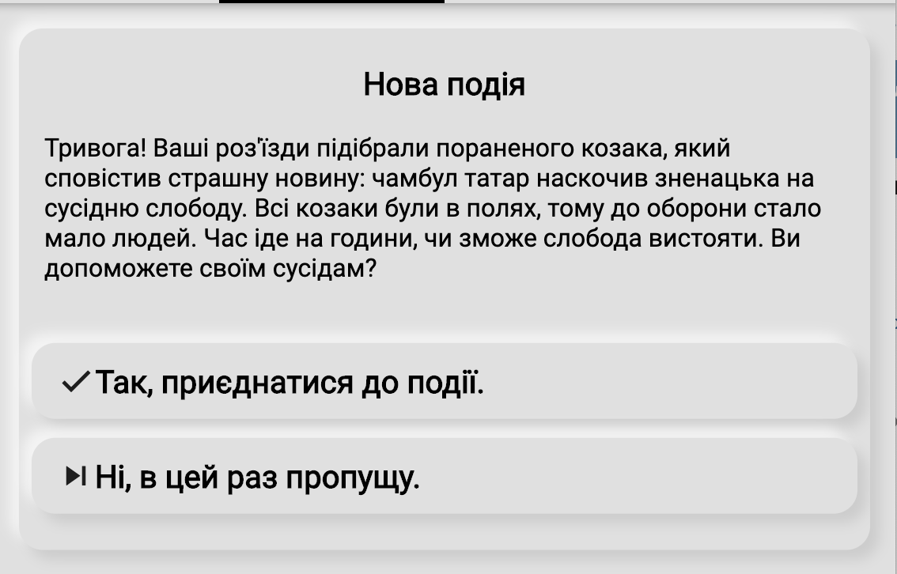
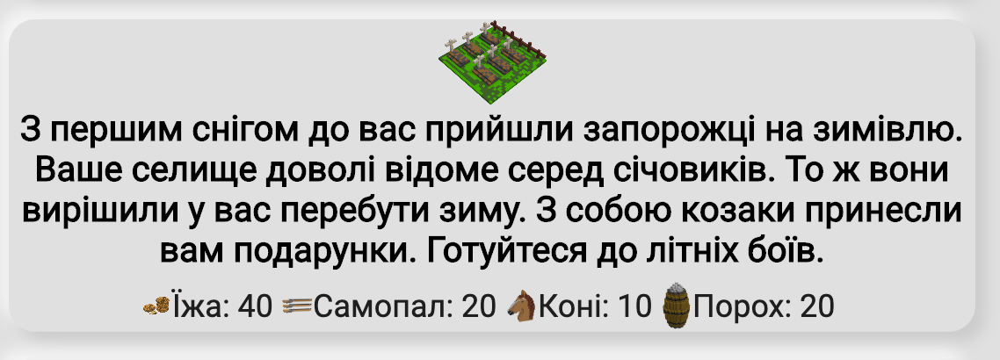
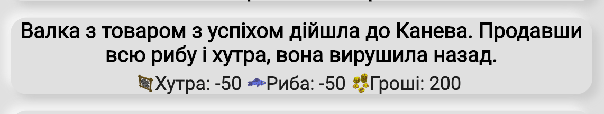
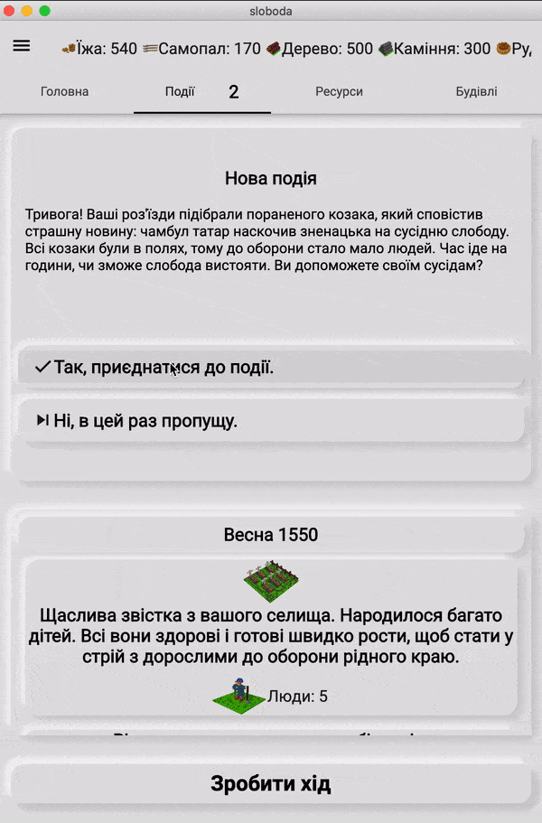

*Захотілося розбавити статті про Flutter&Dart чимось прикладним, а не черговим описом Todo/Counter/REST/CRUD фігнею.*

Під час розробки покрокової  [гри в стилі "побудуй селище"](https://locadeserta.com/sloboda) у мене постала необхідність у впроваджені сутності подій. За задумом, в залежності від показників вашого селища та часового проміжку, в грі мали б з'являтися різні явища/подіЇ. Наприклад: напад сарани весною, приїзд купців, якщо у вас на складі достатньо накопичено товарів для них, військові дії, якщо у вас є достатньо військ, прохання допомоги від інших селищ, якщо ваше селище доволі відоме і має військову силу. Щоб цей розвиток подій не був лінійним, я також додав елемент випадковості до кожної події. Наприклад, атака сарани має 20% шанс, відвідання купця - 100%.

Додаткові складність вносить також інтерактивність в ці події: на деякі події я можу погодитися, а можу і ні. Наприклад: вислати допомогу сусідній слободі. Я можу як послати туди військовий загін, так і проігнорувати. Кожен вибір має вплив на подальший розвиток подій і впливає на показники слободи. Вдалий військовий похід приносить прибуток і славу. Невдалий - втрата військ і ресурсів.

Приклад умовної події:



Але є ще події, які відбуваються безумовно (прості події). Наприклад: ви не можете вибрати, чи нападе на вас сарана, чи ні. Або чи прийдуть до вас гості, чи ні.



І щоб додати ще більшої непередбачуванності, кожна з подій має два розвитки: успішний і провальний. Вдалий напад сарани на вас забере ресурси. В той же час вдалий військовий похід принесе вам їх. Успіх/провал я вирішив також зробити елементом випадковості.

Приклад успішного результату події з торгівлею:



## Тобто, можна підсумувати вимоги до механізму подій:

1. Подія може бути з вибором або проста.
2. Подія має якийсь випадковий шанс до активації.
3. Активуватися подія може лише при наявності якихось факторів, показників Слободи, пори року, рік, результатам попередніх подій.
4. Кожна подія (умовна і проста) має шанс на успіх і на провал.
5. Умовна подія, у разі її активації користувачем, має випадковий шанс на успіх і провал.
6. Кожна подія (умовна і проста), визначає наслідки для гравця (зменшення/збільшення ресурсів).
7.  Наслідки від подій можуть наступити або одразу в цей же хід гри, або на наступний.
8. Подія має інформувати гравця (у текстовому вигляді) про успіх, невдачу, настання події, закінчення події. Всі повідомлення мають бути локалізованими.

# Реалізація

Поки що, у нас існує два типи подій: RandomTurnEvent та ChoicableRandomTurnEvent. Перший відповідає за прості події, другий - дає змогу користувачеві можливість активізувати себе.

Спочатку імплементуємо абстрактний класс RandomTurnEvent, який би повністю покривав потреби простих події:

```dart
abstract class RandomTurnEvent {
  // ключ для локазізованної назви події
  String localizedKey;

  // список функцій, які перевіряють можливість активації події.
  List<Function> conditions;

  // вплив на ресурси слободи у випадку успіху
  Stock stockSuccess;

  // вплив на ресурси слободи у випадку провалу
  Stock stockFailure;

  // картинка, якщо подія успішна
  String successIconPath = "images/events/success_event.png";

  // картинка, якщо подія провальна
  String failureIconPath = "images/events/failed_event.png";

  // вплив на показники селища
  CityProps cityPropsSuccess;
  CityProps cityPropsFailure;

  // ключі до локалізованих повідомлень
  String successMessageKey;
  String failureMessageKey;

  // вірогідність активації події. Від 0 до 100.
  int probability = 0;

  // вірогідність успіху події. Від 0 до 100.
  int successRate = 0;
}
```

Тепер заімплементуємо декілька методів.

- Перевірка виконання умов для події:
```dart
  bool satisfiesConditions(Sloboda city) {
    for (var func in conditions) {
      if (!func(city)) {
        return false;
      }
    }
    return true;
  }
```
- Перевірка випадковості та виконанню подій. Тобто, чи буде активована подія чи ні.
```dart
  bool canHappen(Sloboda city) {
    bool canHappen =
        Random().nextInt(100) < probability && satisfiesConditions(city);
    debugPrint(
        'Event: $localizedKey satisfies: ${satisfiesConditions(city)}, will happen: $canHappen');
    return canHappen;
  }
```
- Виконання події у разі її активації

```dart
  Function execute(Sloboda city) {
    var r = Random().nextInt(100);
    return () {
      bool success = r <= successRate;
      return EventMessage(
          event: this,
          stock: success ? stockSuccess : stockFailure,
          cityProps: success ? cityPropsSuccess : cityPropsFailure,
          imagePath: success ? successIconPath : failureIconPath,
          messageKey:
              success ? this.successMessageKey : this.failureMessageKey);
    };
  }
```

Функція execute повертає іншу функцію. Про це буде описано нижче.

За допомогою всього  трьох методів і з десятка властивостей класу, ми можемо повністю описати випадкову просту подію.

Для прикладу візьмемо напад сарани:

```dart
class SaranaInvasion extends RandomTurnEvent {
  String localizedKey = 'randomTurnEvent.saranaInvasion';
  String successMessageKey = 'randomTurnEvent.successSaranaInvasion';
  String failureMessageKey = 'randomTurnEvent.failureSaranaInvasion';
  int probability = 50;
  int successRate = 40;

  Stock stockSuccess = Stock(
    values: {
      RESOURCE_TYPES.FOOD: -50,
      RESOURCE_TYPES.HORSE: -10,
    },
  );

  Stock stockFailure = Stock();

  List<Function> conditions = [
    (Sloboda city) {
      return city.currentSeason is SpringSeason;
    },
  ];
}

```

Із умов настання цієї події у нас лише: весна. І з вірогідністю 50% сарана нападе на селище, і з вірогідністю 40% вона все-таки насесе шкоду (буде успішна). Для створення нових подій треба лише описати основні параметри RandomTurnEvent класу і не треба навіть додавати якусь логіку, якщо влаштовує стандартна.

Більш складний приклад настання події для приходу до вас переселенців з інших селищ:

```dart
List<Function> conditions = [
    (Sloboda city) {
      return city.currentSeason is AutumnSeason;
    },
    (Sloboda city) {
      return city.props.getByType(CITY_PROPERTIES.GLORY) > 20;
    },
    (Sloboda city) {
      try {
        city.cityBuildings.firstWhere((element) => element is Church);
        return true;
      } catch (e) {
        return false;
      }
    }
  ];
```

Якщо осінь, популярність селища більша за 20, якщо побудована церква, то до вас прийдуть ( з якоюсь випадковою вірогідністю) нові люди.

# Випадкові події, які вимагають вибору гравця
Розібралися з просто випадковими подіями, тепер реалізуємо події, які вимагають вибору гравця і вступають в силу на наступний хід гри (сезон).

Використовуючи міць ООП, ми можемо перевикористати весь клас RandomTurnEvent, і додати лише методи і властивості, які стосуються вибору.

Нових властивостей лише три:

```dart
abstract class ChoicableRandomTurnEvent extends RandomTurnEvent {
  String localizedQuestionKey;
  String localizedKeyYes;
  String localizedKeyNo;

```

Вони використовуються для відображення повідомлень гравцю на екрані: запитання, текст у разі відповіді Так або Ні.

Особливість покрокових ігор в тому, що дія гравця на поточному ході насправді виконується лише на наступному. Наприклад: ви надіслали військо в похід. Результат походу ви одразу не знаєте (поки дійдуть війська і тд), тому його виконання має передатися на наступний хід.

Для цього ми додамо новий метод postExecute. Він якраз і буде зв'язуючою ланкую між ходами:

```dart
 Function postExecute(Sloboda city) {
    var r = Random().nextInt(100);
    return () {
      bool success = r <= successRate;
      return EventMessage(
          event: this,
          stock: success ? stockSuccess : stockFailure,
          cityProps: success ? cityPropsSuccess : cityPropsFailure,
          messageKey:
              success ? this.successMessageKey : this.failureMessageKey);
    };
  }
```

Метод повертає ще одну функцію, яка буде виконана під час настання наступного ходу.

Гравець же, вірніше віджет подій, працює з наступним методом:

```dart
  Function makeChoice(bool yes, Sloboda city) {
    if (yes) {
      return this.postExecute(city);
    } else {
      return () {};
    }
  }
```

Він напряму викликається з обробчика діалогу. Якщо гравець погодився взяти участь в події, то в чергу подій додається результат виконання this.postExecute(city). Цей результат являє собою посилання на іншу функцію, яка ще не виконана.

В класі Sloboda, що являє собою обробчик всіх подій і відповідає за управління ресурсами, людьми, подіями, є список зареєстрованих подій:

- Обробчик вибору гравця
```dart
  void runChoicableEventResult(ChoicableRandomTurnEvent event) {
    Function f = event.makeChoice(true, this);
    _nextRandomEvents.add(f);
  }
```

- Під час обробки наступного ходу, виконується метод, який ітерує по всіх зареєстрованих подіях і виконує їх:

```dart
 void _runAttachedEvents() {
    for (var _event in _nextRandomEvents) {
      EventMessage event = _event(); // це уже безпосередньо результат виконання вкладеної в postExecute функції
      this.stock + event.stock;
      this.addProps(event.cityProps);
    ....
```

## Приклад події з вибором

```dart
class BuyPrisoners extends ChoicableRandomTurnEvent {
  String successMessageKey = 'randomTurnEvent.successBuyPrisoners';
  String failureMessageKey = 'randomTurnEvent.failureBuyPrisoners';
  String localizedKeyYes = 'randomTurnEvent.BuyPrisonersYes';
  String localizedKeyNo = 'randomTurnEvent.BuyPrisonersNo';

  int probability = 100;

  Stock stockSuccess = Stock(values: {
    RESOURCE_TYPES.MONEY: -40,
  });

  Stock stockFailure = Stock(values: {
    RESOURCE_TYPES.MONEY: 20,
  });

  CityProps cityPropsFailure = CityProps(
    values: {
      CITY_PROPERTIES.GLORY: 10,
      CITY_PROPERTIES.CITIZENS: 15,
      CITY_PROPERTIES.FAITH: 10,
    },
  );
  CityProps cityPropsSuccess = CityProps(
    values: {
      CITY_PROPERTIES.CITIZENS: 5,
    },
  );

  int successRate = 30;

  String localizedKey = 'randomTurnEvent.BuyPrisoners';
  String localizedQuestionKey = 'randomTurnEvent.BuyPrisonersQuestion';

  List<Function> conditions = [
    (Sloboda city) {
      return city.currentSeason is AutumnSeason;
    },
    (Sloboda city) {
      return city.stock.getByType(RESOURCE_TYPES.MONEY) > 40;
    },
    (Sloboda city) {
      return ChoicableRandomTurnEvent.onceInYears<BuyPrisoners>(city, 3);
    }
  ];
}
```


# Запуск подій

Клас Sloboda, який відповідає за роботу всього селища, має чергу наступних подій:

```dart
  final Queue<RandomTurnEvent> pendingNextEvents = Queue();
```

Під час кожного ходу, Sloboda опитує всі події із списку і бере перші 3 з них, які можуть бути активними на даному ходу:

```dart
  _queueNextEvents() {
    List<RandomTurnEvent> choicableEvents =
        getChoicableRandomEvents().take(3).toList();
    pendingNextEvents.addAll(choicableEvents);
  }
```

Ця черга використовується у віджеті, який показує доступні події один за одним:

```dart
 Widget build(BuildContext context) {
    final city = InheritedCity.of(context).city;
    final Queue<RandomTurnEvent> pendingEvents = city.pendingNextEvents;
    return Column(
      children: <Widget>[
        if (pendingEvents.isNotEmpty)
          Expanded(
            flex: 3,
            child: PendingEventsView(
              events: pendingEvents,
            ),
          ),
```

Коли гравець робить свій вибір, то з черги видаляється екземпляр цієї події і додається в журнал селища запис з вибором гравця:

```dart
  void addChoicableEventWithAnswer(bool yes, ChoicableRandomTurnEvent event) {
    events.add(
      CityEvent(
        season: currentSeason.previous,
        yearHappened:
            currentSeason is WinterSeason ? currentYear - 1 : currentYear,
        sourceEvent: EventMessage(
          stock: null,
          event: event,
          messageKey: event.choiceToStringKey(yes),
        ),
      ),
    );

    if (yes) {
      runChoicableEventResult(event);
    }

    pendingNextEvents.remove(event);

    _innerChanges.add(this);
  }
```

### Реєстр всіх подій
Нажаль, в Dart немає можливості отримати всі під класи якогось класу, як це зроблемно в Smalltalk. Тому кожен новий клас подій необхідно додати в статичний список:

```dart
static List<RandomTurnEvent> allEvents = [
    KoshoviyPohid(),
    TartarsRaid(),
    SaranaInvasion(),
    ChildrenPopulation(),
    SteppeFire(),
    RunnersFromSuppression(),
    SettlersArrived(),
    GuestsFromSich(),
    ChambulCapture(),
    MerchantVisit(),
    UniteWithNeighbours(),
    HelpNeighbours(),
    BuyPrisoners(),
    AttackChambul(),
    TrapChambulOnWayBack(),
    HelpDefendSich(),
    SendMoneyToSchoolInKaniv(),
    SendMerchantToKanev(),
    AttackCatholicChurches(),
    HelpDefendAgainstCatholicRaiders(),
  ];
```

# Демонстрація:



# UML схема всіх подій


# Заключення

Реалізований механізм подій виявився доволі гручким. Кожна з подій може задавати свої необхідні умови, кастомізувати їх під свої потреби. Наприклад, подія "Відвідування купця", має свою власну postExecute імплементацію, так як їй треба визначити наявність товару і провести калькуляцію винагороди.

```dart
Function postExecute(Sloboda city) {
    var r = Random().nextInt(100);
    return () {
      bool success = r <= successRate;
      var furTotal = city.stock.getByType(RESOURCE_TYPES.FUR);
      var fishTotal = city.stock.getByType(RESOURCE_TYPES.FISH);
      var stock = Stock(values: {
        RESOURCE_TYPES.FUR: -furTotal,
        RESOURCE_TYPES.FISH: -fishTotal,
      });

      if (success) {
        stock.addToType(RESOURCE_TYPES.MONEY, (furTotal + fishTotal) * 2);
      }
      return EventMessage(
          event: this,
          stock: stock,
          cityProps: null,
          messageKey:
              success ? this.successMessageKey : this.failureMessageKey);
    };
  }
```

І що саме головне, з точки зору Flutter Widget, немає ніякої різниці, який тип подій відобразити гравцю:

```dart
// тут десь Column вище
 ..._events[key].reversed.map((event) {
    var textStyle;
    if (city.currentSeason.isNextTo(event.season)) {
      textStyle = Theme.of(context).textTheme.headline6;
    }
    return Padding(
        padding: const EdgeInsets.all(8.0),
        child: SoftContainer(
          child: Column(
            children: <Widget>[
              if (event.sourceEvent.imagePath != null)
                Image.asset(
                  event.sourceEvent.imagePath,
                  width: 64,
                ),
              FullWidth(
                child: Text(
                  SlobodaLocalizations.getForKey(
                      event.sourceEvent.messageKey),
                  textAlign: TextAlign.center,
                  style: textStyle,
                ),
              ),
              if (event.sourceEvent.stock != null)
                StockMiniView(
                  stock: event.sourceEvent.stock,
                  stockSimulation: null,
                ),
              if (event.sourceEvent.cityProps != null)
                CityPropsMiniView(
                  props: event.sourceEvent.cityProps,
                ),
            ],
          ),
        ));
  }).toList()
```

# То ж, грайте в Слободу https://locadeserta.com/ та читайте інтерактивні історії!

Збірки під десктоп платформи та андроід: https://github.com/gladimdim/sloboda/releases