# Стисло

- Додані дослідження. Тепер можна відкривати різноманітні винаходи у вашій Слободі для покращення виробничих процесів. 
- Доданий арт для фонових малюнків всіх будівель та ресурсних точок на мапі.

# Де взяти гру?

Гра доступна онлайн:  [https://locadeserta.com/sloboda/](https://locadeserta.com/sloboda/), але будьте уважні - тут викладаються розробницькі збірки.

Релізні випуски гри доступні на Google Play Store:  [Дике Поле: Слобода](https://play.google.com/store/apps/details?id=com.gladimdim.sloboda) 

Ви також можете скачати APK та Windows збірки напряму з github:

 [Реліз 2.9.0 на Github](https://github.com/gladimdim/locadeserta/releases/tag/2.9.0-sloboda) 

 [Збірка для Android APK](https://github.com/gladimdim/locadeserta/releases/download/2.9.0-sloboda/sloboda_2.9.0.apk) 

 [Windows 10 збірка](https://github.com/gladimdim/locadeserta/releases/download/2.9.0-sloboda/sloboda_290.zip) 

# Нововедення в ігролад

Гравцю дається можливість витрачати зароблену Славу та ресурси на відкриття досліджень.

Щоб відкрити список доступних досліджень, треба натиснути на нову кнопку:

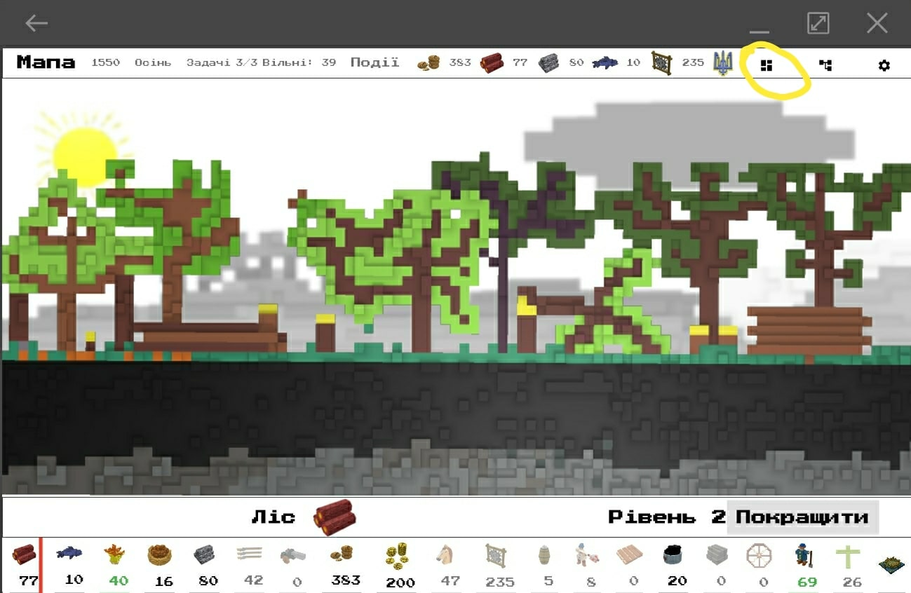

Наразі доступно 7 відкритів, які значно покращують ефективність виробничих ланцюжків:

## Подвійний плуг

Значно полегшує роботу в полі.

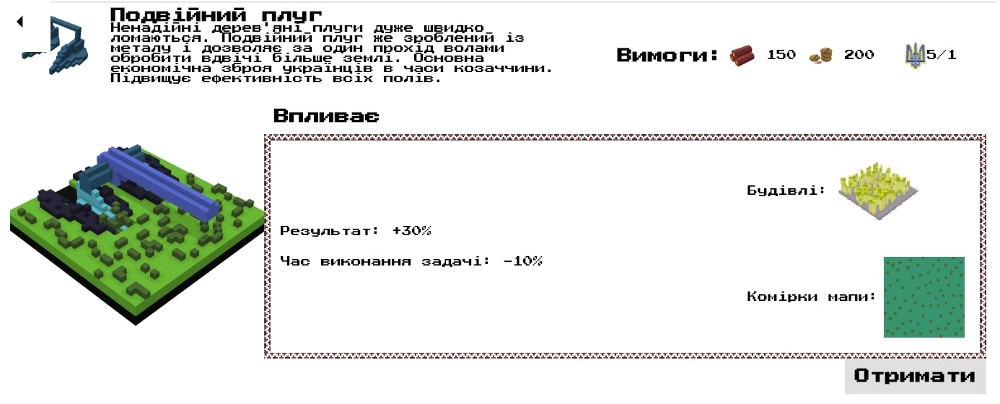

## Вертикальна пилка

Дошки пиляються швидше на лісопилці.

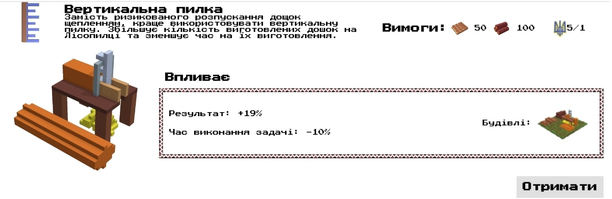

## Міцна сітка

Риболовля дає більше результату.

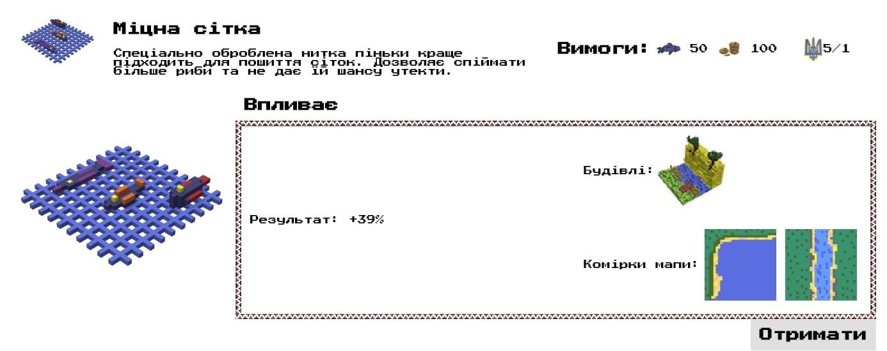

## Московський замок

Уніфіковане виробництво московських замків до самопалів.

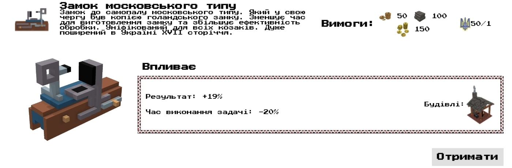

## Татарська підкова

Допомогає швидше виводити коней для війська.

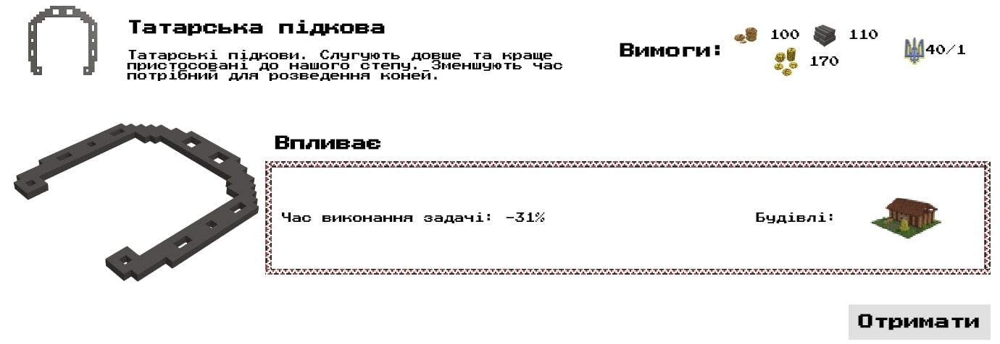

## Полегшена сокира

Рубати дерева стало легше. Зменшує час виконання задач та збільшує результат.

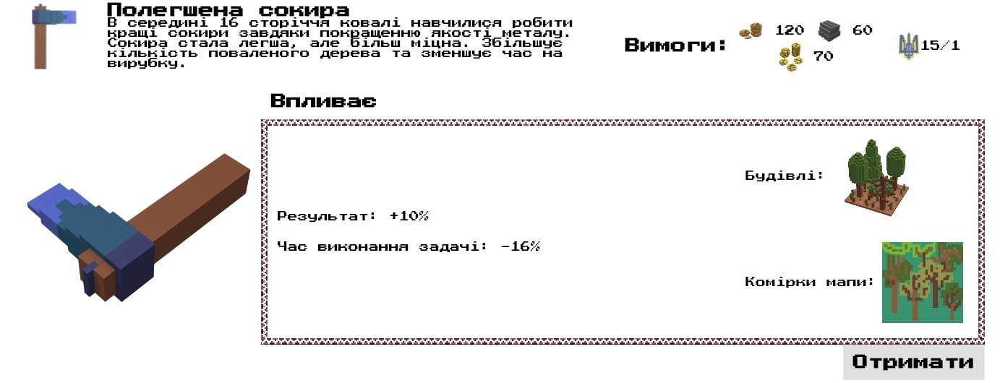

## Покращене ковадло

Працювати з металом стало легше. 

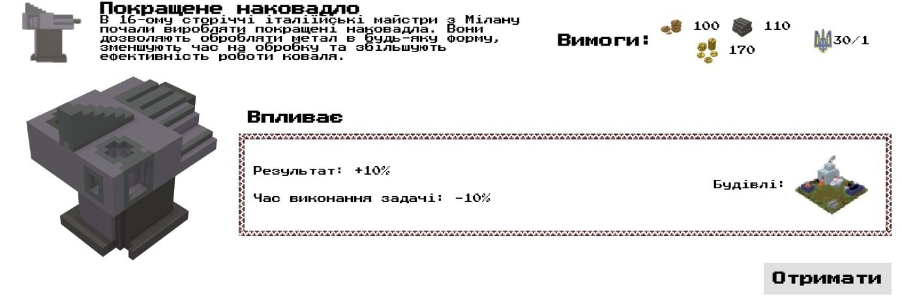

# Більш різноманітний вигляд будівель.

Екрани, на яких зображені деталі виробництва будівель, стали різноманітнішими. Було додано близько 20 нових артів для фонових малюнків:

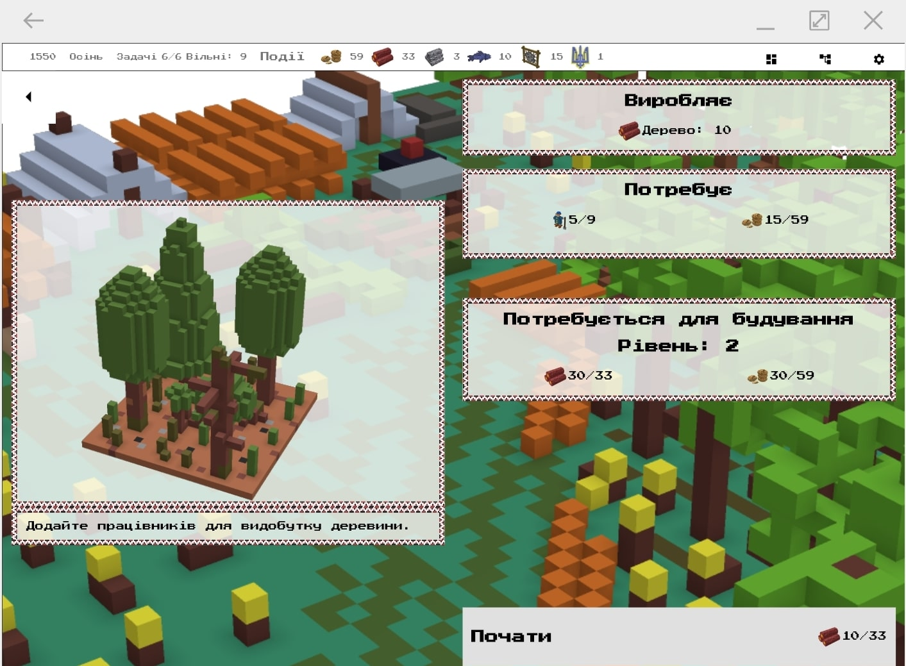

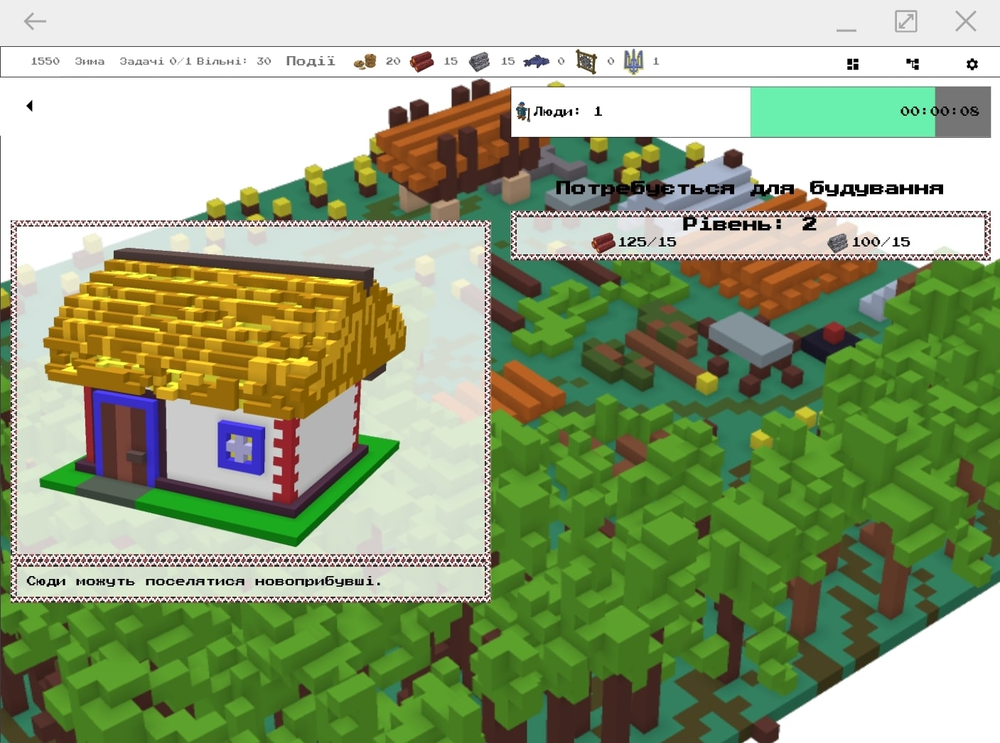

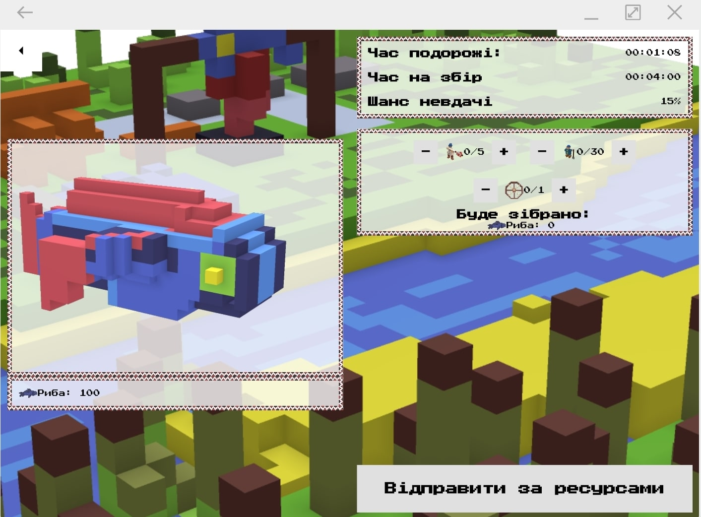

## Кольорова ідентифікація задач в будівлях

Раніше важко було зрозуміти, який будинок завершив виробництво, а який досі працює. Тепер це стало легше зробити завдяки кольоровій ідентифікації стану задач. Синій означає, що роботи ще ведуться. А зелений - всі задачі виконані:

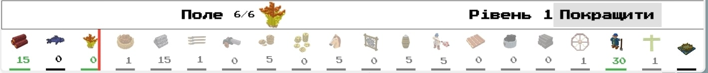

# Слава

За вдалі військові або мисливські заходи ви також будете отримувати славу. Ці очки потім можна використовувати для відкриття досліджень. Тому розвивайте військо, беріть участь у походах і здобувайте славу!
