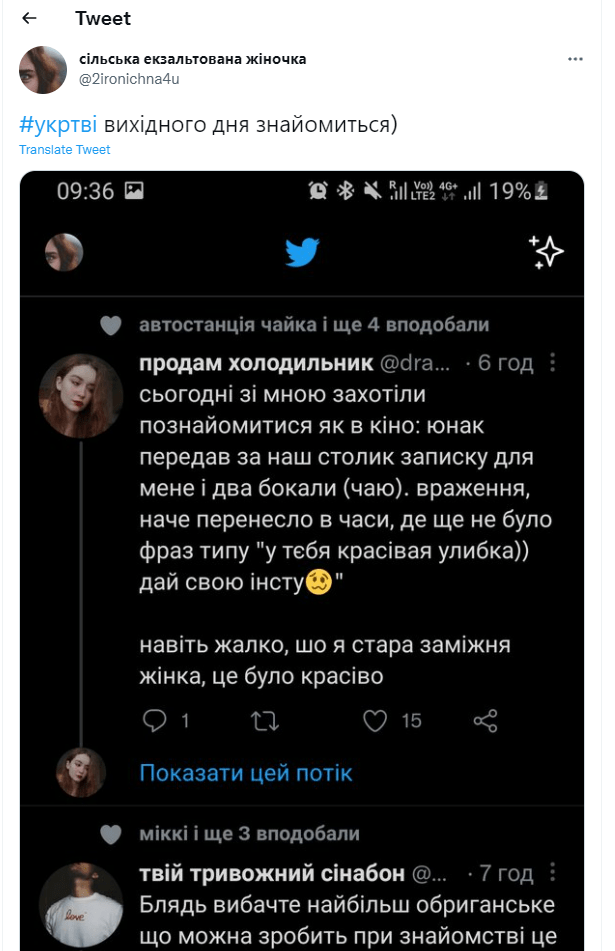
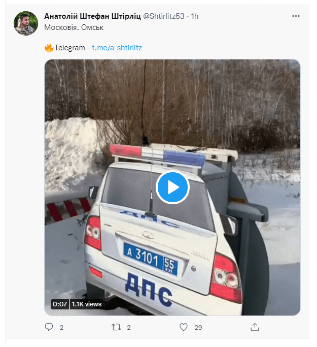
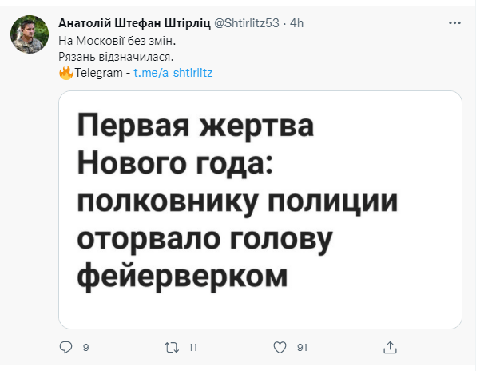
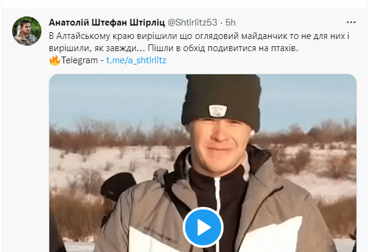
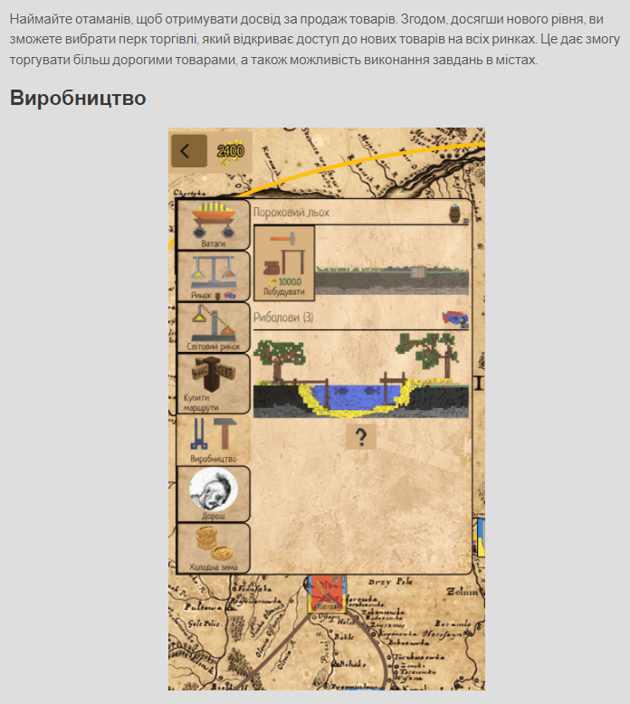

Інколи занурюсь в світ #укртві і кожен раз жалкую.

Майже всі тисячники це якісь повії, які раз в місяць виставляють цицьку/піську/жопку і отримують по 500 лайків за годину. Або просто помийні твіти ні про що:

[https://twitter.com/2ironichna4u/status/1474600064609751040?s=21](https://twitter.com/2ironichna4u/status/1474600064609751040?s=21)

При цьому, що у них по 2000-8000 фоловерів: [https://twitter.com/2ironichna4u](https://twitter.com/2ironichna4u)

Цей акк взяв як приклад, бо збереглися скріни і пост з мастодона. Інший хлам з 500 лайків за день має такий самий вміст. Тобто нульовий.

# Про що я

Коли такий хлам виявляється популярним, то не дає розвинутися нічому іншому. Чи ви знаєте твітори людей, які роблять арт, музику, звуки, ігри, чи просто щось цікаве? Крім тупих фоток чашки кави в руках біля вікна, чи жарту "який розімують лише галичаняне" в твіторах майже немає нічого в українському сегменті. І виходить, що на такому тлі бур'яну не можливо пробитися дійсно культурним рослинам.

# 100% Політизація всього

Інша величезна проблема: весь наш онлайн простір контролюється парою десяткою телеграм каналів новин, інсайдів, ще якоюсь хернею. 

Яку повістку дня вони створюють:

- КІВА ПОЧУХАВ ЧЛЕН
- ФОТОЖАБИ НА ЗЕ
- ЛЕНКІНЕ ВБРАННЯ
- НА РУСНІ ЩОСЬ ЄБАНУЛО ХАХАХА
- ФОТКИ АЛКАШІВ З ПІДПИСОМ ЩОСЬ ПРО РОСІЯН

При чому, що кожен день це щось нове, але те саме. Людей постійно заставляють жити вчорашнім або сьогоднішнім. І кожен думає, що ось він лайкнув фотожабу чи як щось на росії єбануло і все, він щось приніс в нашу культуру чи інфопростір. Подивіться всі ці твіти та навіть місяць тому. Це все сміття, воно не варте навіть уваги коли сереш на унітазі, бо його період напіврозпаду зранку і до обіду. А завтра всім вкинуть нову фотожабу, чи криву фотку Пороха/Зеленського. І купа хом'яків побіжить репостить, лайкать, слати одне одному в ТГ і обговорювати на кухні.

# Побудова ідеї "головне, щоб проти росії"

Вся повістка дня побудована на ідеї все зробити так, що б на росії підгоріло, попасти в їх висерні новини на ОРТ, чи щоб скабеєва чи соловьов почали срач в твіторі. Потім ці всі ролікі з їх новинами героїчно репостяться в твіторі і вихваляються як велику перемогу. 

Що ж насправді відбувається: нас постійно тримають в в інфопросторі держави-агресора. 

Просто приклади такий твітор гігантів за останній день:

Там 90% це постання якогось трешу з росії, 5% це фотки з пораненими і 5% лінки на картку привату чи патреон.

А може робити 100% новин про нашу країну? Невже відео, де пьяні російські ДПСники більше варте уваги, ніж історії наших солдат? От вам дійсно треба це бачити і знати? Через 10 хв ви про це забудете, але ваша енергія уже буде витрачена на це і не буде сил займатися чимось іншим.

Як наприклад робить Юрій Бутусов: записав просто кілометри інтерв'ю з нашими солдатами. Там сотні годин, які можна розпустити на ролики. А не репостать відео з відірваною феєрверком головою .

До речі, цей настоящий полковник взагалі проігнорував моє прохання ретвітнуть твіт з новиною про вихід моєї гри про козаків: [Слобода та Чумаки](https://locadeserta.com). Як і парочка інших титанів з 5к+ фоловерів. [Олександр Колим (@OleksandrKolym) / Twitter](https://twitter.com/OleksandrKolym), адмін вікіпедії і ще хтось, уже забув). Ну на захист адміна укрвікі скажу, що він репостнув новину про інтерактивні історії. Єдиний з десятка. Куди ж цікавіше постать ролікі з ОРТ, як жирік побився з кимось, чи п'яні ДПСники у Брянську упали в річку. 

А тут якомусь чуваку натиснути ретвіт, бо він зробив гру про Україну. У нас же тисячі ігор виходять в рік...

# Чому це погано

Весь наш інфопростір засраний лайном. Титани з купою фоловерів постять російські новини, шльондри виставляють пів цицькі для лайків. І все. Простір заповнено. Кожен двадцятий пересилає це ще комусь, і хопа, уже є теми для розмов на кухні. Наче щось зробив гарне для країни. Прокидаєшся вранці і все заново. День сурка і абсолютна деградація.

Ось я роблю ремейк гри Слободи [Дике Поле: Слобода](https://t.me/locadesertachumaki) , але уже вирішив не таргетить українське суспільство, а сходу виходити на аудиторію Європи. У них баки не забиті фотожабами і відосами, а люди дійсно створюють і діляться щось новим і цікавим. І крім того, підтримують тих, хто щось робить. До того ж, багато хто з друзів і знайомих сприймає мої активності у дусі "ти чо, охуєл тут займаєшся чимось цікавим, а не таким же лайном як і я, а ну зараз обісру тебе тут в фб чи в лічке, щоб засунити тебе назад в болото". І це я чув від людей, які типу патріоти і з якими я ходив не в один похід. Ніхто з моїх колишніх одноклубників по реконструкції козаччини не репостнув навіть у фейсбуці.

# Чому треба щось робити 

Хочете, щоб культура розвивалась і поширювалась? Дивіться, як це роблять росіяни. У них уже є ігри про слов'ян, і це крута стратегія з елементами екшна. Вони створюють гру і таким чином вкладають в голови гравцям своє бачення подій. Що мокшанські болота - це Русь. Що праправнук Чингсисхана Іван IV - це Рюрікович. І все. В гру грають люди, і їм це програмується автоматично. Також це все уходить на захід. І тому всі сприймають нас як пост совок, що ми всі рускіе. А українці самі себе придумали.

Що є у нас: гра Козаки, якій 22 роки. Гра Сталкер, яка 100% совок. Ось скоро виходить новий Сталкер. Де вся фабула - російська.

Колись читав статтю, яким чином вікінги стали популярні в медіа і книгах. А просто: скандинави випускали по 2-3 фільми про свою історію в 1970х. Придумали шоломи з рогами, берсерків. Тепер подивіться яку насправді культурну експансію вони зробили: про вікінгів знають всі (і те що вони принесли культуру на наші землі), всі пізнають ці типажі. А у нас на Хортиці алкаші в чересах і з голим торсом показують, як гопаком збивали польських гусар з коней...А коли ти ставиш їм зауваження, що це все ахінея - погрожують фізичною розправою.

У нас же і не створюють, і не дають поширення того, що хтось намагається щось створити. А потім починається дикий заміс, БО БАЧИТЕ В СТАЛКЕРІ НЕМАЄ УКРАЇНСЬКОЇ ОЗВУЧКИ. І чому в новій Епосі Імперій 5 Русь почалась з Москви і з монголоїдами на картинках???

Да тому що ви здатні лише репостать фотожаби і "аби проти росії щось піздануть".

**Тому, всі кому цікаве щось нове, заходьте на мій ТГ канал [https://t.me/locadesertachumaki](https://t.me/locadesertachumaki), де я публікую новини про гру Слобода 2.0. Знаходьте мої старі ігри, поширюйте їх: [https://locadeserta.com/](https://locadeserta.com/)**