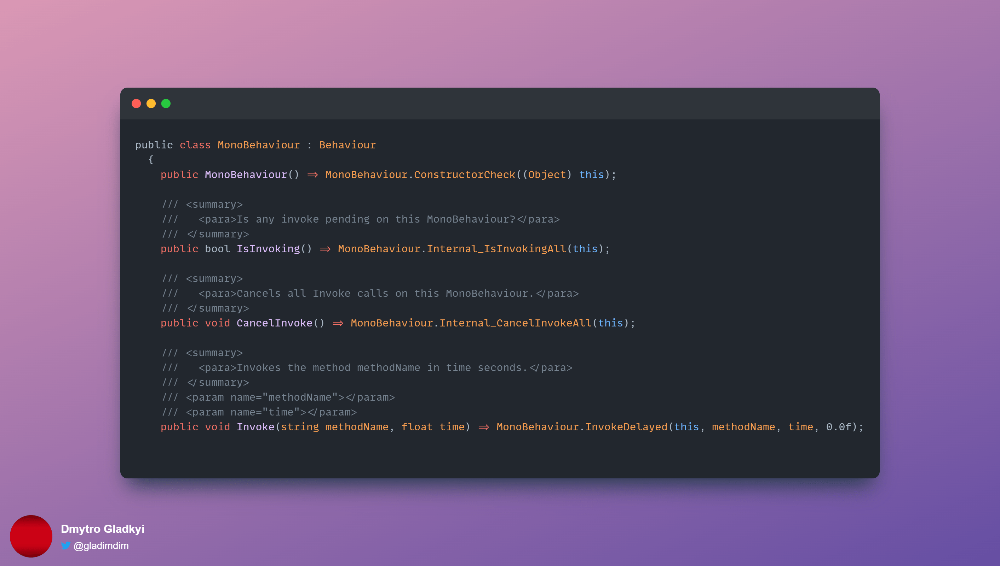

# The Magic of Start/Update Events in Unity's MonoBehaviour

If you programmed at least something in the **Unity** then you definitely extended the **
MonoBehaviour** class and defined your custom **Start, Update, Awake**, etc methods.

But the method is **private** and it is not possible
to [override private methods in C#](https://docs.microsoft.com/en-us/dotnet/csharp/language-reference/keywords/override)
. They have to be either public or protected...

And did you know that...these methods were not derived from the parent **MonoBehaviour** class?

```c#
 // Start is called before the first frame update
void Start()
{
    audioSource = GetComponent<AudioSource>();
    player = FindObjectOfType<PlayerController>();
    if (objectPool.Count == 0)
    {
        prepareContainerObjects();
    }

    hideRequirementInfo();
}


// Update is called once per frame
void Update()
{
    processAction();
}
```

Go to **MonoBehaviour.cs** and check that it has no methods. Also its parent - **Behaviour**...



Then how does it work? How does **Unity** know there is Start method that should be called on **
MonoBehaviour** subclasses?

# Event System

Easy! Unity uses its own messaging system that's
using [C# reflection](https://docs.microsoft.com/en-us/dotnet/csharp/programming-guide/concepts/reflection)
feature

The methods Start/Update/etc are magic methods that can be defined in your **MonoBehaviour**
subclasses. They do not override the implementation from base class. The Unity engine uses **
Component.SendMessage** method in order to dispatch commands to your **MonoBehaviour** subclass.

```c#
/// <summary>
///   <para>Calls the method named methodName on every MonoBehaviour in this game object.</para>
/// </summary>
/// <param name="methodName">Name of the method to call.</param>
/// <param name="value">Optional parameter for the method.</param>
/// <param name="options">Should an error be raised if the target object doesn't implement the method for the message?</param>
public void SendMessage(string methodName, object value) => this.SendMessage(methodName, value, SendMessageOptions.RequireReceiver);

```

The class hierarchy looks like this for your script:

```
YourScript -> MonoBehaviour -> Behaviour -> Component
```

So, whenever the **Unity** engine decides to call **Update** method on all objects it calls **
Component.SendMessage** method on the object . It checks whether **Start/Update**/Whatever from the
magic list of methods is defined and will call them.

# So what?

So, if you have these events with empty bodies - delete them from your code! Before that I thought
that defining empty method had 0 impact as it would be called anyway from parent class. But as you can
see from the investigation: the call will be ignored! So you can save another 1-2 nanoseconds on
each object as the Engine will just skip it.


