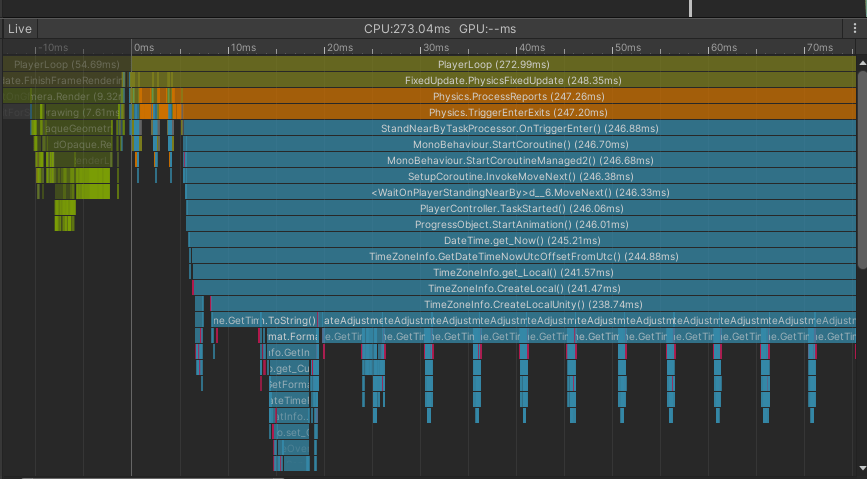
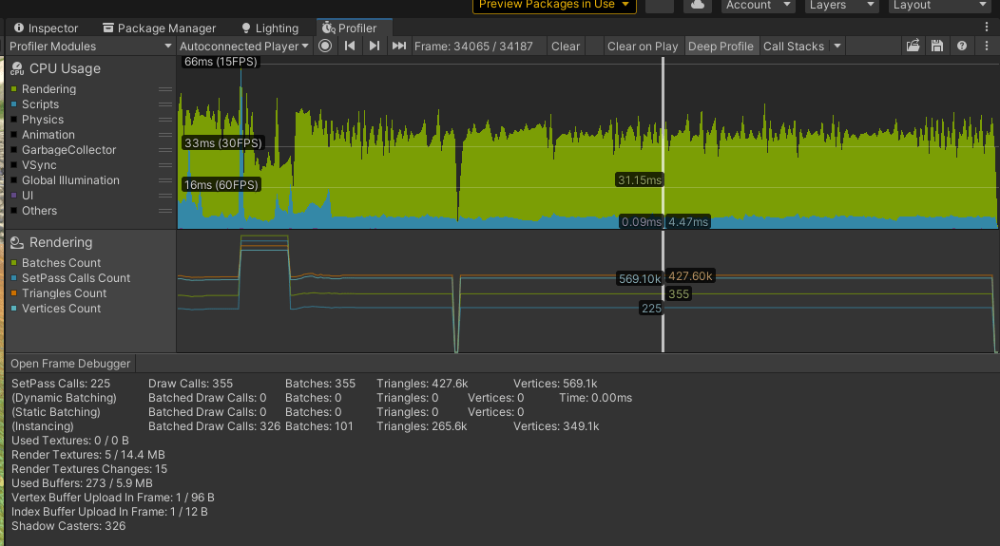
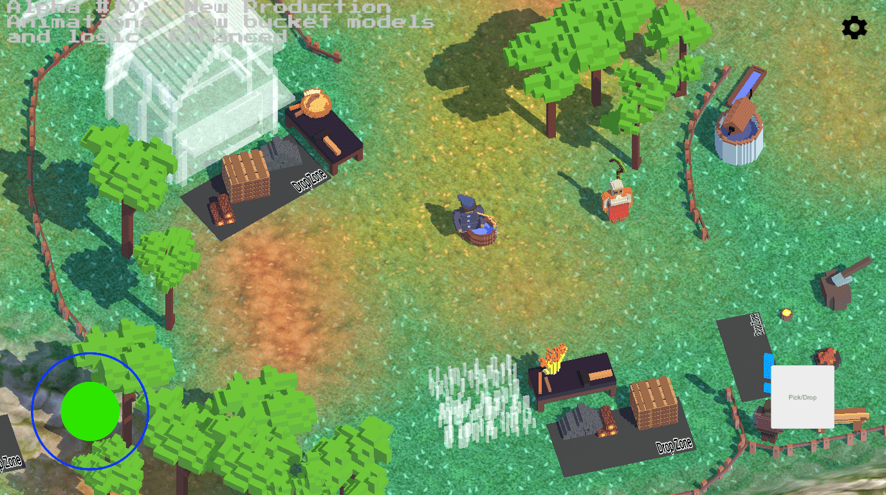

# Replacing Coroutines in Unity with C# Task Async Pattern (TAP)

## Intro

In any game you have to code an asynchronous logic. For example: timeouts, countdowns, progress bars
or delayed interactions.

**In my city-building
game [Loca Deserta: Sloboda](https://github.com/gladimdim/locadeserta/blob/master/sloboda2/alpha.md)**
one of the main interactions in game to build/upgrade/produce is done by standing near the objects.
If you stand 1 second near the table it will open its UI like this (notice green progress circle
enlarging as the progress goes on):


The logic of that delayed interaction is following:

- Collision checks for Player object
- Collided object launches a 1 second delay before finally opening desired UI or completing action (
  like cutting trees)
- Player object get notification to show progress bar
- Any time player can move away. The progress should stop and collided object should 'forget' about
  the player and cancel the launched task.
- If the player still stands near the collided object and timeout ends, then the action is
  executed (cutting tree, mining stone, opening build UI, etc).

## Coroutines

One of the ways to do this is by using Unity's
Coroutines: [https://docs.unity3d.com/Manual/Coroutines.html](https://docs.unity3d.com/Manual/Coroutines.html)

They give a built-in mechanism for starting and cancelling async actions.

The code that starts coroutine to mine a stone resource in my game:

```c#
public void StartMining()
{
    actionCoroutine = StartCoroutine(processMining());
    audioSource.PlayOneShot(actionSound);
    Actions?.Invoke(MineableActions.STARTED, this);
    playMiningParticle(true);
}

IEnumerator processMining()
{
    yield return DelayedRoutine.delayBy((float)miningDurationInSeconds);
    executeMining();
}
```

And in **OnTriggerExit**, when the player leaves the collided object, we can cancel launched
coroutine in case it was not yet finished. The game should 'forget' about the launched action:

```c#
private void stopMining()
{
    if (actionCoroutine != null)
    {
        StopCoroutine(actionCoroutine);
        actionCoroutine = null;
        Actions?.Invoke(MineableActions.STOPPED, this);
        audioSource.Stop();
        playMiningParticle(false);
    }
}
```

## The problem with performance

This code works perfectly fine. But the performance of Coroutines on low-end mobile phones is below
desired.

Here is the profile frame when the collision happens and Unity creates coroutine for you recorded
on **Galaxy Note 8** device:



It takes...200-300ms to launch a coroutine! The bad thing: it was happening on each collision call.
Players could feel the lag once they wanted to open a UI or cut a tree.

The performance on **Galaxy S21 Ultra** was way better but still I could see spikes when coroutine was created.

You can google dozens of questions regarding the performance issues with coroutines:

- [https://answers.unity.com/questions/1451237/performance-of-coroutines-in-mobile.html](https://answers.unity.com/questions/1451237/performance-of-coroutines-in-mobile.html)
- [https://stackoverflow.com/questions/61464452/in-unity-when-should-i-use-coroutines-versus-subtracting-time-deltatime-in-upda](https://stackoverflow.com/questions/61464452/in-unity-when-should-i-use-coroutines-versus-subtracting-time-deltatime-in-upda)

## Task-based Async Pattern (TAP)

The C# official way of dealing with asynchronous tasks is **
TAP**: [https://docs.microsoft.com/en-us/dotnet/standard/asynchronous-programming-patterns/task-based-asynchronous-pattern-tap](https://docs.microsoft.com/en-us/dotnet/standard/asynchronous-programming-patterns/task-based-asynchronous-pattern-tap)
.

Almost all async Task methods
support [https://docs.microsoft.com/en-us/dotnet/api/system.threading.cancellationtoken?view=net-6.0](https://docs.microsoft.com/en-us/dotnet/api/system.threading.cancellationtoken?view=net-6.0)
parameter. It is used to check if your task was cancelled by the source or not.

Read the MS docs and then return back to my article to get basic understanding what's going on.

The rewritten Coroutine code with **TAP** pattern looks like this:

```c#
public async void StartMiningTask()
{
    audioSource.PlayOneShot(actionSound);
    Actions?.Invoke(MineableActions.STARTED, this);
    playMiningParticle(true);

    cancellationTokenSource = new CancellationTokenSource();
    await ProcessMining(cancellationTokenSource.Token);
}
```

We add async keyword, add **Task** suffix to the method name (common pattern). And instead of saving
coroutine to variable we create new **CancellationTokenSource** and send it to awaited method **ProcessMiningTask**.

**ProcessMiningTask** method uses **Task.Delay** and sends it the same **CancellationToken** it
received . If the **CancellationToken** is activated then the **Task.Delay** would throw exception that we catch:

```c#
async Task ProcessMiningTask(CancellationToken token)
{
    try
    {
        await Task.Delay(miningDurationInSeconds * 1000, token);
        ExecuteMining();
    }
    catch (TaskCanceledException _)
    {
    }
    finally
    {
        cancellationTokenSource = null;
    }
}
```

And **StopMining** method checks for active source and cancels the Task. Then proceeds with standard
gameplay logic:

```c#
private void StopMining()
{
    if (cancellationTokenSource == null)
    {
        return;
    }

    cancellationTokenSource.Cancel();
    Actions?.Invoke(MineableActions.STOPPED, this);
    audioSource.Stop();
    PlayMiningParticle(false);
}
```

That's how easy it was to rewrite using standard C# pattern!

## Summary

In your case the Coroutines in Unity might work and perform well but definitely not in my case. Also
I prefer standard C# .NET features instead of relying on Unity-specific implementations of common
patterns.

After I've got rid of all of these Coroutine calls there are no longer spikes on collisions:



As usual, do and use what suites you the best!

# Sloboda Game

If you are into games like Settlers, Minecraft, Unrailed! or just any Voxel Art games, then you can
follow my progress on creating complete new game from scratch!



- Use alpha builds to get the latest features I add on a weekly
  basis: [https://github.com/gladimdim/locadeserta/blob/master/sloboda2/alpha.md](https://github.com/gladimdim/locadeserta/blob/master/sloboda2/alpha.md)
- Follow my dev diary blog in
  Telegram: [https://t.me/locadesertachumaki](https://t.me/locadesertachumaki)
- Follow on Twitter: [https://twitter.com/gladimdim](https://twitter.com/gladimdim)