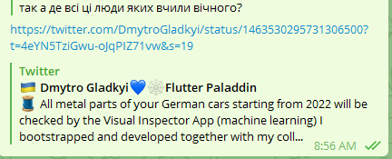

Змушений написати цей пост, адже останнім часом серед "IT" (не люблю це слово) тусовки часто шириться думка, чому технічна освіта не потрібна, і що вона нічого не дає.

Це кажуть як люди, які отримали освіту, так і без неї.
Особливо це пропагує ДОУ, який почав випускати багато відео інтерв'ю з різноманітними людьми, і майже всі вони заявляють, що їх освіта була марною і нічого не дала.

Також ця пошесть популярна і серед лідерів думок.

```
Гуми чомусь одразу агряться, пояснення в TLDR
```

# TLDR

Render unto Caesar


# Початок

Звісно, далі без конкретних імен пару прикладів, які я бачив в коментах на ДОУ, а також на їх власних каналах в ютюбі та ТГ:

- менеджер роддому (сорі, тобто delivery) в якийсь шараге. Освіта: Мореход
- СТО команди з 3 калік, який бере роботу з апворка. Освіта: заочка
- Chief-Щось-Там-Офіцер богодельні по продажам онлайн. Освіта: Інженер
- Власник великого ТГ каналу з ахінеєю. Освіта: Філолог (осилив 3 курси).
- Джавастриптизери різноманітних мастей. Освіти: бурси, педи, кулькі, кнеу, харчовий.
- Професійні-клоуни-виступачі-на-конфах про JavaScript. Освіта: хз.
- Мега-жсери, правда на фрілансі, по 15-20 робіт за рік.

# Чому я погоджуюсь з ними

Дійсно, якщо твоя задача по роботі це "деліверіть" і "чесать" з кастомером, то ніяка освіта КПІ чи Шевченка тобі не допоможе. Також, якщо результат твоєї роботи - це онлайн сервіс з продажу кросівок (перепроданих баригами з аліка), то до чого тут взагалі інженери? І до чого тут Computer Science. Якщо все, що ти робиш по роботі, це верстаєш компоненти реакта. Ну так, 100% тобі ніяка технічна освіта не треба. Тобі треба зовсім інше - маркетинг, реклама, управління бізнесом.


Так само, **якби б я вчився на філолога**, а потім пішов **реактером**, і почав би воняти на ютюбі, що **освіта філолога херня, нічого не дала, просрав 5 років життя**...БЛДЬ, ШТО? Де тут зв'язок?..


# Але

Багато хто з них купив мікрофон з камерою, і починає вещать в народ про те, як круто вони працюють (але продукт секретний, не можна показувати...) , як вони просрали 5 років життя в Шеве чи КПІ, які булі тупі препроди, освіта рівня 1970х...Жах.


Але, перед тим, як вірити їм, подивіться чим вони займаються. Як я описав вище, зазвичай це постна хуйня, яка нікому не треба, а що головне - результат їхньої роботи ні на що не впливає, і легко викидається чи заміняється через 3 місяці.

# Стоп, а ти сам хто по масті?

Не повірите, але це питання задають як раз одні з лідерів думок.




(лінк з скріна: https://twitter.com/DmytroGladkyi/status/1463530295731306500?t=4eYN5TziGwu-oJqPIZ71vw&s=19)

Тобто, у них навіть в думках немає, що дійсно в КПІ чи Шеві можуть вчити чомусь цікавому і потрібному, а не те, що дає можливість їх рівень розвитку - **обсмоктувати різницю між ООР та ФП**, і писати статті про **монади** через 5 хвилин, як про них взнав, або як правильно звільнити людину, щоб він не вкрав лептоп додому.

**Я закінчив кафедру Технічна Кібернетика, факультет ФІОТ, КПІ. Я впевнений, що моя освіта була потрібна**. Бо тим, чим я займаюсь уже 10 років - це як раз про інженерію виробничих систем.

Ось більш детальний приклад, чим я займався останні 2 роки англійською мовою:

https://twitter.com/DmytroGladkyi/status/1465311158873858049

Візуальний аналіз дефектів на виробництві, який уже працює в спільному підприємстві **BMW & Porsche**.

Інтеграція з різноманітними вендорами ML моделей, звітність, принеси-свої-власні-моделі, принеси-свої-власні-дані, навчання-на-ходу...

Як вам? Сходіть на гору поста і порівняйте з тим, чим займаються противники освіти інженера (назовем її так змість технічна).

Максимум, що можуть ляпнути - "я робив лендінг пейджу для Porsche на nextjs, кличте мене на конфу розповім як".


Так, ФІОТ не навчив мене керувати 3-ьома каліками на апворку.

Так, ФІОТ не навчив мене кодить реакт компоненти для хуйні, яку перепишуть через 3 місяці.

Так, ФІОТ не навчив мене піднімати докери на AWS.

Так, ФІОТ не навчив мене робить оборудки через 400 ФОПів по продажу біжютерії.


Бо це все хуйня. Собача. Воно має таке ж відношення до технічної освіти як і твоє копання картоплі в дитинстві до освіти агронома.


# Що саме кльового в КПІ чи Шеві


Під час дискусії в ТГ каналі Bite the Byte https://t.me/bitethebyte (єдиний ТГ канал після мого, який я апрувлю) почали згадувати, що ж там гарного було.

Я б з радістю перепройшов ці предмети ще раз:

- **Теорія розпізнавання Сигналів**. Це взагалі мега тема. Приходить тобі на вхід ЩОСЬ, а ти маєш розпізнати, це ЩОСЬ просто ЩОСЬ, чи конкретне те, що тобі треба ЩОСЬ. (майже як АРІ зроблені реактерами лол). Звісно, якщо у тебе шкільний рівень математики і в общаге давлять другий пузир без тебе, то тобі це все здавалось хуйнею. Ти ж уже працювати пішов пихарем, або тягав кабелі у провайдера, лол навіщо тобі сигнали якісь.
- **ЧМО. Чисельні Методи Обчислень**. Всі ниють про те, що їх не навчили O(n) в КПІ.  Це як жаліться, що в Архітекторном не навчили гризти олівці. Зайдіть на вікі [https://uk.wikipedia.org/wiki/Чисельні_методи](https://uk.wikipedia.org/wiki/Чисельні_методи) і почитайте про що цей предмет. Тут така математична підготовка до програмування, що я не знаю що це ще.
- **Схемотехніка**. Якимсь дивом це був мій один з найулюбленіших предметів. Розробляли мікросхеми різних алгоритмічних пристроїв...Стоп, так в КПІ ж не навчили нікого алгоритмах! Звісно, якщо ти бухав в общаге і читав ньюси, що в VI знову хтось насрав прямо в мильниці,  то ти пішов і купив курсач і навіть не взнав що це. А зараз в мікрофони шепчуть що не навчили нічого і нікого, бідолаги.
- **СУБД**. Одразу чию вий: ЛОЛ ТАМ FOXPRO MS DOS БУВ ЛОЛОЛОЛО. **Так, а що, нормалізація баз даних залежить від програмного пакету?** Чи від методів вводу з клавіатури чи мишею? Я особисто офіційно заявляю, що після закінчення універу ще 5 років ви могли мене розбудити в 4 ранку і я міг би вашу срану монгу розкидать по таблицях якоїсь нормальної Postgres з заданим рівнем нормалізації. Та еп, мене б без цього не взяли навіть в QA ще в 2008 році.
- **"Начерталка"**. Була і "ручна" і в Compas/AutoCad. Багато хто плюється, але це звичай - інженер має вміти читати схеми. Також це настільки гарно розробляє візуальну частину мозку, що її треба вводити просто всім. Не кажучи уже, якщо тягне до gamedev...
- **Вишка, Матан**. Вишка для інженера це як крос для солдата. Має бути і все, я тут не знаю навіть, що обговорювати. Особисто я весь курс матана пройшов ще в 11 класі під час підготовки до вступу, тому мені перші два роки здавались, ну таке просте щось все...Потім поплатився за расзлобон на два роки :)

# Що я б викинув нахуй з КПІ

- **Контрактників. Просто нахуй** в інший підвідділ факультету. Навіщо мені дивиться на ці телячі обличчя, яких батьки сюди запхнули "бо комп'ютери (с)". Єдина задача для них була - принести платежку про наступний семестр в деканат. Все. Сесія закрита. Якщо сам здав сесію, то переводять в підвідділ з нормальними студентами.
- **Гуманітарну хуйню**. Ми вчили купу хуйні не потрібної: філософія, філософія науки, політологія, соціологія, хуєталогія. При чому, що всі ці преподи відчували інтелектуальну незграбність свою, і тому чомусь завжди дрючили звичайних технарей, яким похуй, чесно кажучи, що там Кант хотів трахнуть сестру іншого філософа, а та йому не дала, тому він почав свою власну школу і тепер ми оце все маємо вчити всі 15 німецьких напрямків філософії. Не знаю як, але ось здача цих "предметів" завжди чомусь вимагала титанічних зусиль від усіх. Краще б матана накинули, чи алгоритмів. Чому на факультеті Філологія не викладають ЧМО або Схемотехніку? Хай розвиваються з усіх сторін...
- **Конспекти**. Це просто піздец. Допуск до екзамену - КОНСПЕКТ НАПИСАНИЙ ТВОЄЮ РУКОЮ. Деякі додікі реал перевіряли твої інші зошити. Це що, Києво Могилянська академія 17 сторіччя? Де єдина задача студіка була писати за диктором.
- **Фізра**. Піздец, не знаю навіть навіщо. Ще і ходити 30 хвилин через зруйновані трущоби промки.
- **Деканат**. Якщо хтось жалівся на ЖЕК, то деканат це вершина приниження будь-якої особи. Королева Британії сама зреклася б корони від опущенності після відвідування Деканату.
- **Іноземці**. Виділіть їх теж в іншу групу. Вони і російської не знали, а тут ще матан українською...


А так, більше і не знаю що. Якби все що зверху викинути, то був для мене топчік.


# Що я б додав в КПІ

- на 2-3 курсі більше комплексних завдань, які б перетікали одне в одне. Наприклад: побудова якогось продукту від структури даних, СУБД, сервісів, до UI репрезентації. Мені повезло з курсовим і дипломним керівником, ми з 3 курсу почали тему і до самого захисту диплому магістра її робили. І так, ми її внедрили в КПІ, це була не просто теорія. Це було супер.
- Більше технічних предметів замість гуманітарних.
- Вибір предметів після 3 курсу. Ну от не хочу я вчити Теорію Автоматизованого Управління. Дайте мені вибір. Хочу більше баз даних.


# Висновок

Якщо ви хочете ідти в менеджмент, займатися версткой, або продуктами, які здохнуть через 3 місяці, то вам технічна освіта не треба. Вас з радістю візьме якась галера і будете там педалити свій реакт. Але не треба всім розповідати, що технічна освіта - фігня.

**Якщо ж ви хочете дійсно вийти на інший рівень, працювати над дійсно цікавими і потрібними продуктами, то інженерна освіта - це мастхев. Я навіть впевнений, що ті хто її отримав, а зараз плаче, що вона нічого не дала, насправді досягли своїх вершин лише завдяки їй. А якби вчились, а не просто ходили, то стрибнули б ще вище.**